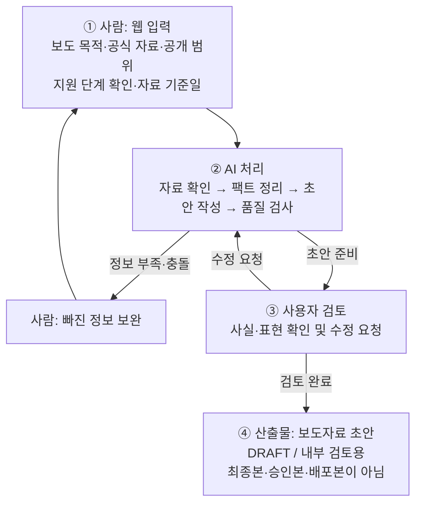
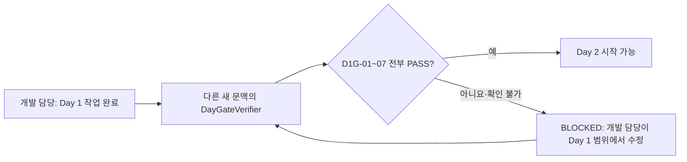

# 국회 법률 개정·개선 보도자료 초안 작성 Agent

> 문서 버전: 0.23.0-draft  
> 문서 상태: REQUIREMENTS_DRAFT  
> 준비 상태: STEPS_1_TO_8_README_COMPLETE / FEASIBILITY_REVIEW_8_ITEMS_INTEGRATED / EXTERNAL_REVIEW_3_ITEMS_INTEGRATED / TEST_SET_V1_2_1_FROZEN / SCHEDULE_25_BUSINESS_DAYS_DETAILED / START_GATE_PASS / DAY0_GATE_PASS / DAY1_TO_DAY2_GATE_DEFINED  
> 구현 시작 관문: **OPEN** (`START_GATE=PASS / DAY0_GATE=PASS / USER_START=GIVEN`)  
> 구현 상태: AUTHORIZED_NOT_STARTED  
> 외부 AI 실행 상태: DAY0_SMOKE_COMPLETED / 실제 호출 1회 / 공식 단가 기준 추정 비용 0.004846달러(공급자 청구서 확정값 아님)  
> 기준일: 2026-08-22  
> 일정 기준: 1명 전업 기준 누적 영업일 1은 Day 0 사전 점검, 누적 2~6은 얇은 시연판 개발 5일. 전체 1차 제품(P1)은 Day 0을 포함해 잠정 18~25영업일이며 §3.7에 최대 25영업일을 하루씩 표시  
> 주요 작성 기준: 사용자 제공 [「보도자료 작성요령 교육」](./보도자료작성요령교육.pdf) 7쪽을 선별 적용  
> 1차 기관·유형: 대한민국 국회 / 국회의원실 / 일부개정법률안 본회의 의결 결과 안내형  
> 작업 원칙: §6의 README 기준 8개, Day 0 기술 확인, 그 결과를 본 사용자의 명확한 구현 시작 지시가 모두 통과하기 전에는 제품 코드를 작성하지 않는다. 시연판 개발 1일차 뒤에는 별도 `DayGateVerifier`가 통과시키기 전까지 개발 2일차 범위를 시작하지 않는다.

## 0. 1차 목표 한눈에 보기

### 0.1 구현 전에 정한 1~8 — 쉬운 설명

아래 1~8은 웹 화면의 버튼 순서가 아니라, **프로그램을 만들기 전에 무엇을 만들지 정한 과정**이다. 현재는 설계 문서·Day 0 연결 점검·구현 시작 허가까지 끝냈으며 제품 코드는 아직 만들지 않았다.

| 번호 | 쉬운 질문 | 정한 내용 | 현재 상태 |
|---|---|---|---|
| 1 | 누구를 위한 도구인가? | 국회의원실이 사용할 상황을 가정한 보도자료 초안 도구다. 국회가 만든 공식 시스템이라는 뜻은 아니다. | README에서 확정 |
| 2 | 어떤 소식을 작성하는가? | 일부개정법률안, 즉 기존 법의 일부를 바꾸자는 제안이 국회 본회의에서 의결된 결과를 알린다. 아직 공포·시행된 법이라고 쓰지는 않는다. | README에서 확정 |
| 3 | 어떤 보도자료를 참고하는가? | 같은 유형의 국회의원실 공개 보도자료 3건을 골랐다. 글의 순서와 표현만 참고하고 과거 이름·날짜·숫자·인용문은 가져오지 않는다. 처음 받은 찬성토론문은 표결 결과 참고 사례에서는 제외하고, 발언 근거가 필요할 때만 제한적으로 쓴다. | README에서 확정 |
| 4 | 어떤 기준으로 글을 쓰는가? | 사용자가 준 `보도자료작성요령교육.pdf`에서 핵심부터 쓰기, 6하 원칙, 쉬운 문장 등 필요한 기준을 골랐다. 오래된 예시 사실과 결재·송부 규칙은 사용하지 않는다. | README에서 확정 |
| 5 | 안전하게 작동하는지 어떻게 시험하는가? | 현재 실제 2건·합성 3건의 5종류 자료와 정상·차단 기준을 포함한 필수 시험 24개를 설계했다. 코드는 외부 AI 없이 전부 반복 시험하고, 실제 AI는 대표 사례를 3회씩 시험한다. 수정가결·대안 정상 사례와 1만·3만 자 성능 자료는 첫 전체 평가 전에 추가한다. | 기존 시험 설계 완료. Day 0 연결 smoke를 제외한 보도자료 품질용 실제 AI·추가 시험 자료·고정 AI 응답·사람 검토는 아직 미실행 |
| 6 | AI에게 글쓰기 규칙을 어떻게 알려주는가? | 기관 표기, 문서 순서, 문체와 금지 규칙을 합친 **AI용 글쓰기 규칙표**(`Writing Contract`)를 설계했다. 국회가 공식 인증한 양식은 아니다. | README 확정, 실제 설정 파일은 미작성 |
| 7 | 프로그램은 어떻게 실행되는가? | 개발 PC에서 React(웹 화면)를 열고 FastAPI(뒤에서 자료와 AI 요청을 처리하는 서버)가 작업한다. 공개 확인 자료만 외부 AI에 보내며 자료는 서버 메모리에 잠시 보관한다. AI 실제 호출은 한 작업당 최대 7회다. | 기술 설계 완료, 구현 전 |
| 8 | 어떤 AI를 쓰고 비용·자료 전송은 어떻게 관리하는가? | OpenAI API의 `gpt-5.6-terra`를 1차 모델로 선택했다. `store=false`(API 응답 보관 요청 끄기)를 써도 기본 안전 로그는 보통 최대 30일, 법률·안전상 예외에는 더 길게 남을 수 있다. 첫 초안 목표는 0.35달러 이하이며 다음 호출 전 예약액이 작업 예산선 1.10달러를 넘으면 멈춘다. | 문서 선택 완료, Day 0 연결·최소 안전 설정 `PASS`, 한국어 보도자료 품질은 미검증 |

> **현재 결론:** 외부 피드백까지 반영한 README 설계 관문과 Day 0 기술 확인은 모두 `PASS`이고, 사용자가 2026-08-22 구현 시작 의사를 명확히 밝혔다. 따라서 구현은 허용됐지만 이 문서 수정 작업에서는 제품 코드를 만들지 않았으며, 실제 상태는 `AUTHORIZED_NOT_STARTED`다.

### 0.2 제품이 실제로 움직이는 4단계

1차 목표는 아래 흐름 하나를 브라우저에서 처음부터 끝까지 동작하게 만드는 것이다.

이 문서에서 **Harness**는 작업 순서·상태·Gate·비용·재시도를 통제하는 일반 프로그램이고, **제품 AI Agent**는 Harness가 준 입력을 정해진 형식으로 변환하는 제한된 담당자다. 제품 Agent가 서로 직접 대화하거나 다음 작업을 스스로 선택하는 자율 멀티에이전트 구조는 사용하지 않는다. 개발 결과를 검사하는 `DayGateVerifier`는 제품 밖의 별도 도구다.

| 용어 | 쉬운 의미 |
|---|---|
| Harness | 전체 순서와 안전 규칙을 관리하는 진행 관리자 |
| 제품 Agent | 실제 웹 제품에서 근거 정리·초안 작성·수정 중 한 역할만 맡는 AI 담당자 |
| `DayGateVerifier` | 제품 밖에서 Day 1 개발 결과를 검사하는 **개발 단계 문지기**. 코드를 만들거나 고치는 Agent가 아님 |
| Run | 보도자료 초안 작업 1건 |
| P1 | 시연판 뒤의 보강·전체 시험까지 포함한 1차 제품 범위 |
| API | 이 PC의 서버가 인터넷을 통해 AI 회사에 요청하고 답을 받는 통로 |
| Day 0 | 본개발 전에 연결·비밀키·가격·안전 설정을 확인하는 첫 사전 점검일. 전체 일정에서는 **누적 영업일 1일차**로 셈 |
| smoke 테스트 | 긴 실제 작업 전에 아주 짧은 공개 합성자료로 연결과 기본 설정만 확인하는 시험 |
| 하드캡·예산선 | 호출 수·시간처럼 미리 정확히 셀 수 있는 값은 넘기 전에 자동 정지. 금액은 다음 요청 전 최대 비용을 예약해 막는 앱 예산선이며 공급자 청구액의 절대 상한 보증은 아님 |
| `store=false` | API 응답을 나중에 다시 불러오기 위한 저장 요청을 끄는 설정. 안전 점검용 로그까지 없앤다는 뜻은 아님 |
| Gate | 다음 단계로 넘어가도 되는지 확인하는 검문소 |
| Fact 원장 | 사용할 사실과 그 원문 위치를 적어 둔 근거 목록 |
| Writing Contract | 기관 양식·문체·금지 규칙을 모은 작성 규칙표 |
| `FactProvenance` | 그 사실이 공식자료·사용자 확인·프로젝트에서 미리 정한 기관 정보 중 어디에서 왔는지 나타내는 꼬리표. 보도자료 승인 의미는 아님 |
| `SourceUseScope` | 자료를 사실 전체·발언만·문체만 중 어디까지 사용할지 나타내는 사용 범위 |
| claim | 초안 안에서 사실을 주장하는 한 문장 또는 한 부분 |
| `STYLE_ONLY` | 구조·문체만 참고하고 사실은 가져오지 않는 자료 |
| Validation Finding | 어느 규칙이 어느 부분에서 차단·경고됐는지 남긴 검사 결과 |
| 절차 단계 | 법률안이 발의·위원회 의결·본회의 의결·정부 이송·공포 중 어디까지 진행됐는지 나타내는 상태 |
| 효력 상태 | 공포된 개정규정이 아직 시행 전인지, 일부 또는 전부 시행 중인지 나타내는 별도 상태 |
| 발의 | 국회의원이 “이렇게 법을 바꾸자”는 법률안을 국회에 냄. 아직 법이 바뀐 것은 아님 |
| 의결 | 위원회나 본회의가 법률안을 심사해 원안·수정안·대안 등을 결정함 |
| 공포 / 시행 | 공포는 법률로 공식 발표하는 것, 시행은 그 규정의 효력이 실제 시작되는 것 |
| 대안반영폐기 | 원래 법률안의 일부 취지가 다른 대안에 반영되고 원안 자체는 폐기된 결과. 원안이 그대로 통과된 것이 아님 |
| 부칙 | 시행일·적용례·경과조치처럼 새 규정을 언제 누구에게 어떻게 적용할지 적은 부분 |



여기서 AI가 하는 확인은 **사용자가 공식 자료라고 표시해 제공한 문서 안에서 누락과 충돌을 찾는 것**이다. AI가 인터넷이나 다른 기관 시스템을 조사해 자료가 정말 공식인지, 최신인지, 기준일 뒤 상태가 바뀌었는지를 독립적으로 보증하는 것은 아니다.

검토 완료는 최종 승인이라는 뜻이 아니다. 이 프로젝트의 정상 산출물은 언제나 DRAFT / 내부 검토용 초안이며, 승인·반려·게시·발송·배포 기능은 1차 목표에 없다.

사용자 검토에는 **사실 확인 체크리스트**가 포함된다. 사용자는 AI가 찾은 법률안명·의안번호·처리 결과·날짜·변경 조문·부칙과 원문 근거를 대조한다. 이것은 최종 승인 절차가 아니라, AI와 코드가 의미를 완벽히 보증할 수 없는 부분을 사람이 확인하는 초안 작성 단계다.

### 0.3 구현 가능성 검토 — 8개 문제와 확정 해결안

README를 실제로 구현할 수 있는지 다시 검토해 다음 8개 보완안을 확정했다. 모두 **문서에만 반영한 상태**이며 아직 제품 코드는 만들지 않았다.

| 번호 | 발견한 문제 | 확정 해결안 | 현재 상태 |
|---:|---|---|---|
| 1 | AI와 코드만으로 글의 뜻과 중요한 사실을 100% 확인할 수 없음 | AI 초안이 나온 뒤 사람이 원문 근거 체크를 마쳐야 다운로드 가능한 DRAFT로 넘어감. 승인·최종본 절차는 추가하지 않음 | README 반영 / 구현 전 |
| 2 | 줄바꿈·한글 조합·따옴표가 달라지면 원문 근거 위치가 흔들릴 수 있음 | 원문과 비교용 정규화문을 함께 보존하고, 허용 변환·해시·원문 위치 연결 규칙을 `source_text_v1`로 고정 | README 반영 / 구현 전 |
| 3 | AI 사용량을 미리 정확히 세지 못하면 첫 시험부터 막힐 수 있음 | 입력은 3만 자로 제한하고 단계별 최대 비용을 먼저 잡은 뒤 AI가 돌려준 실제 사용량으로 보정 | README 반영 / 구현 전 |
| 4 | 긴 AI 처리·중복 클릭·서버 종료·2시간 삭제의 동작이 모호함 | 뒤에서 한 작업만 안전하게 처리하고, 중복 클릭 방지·60초마다 만료 확인·안전한 시작/종료 절차를 고정 | README 반영 / 구현 전 |
| 5 | 첫 화면에서 12가지 자료 역할을 고르게 하면 비전공자에게 어려움 | 사용자는 기본 네 항목만 입력하고 자료 역할은 기본값 `잘 모르겠음`; AI가 근거와 함께 1~3개 쉬운 후보를 제안하면 사람이 선택 | README 반영 / 구현 전 |
| 6 | 5일 시연판과 전체 P1의 합격선이 섞여 있음 | 시연판은 원안이 그대로 가결된 단순 사례와 필수 시험 5개로 좁히고, 수정가결·대안은 전체 P1 검증으로 분리 | README 반영 / 구현 전 |
| 7 | 전체 P1 11~16영업일은 보강·반복 시험·사람 검토를 반영하기에 촉박함 | 얇은 시연판은 약 6영업일을 유지하되 전체 P1은 Day 0 포함 잠정 18~25영업일로 재산정 | README 반영 / 구현 전 |
| 8 | 실제 AI 문장을 매번 똑같이 기대하면 시험이 불안정하고 수정가결·대안 정상 사례가 부족함 | 코드만 쓰는 고정 시험 24개, 대표 실제 AI 시험 3회, 1만·3만 자 성능 시험, 전문가와 비전공자 검토를 분리 | README 반영 / 구현 전 |

### 0.4 구현 관문 재감사 — 추가 피드백 3건

외부 재검토에서 `START-GATE-03·08`을 바로 `PASS`로 둔 근거가 부족하다는 지적을 받았다. 지적을 실제 자료와 다시 대조해 다음처럼 보완했다.

| 발견한 문제 | 확정한 해결 방법 | 반영 위치 |
|---|---|---|
| 최초 발의안과 본회의 `원안가결`만으로 최종 의결 내용을 확정하면, 중간 심사에서 수정된 사례를 놓칠 수 있음 | 명시적 본회의 최종문·상정안을 우선 사용. 최초 발의안을 대신 쓰는 예외는 같은 의안번호의 **소관위·법사위·본회의가 모두 원안가결**이고 중간 변경·대안이 0건일 때만 허용. 각 Source 해시는 자기 Source의 저장값과만 비교하고 서로 다른 문서의 해시끼리는 비교하지 않음 | §2.10, §2.15.7, §2.16.2, P1-V-35 |
| 변경 상위 조문 1~3개를 AI 결과만 보고 세고 있었음 | Harness의 `article_target_parser_v1`이 `resolved_final_text`의 개정 지시문에서 대상 최상위 조문 집합을 직접 계산한다. 본칙 지시문을 100% 해석해 미해석 구간이 0개이고 AI의 ProvisionComparison 집합과 정확히 같을 때만 진행 | §2.10~2.11, §2.16.3, P1-V-36 |
| 자료 역할 후보가 늘었는데 사실 추출 출력 상한은 6,000토큰 그대로였음 | 중복 근거를 `evidence_id`로 한 번만 저장하고 배열 개수와 문자열 길이를 제한한 뒤, 사실 추출 상한을 12,000토큰으로 상향. Run·평가 예약 예산도 새 상한으로 다시 계산 | §2.12~2.14, §4.1, §7.2 |

이 세 건을 보정하는 과정에서 raw AI schema에 OpenAI strict Structured Outputs가 지원하지 않는 조합 키워드가 들어간 문제도 발견했다. API용 schema를 root object와 중첩 `result.anyOf` 두 분기로 바꾸고, 중복·참조 관계는 Harness의 Pydantic 의미 검사가 다시 확인하도록 고쳤다.

정정 전에는 `START-GATE-03·08=PASS`라고 할 수 없었다. 현재는 위 규칙과 `ACTUAL-PASS-001` 시험 근거를 보완하고 수치·schema·checksum 재검사까지 끝냈으므로 §6.2에서 두 항목을 `PASS`로 재판정한다. 이는 구현 준비 문서의 합격이며, 아직 만들지 않은 프로그램이나 실제 AI 시험의 합격을 뜻하지 않는다.

---

## 1. 목표 / 목적

### 1.1 해결하려는 문제

보도자료 담당자는 여러 공식 자료에서 이름, 날짜, 수치와 핵심 메시지를 찾아 보도자료 형식으로 다시 정리해야 한다. 자료가 빠졌거나 서로 다르면 다시 확인해야 하고, 표현을 고칠 때 원래 사실이 바뀌지 않았는지도 살펴야 한다.

이 Agent는 이 반복 작업을 줄여 **사람이 검토할 수 있는 첫 초안을 빠르게 만드는 웹 도구**다. 사람을 대신해 최종 판단하거나 보도자료를 배포하는 시스템이 아니다.

### 1.2 1차 목표

비전공자가 브라우저에서 다음 과정을 완료할 수 있게 한다.

1. 보도 목적, 공식 자료, 공개 범위와 자료 확인 기준일을 입력하고 화면에 고정 표시된 지원 단계를 확인한다.
2. 정보가 부족하거나 자료가 충돌하면 쉬운 확인 질문을 받는다.
3. 자료가 충분하면 핵심 사실, 경고와 보도자료 초안을 함께 받는다.
4. 사실이나 표현을 검토하고 자연어로 수정 요청을 보낸다.
5. 수정된 DRAFT / 내부 검토용 초안을 화면에서 확인하고 내려받는다.

### 1.3 주요 사용자

- 홍보·대변인실·정책 커뮤니케이션 담당자
- 정책·사업 내용을 제공하는 담당자
- 초안의 사실과 표현을 확인하는 팀장 또는 실무 검토자

한 사람이 입력과 검토를 모두 담당해도 된다. 별도의 승인권자는 두지 않는다.

### 1.4 1차 성공 기준

| 확인 항목 | 1차 목표 |
|---|---|
| 핵심 흐름 | 웹 입력부터 수정·다운로드까지 4단계가 한 번에 동작 |
| 사실 안전성 | 준비된 테스트에서 자료에 없는 이름·날짜·수치 생성 0건 |
| 충돌 처리 | 서로 다른 날짜·수치를 임의로 고르지 않고 사용자에게 표시 |
| 인용문 | 원문이 없는 발언을 실제 인용문으로 표시하는 사례 0건 |
| 실행 통제 | Harness를 우회한 상태 변경·Agent 직접 호출·호출 한도 초과 0건 |
| 작성 기준 | 선택한 유형·기관 Writing Contract의 필수 구조와 공식 표기 누락 0건 |
| 초안 표시 | 화면과 다운로드 파일 모두 DRAFT / 내부 검토용 표시 100% |
| 사용성 | 비전공자 2명이 개발자가 대신 클릭하거나 설명하지 않아도 20분 안에 전체 흐름 완료 |
| 처리 시간 | 1만 자·3만 자 표준 자료를 각각 3회 실행해 중앙값·최댓값·AI 비용을 기록. 1만 자는 잠정 목표 3분·0.35달러 여부도 확인 |

표준 성능 시험은 한국어 약 1만 자와 입력 상한에 가까운 약 3만 자 자료로 첫 초안과 품질 검사까지 수행하는 경우를 뜻한다. 1만 자의 3분·0.35달러는 합격을 보증하는 강제선이 아니라 첫 프로토타입에서 확인할 **성능 목표**다. 각 Run의 8분과 안전 Gate는 **하드 상한**이고, 1.10달러는 다음 요청 전에 검사하는 **앱 예약 예산선**이다.

### 1.5 Day 0 이후 5영업일 시연판이 성립하는 전제조건

다음 전제조건이 준비되고 지원 프로필 하나만 활성화된 경우, **Day 0(누적 영업일 1, 0.5~1영업일)**과 시연판 개발 5일(누적 영업일 2~6)을 합친 약 6영업일 안에 정상 흐름의 얇은 시연판을 목표로 한다. 얇은 시연판은 `ORIGINAL_PASSED`와 §3.7의 `TS-V-01~05`만을 합격선으로 하며 전체 P1 완료가 아니다. Day 0은 2026-08-22 `PASS`했으며, P1-FR-01~25, P1-NFR-01~08, P1-V-01~36, 결정형 코드 시험, 실제 AI 반복 시험, 성능·사람 검토까지 완료하는 전체 P1 일정은 현재도 Day 0 포함 잠정 18~25영업일이다. 주말·공휴일과 API 권한·사용자 허용·검토자 참여를 기다리는 날은 작업 영업일에 넣지 않는다.

- 대상 기관 1개 (**확정: 대한민국 국회**)
- 우선 지원 유형 1개 (**확정: 법률 개정·개선 안내형**)
- 첫 지원 프로필 1개 (**확정: 일부개정법률안의 본회의 의결 결과 안내**. 절차 단계와 효력 상태는 내부에서 분리)
- 국회 안의 공식 발표 주체 1개 (**확정: 국회의원실**. 특정 의원 1명이 아니라 의원실 보도자료 공통형)
- 기본 보도자료 양식 1개 (**확정: README §2.7 양식 v1**)
- 좋은 보도자료 참고 사례 3~5개 (**확정: 국회도서관 공개 사례 3건, §2.15.6 참고**)
- 테스트용 공식 또는 합성 자료 5건 이상 (**설계 확정: `test_sets/`의 실제 공개자료 2건 + 합성 위험자료 3건. 구현 뒤 자동 실행은 별도**)
- 금지 표현과 반드시 지킬 작성 규칙
- 사용할 AI 공급자·모델, 공급자 보관 정책, 공식 가격표와 금액·토큰 한도 (**README 선택 및 Day 0 최소 확인 완료: OpenAI API / `gpt-5.6-terra` / §7.2. 실제 품질·속도·제품 실비는 Harness와 Agent가 준비된 뒤 첫 전체 평가에서 확인**)
- 개발 PC `127.0.0.1`의 로컬 웹·단일 사용자로 먼저 실행한다는 합의 (**확정**)

5영업일 시연판은 `ORIGINAL_PASSED`인 대상 법률 1개·본회의 최종 의결 대상 1건·변경 상위 조문 1~3개로 제한한다. 변경 상위 조문 수는 서로 다른 최상위 `제○조` 번호의 개수다. 같은 조 안의 항·호가 여러 개 바뀌어도 1개로 세고, 부칙은 이 개수에서 빼되 별도 보호 규칙으로 검사한다. `MODIFIED_PASSED`와 위원회 대안 경로는 전체 P1에서 유지하지만 5일 시연판에는 넣지 않는다. 그보다 많은 원안·대안, 별표·서식, 여러 법률을 한꺼번에 바꾸는 일괄개정과 복잡한 조문 이동은 후속 범위다.

### 1.6 1차 제외 범위

1차 프로토타입은 다음 기능을 만들지 않는다.

- 최종 승인, 반려, 결재, 최종본 전환
- 게시, 이메일 발송, 언론 배포, SNS 게시
- 인터넷 자동 검색과 외부 자료 자동 채택
- 사용자 계정, 로그인, 여러 사용자와 세부 권한
- 사내 서버·클라우드 정식 배포와 운영 모니터링
- HWP, 스캔 PDF, 이미지 OCR과 복잡한 표 해석
- 여러 기관, 여러 도메인과 여러 보도자료 유형 동시 지원
- 완전한 법률·보안·개인정보 적합성 판정
- 장기 보관용 데이터베이스와 변조 방지 감사 시스템
- HelixOps 생명과학 코드·데이터·프롬프트·의존성 이관

---

## 2. 요구사항 / 요구사양

이 절은 구현 전에 확인할 상세 계약이다. 입력 범위·로컬 웹·기술 구성·저장/삭제·외부 전송 범위·호출 한도·일정은 §7.1의 7번에서, AI 공급자·모델·외부 보관 고지·가격 기준·금액과 토큰 한도는 §7.2의 8번에서 README 결정으로 확정했다. 실제 API 키·모델 접근과 최소 설정은 제품 코드가 아닌 §6.3의 Day 0 smoke에서 확인했다. 고정 테스트 품질·속도·실비는 Harness와 Agent가 준비된 뒤 첫 전체 평가에서 확인한다. §6의 세 관문이 모두 통과하지 않으면 구현하지 않는다.

### 2.1 사용 환경

- 일반 사용자는 PowerShell이나 터미널이 아니라 웹브라우저를 사용한다.
- 1차 프로토타입은 개발 PC에서 실행하고 같은 PC의 브라우저로 접속하는 단일 사용자 방식을 가정한다.
- 한국어 입력과 한국어 보도자료만 지원한다.
- 실제 비공개·민감 개인정보·엠바고 자료는 1차 프로토타입에 넣지 않는다. 공개 공식 자료의 의원명·직함·업무용 문의처는 허용한다.
- 공개 자료 또는 실제 정보를 제거한 합성 테스트 자료만 사용한다.
- 한 번에 보도자료 작업 1건을 처리한다.
- 원문·초안·수정 요청은 FastAPI 프로세스의 임시 메모리에만 두고, React 브라우저에는 실행 ID만 보관한다.
- 현재 작업 삭제·새 작업·마지막 사용자 동작 뒤 2시간·서버 종료/재시작 시 임시 Run을 삭제한다. 브라우저 탭만 닫는 것은 서버 데이터 삭제를 뜻하지 않는다.
- 일반 실행 로그에는 원문·초안·수정 요청·전체 프롬프트·API 키를 저장하지 않는다.

### 2.2 웹 첫 화면 입력

첫 화면에서 사용자가 반드시 입력하는 것은 **보도 목적·공식 자료·공개 범위·자료 확인 기준일 네 가지**다. 지원 절차 단계는 OD-16에서 하나를 정해 Writing Contract에 고정하고 화면에 읽기 전용으로 보여준다. 자료 역할은 선택 항목이며 기본값은 `잘 모르겠음`이다. 1차 화면에서 12개 내부 역할이나 여러 지원 프로필을 억지로 고르게 하지 않는다. 효력 상태는 사용자가 자유롭게 정하지 않고 제공 자료의 근거로 Harness가 별도 계산하며, 근거가 부족하면 초안을 차단한다. 사용자가 보는 전체 흐름은 §0의 네 단계에서 달라지지 않는다.

| 입력 항목 | 필수 여부 | 설명 | 없거나 문제가 있을 때 |
|---|---:|---|---|
| 보도 목적 | 필수 | 독자가 무엇을 알아야 하는지와 **공식 자료에서 확인된 사실 중 무엇을 강조할지** 한두 문장으로 입력. 새 Fact를 만드는 칸이 아님 | 비어 있으면 초안을 만들지 않고 확인 질문. 새 이름·날짜·수치·성과가 들어오면 채택하지 않고 공식 자료를 요청 |
| 공식 자료 | 필수 | 화면에 붙여 넣거나 UTF-8 TXT·Markdown 파일로 제공. 자료명과 원래 파일명·쪽수·문서 ID는 알면 선택 입력 | 초안을 만들지 않고 자료 요청 |
| 공개 범위 | 필수 | 공개 / 내부 / 엠바고 중 선택 | 내부·엠바고이면 1차 프로토타입 사용 차단 |
| 자료 역할 | 선택 | 기본값 `잘 모르겠음`. 사용자가 확실할 때만 쉬운 이름으로 선택 | AI가 원문 근거와 함께 가능한 역할 1~3개를 제안하고 사람이 선택 |
| 지원 절차 단계 | 필수·고정 | `본회의 의결 결과`가 읽기 전용으로 표시 | 공식 표결 결과와 해결된 최종 의결 내용(`resolved_final_text`)이 없거나 자료가 다른 단계이면 초안 작성 차단 |
| 자료 확인 기준일 | 필수 | 사용자가 제공 자료의 상태를 확인했다고 밝히는 날짜 | 비어 있거나 자료 날짜보다 앞서는 등 모순이면 초안 작성 차단 |

최초 발의안을 `resolved_final_text`로 대신 쓰는 §2.16.2의 예외가 필요한 경우에만, 역할 선택 뒤 “이 자료에 `… 일부를 다음과 같이 개정한다.`부터 모든 개정 지시문과 부칙 끝까지 들어 있습니까?”를 원문 전체 보기와 함께 묻는다. `예`를 누른 시각·Source ID·normalized 해시·확인한 시작/끝 위치를 `final_text_completeness_confirmation`으로 기록한다. 모름·아니오·자료 변경이면 파생하지 않고 본회의 상정안 또는 최종문을 요청한다. 이는 첫 화면의 다섯 번째 상시 입력이 아니며 사실의 진실을 승인하는 절차도 아니다.

AI는 자료에서 다음 내용을 찾아본다.

- 국회 안의 공식 발표 주체
- 의안번호·정식 법률안명·개정 종류
- 제공 자료 안에서 확인되는 절차 단계·효력 상태와 사용자가 입력한 자료 확인 기준일
- 제안자·제안일 또는 의결기관·의결일·처리 결과
- 현행 조문과 현재 단계에 맞는 개정안·최종 의결안·공포 법률의 조문
- 공식 제안이유·개정이유와 주요 내용
- 공포된 경우 법률번호·공포일·부칙의 시행일·적용례·경과조치
- 공식 자료 안에서 보도의 핵심으로 삼을 수 있는 사실과 선택적인 강조 방향
- 발표 날짜와 장소
- 주요 이름, 직함, 수치와 단위
- 공식 인용 원문
- 언론 문의처

찾지 못한 내용은 지어내지 않는다. 누락·충돌 처리 기준은 다음과 같다.

| 확인 항목 | 없거나 충돌할 때 | 초안 작성 |
|---|---|---|
| 발표 기관 또는 주체 | 사용자에게 확인 질문 | 답을 받기 전 차단 |
| 지원 절차 단계·효력 상태·자료 기준일 | 제공 자료 내부에서 대조해 질문. 인터넷 최신성 확인으로 표현하지 않음 | 일치가 확인되기 전 차단 |
| 의안번호·정식 법률안명 | 공식 자료에서 확인 요청 | 확인되기 전 차단 |
| 현행 조문과 변경 조문 | 같은 법률·같은 조문의 공식 원문이 없으면 비교하지 않음 | 변경 내용을 설명해야 하는 초안이면 차단 |
| 처리 결과 | 원안·수정·대안·부결·폐기 등을 임의로 해석하지 않고 질문 | 해결되기 전 차단 |
| 공포·시행 정보 | 공포 뒤에는 법률번호·공포일과 부칙을 요청 | 시행을 설명해야 하는 초안이면 차단 |
| 강조 방향(핵심 메시지) | 선택 항목. 사용자는 공식 자료에 있는 사실 중 무엇을 앞세울지만 정할 수 있음 | 비우면 검증된 핵심 Fact로 AI가 제안하므로 허용. 새 이름·날짜·수치·성과를 입력하면 사실로 채택하지 않고 공식 자료를 요청 |
| 공개 범위 | 사용자에게 확인 질문 | 답을 받기 전 차단 |
| 초안에 사용할 이름·날짜·수치 | 누락이면 해당 내용을 빼고 표시, 충돌이면 어느 자료가 맞는지 질문 | 충돌이 해결되기 전 차단 |
| 발표 예정일·장소 | [확인 필요] 자리표시자 | 허용 |
| 공식 인용 원문 | 초안에서는 인용문 부분을 생략하고 검토 화면에 “사용할 공식 인용문 없음” 안내. 인용문 생성 금지 | 허용 |
| 언론 문의처 | [확인 필요] 자리표시자 | 허용 |

즉, 초안의 주체와 핵심 내용이 없거나 사용할 사실이 서로 충돌하면 생성을 멈춘다. 나중에 채울 수 있는 편집 항목만 자리표시자를 허용한다.

### 2.3 1차 입력 형식

| 항목 | 1차 사양 |
|---|---|
| 직접 입력 | 웹 입력창에 붙여 넣은 일반 텍스트 |
| 파일 | UTF-8 TXT 또는 Markdown |
| 자료 개수 | 붙여 넣기와 파일을 합쳐 최대 6개. 한 Source에는 실제 문서 1개와 자료 역할 1개만 지정 |
| 전체 분량 | 합계 약 3만 자 이내 |
| 언어 | 한국어 |

붙여 넣은 자료에는 사용자가 자료명을 입력할 수 있는 칸을 제공한다. 비워 두면 시스템이 붙여넣기 자료 1, 붙여넣기 자료 2처럼 고유 이름을 붙인다. 업로드 파일은 파일명을 기본 자료명으로 사용한다. 한 공식 파일 안에 서로 다른 역할의 문서가 묶여 있으면 관련 부분을 역할별 Source로 나누되, 원래 파일명·쪽수·문서 ID를 함께 기록해 관계를 잃지 않는다.

PDF, DOCX와 HWP는 AI 호출 전에 업로드를 거부하고 “이 버전은 PDF·DOCX·HWP를 직접 읽지 않습니다. 문서를 열어 필요한 본문을 복사해 붙여 넣으세요. 가능하면 자료명·원래 파일명·쪽수·문서 ID도 적어 주세요. 표·각주·개정 조문이 깨졌다면 원문을 다시 확인하세요.”라고 안내한다. 1차 완료 후 실제 표본으로 추출 품질을 확인한 다음 지원 여부를 결정한다. 기준 문서 `PG-001` PDF는 사람이 이미 규칙으로 선별해 등록한 프로젝트 자료이며, 사용자가 매 작업에서 업로드하는 공식자료 PDF 지원과는 별개다.

#### 2.3.1 원문 보존·비교용 정규화 계약 v1

각 Source는 사용자가 준 내용을 보존한 `raw_text`와 Agent에게 보내고 코드가 비교하는 `normalized_text`를 함께 가진다. 정규화 버전은 `source_text_v1`로 고정한다.

v1에서 허용하는 변환은 다음 세 가지뿐이다.

1. UTF-8 BOM이 있으면 제거한다.
2. `CRLF`와 `CR` 줄바꿈을 `LF`로 통일한다.
3. Unicode를 NFC로 정규화한다.

내부 공백을 합치거나 앞뒤 공백을 일괄 삭제하지 않는다. 문장부호·따옴표·숫자·단위·영문 대소문자나 내용을 바꾸거나 삭제하지 않는다. 업로드 파일은 원본 바이트 SHA-256을, 모든 Source는 `raw_text`와 `normalized_text`의 SHA-256을 각각 기록한다. normalized offset과 raw line·column을 연결하는 span map을 만들어 화면의 근거 보기가 사용자가 붙여 넣은 원문 위치를 가리키게 한다.

변환·해시·위치 연결에 실패하거나 금지된 변경이 생기면 `SOURCE_NORMALIZATION_FAILED`로 AI 호출 전에 차단한다. Agent가 제시한 `evidence_quote`는 `normalized_text`에서 완전 일치해야 한다. 0건이면 Fact를 거부하고, 여러 곳에 반복되어 하나로 특정할 수 없는 고위험 사실·인용문이면 더 긴 근거 문구를 요청한다.

### 2.4 AI가 반드시 지켜야 할 규칙

| ID | 필수 동작 | 확인 가능한 수용 기준 |
|---|---|---|
| P1-FR-01 | 필수 입력이 없으면 초안을 만들지 않고 쉬운 한국어로 질문한다. | 보도 목적·자료·공개 범위·자료 기준일과 고정 지원 단계의 기본 검사를 AI 호출 전에 수행하고, 누락 항목 바로 아래에 안내를 표시 |
| P1-FR-02 | 자료끼리 동일 항목의 날짜·수치가 다르면 임의로 선택하지 않고 충돌을 표시한다. | 서로 다른 값, 각 자료명과 원문을 함께 보여주며 어느 값도 기본 선택하지 않음 |
| P1-FR-03 | 허용된 출처에 없는 이름·날짜·수치·성과·순위·인과관계를 사실처럼 추가하지 않는다. | 모든 사실 claim에 허용 `FactProvenance`와 근거가 연결되고 사람의 의미 대조에서 근거 없는 사실 0건 |
| P1-FR-04 | 불확실한 정보는 [확인 필요]로 표시하거나 질문한다. | 차단 항목과 자리표시자 허용 항목을 §2.2 기준대로 일관되게 처리 |
| P1-FR-05 | 공식 인용 원문이 없으면 실제 발언을 만들어내지 않는다. | 따옴표 안의 공식 발언은 입력 원문과 정확히 일치하며, 없으면 초안에서 인용 부분을 생략하고 검토 화면에 안내만 표시(Finding 없음) |
| P1-FR-06 | 자료 안의 “기존 규칙을 무시하라” 같은 문장을 Agent 명령으로 실행하지 않는다. | 문서 속 명령·URL·스크립트를 실행하거나 자동으로 열지 않고 경고로 기록 |
| P1-FR-07 | 초안과 함께 사용한 핵심 사실, 자료명과 원문 위치를 보여주고 사람이 사실 확인 체크리스트를 완료하게 한다. | 근거 문구가 실제 해당 자료에 존재하지 않으면 그 사실을 초안에 사용하지 않으며, 현재 초안의 필수 Fact·부칙을 사람이 확인하기 전에는 초안 준비를 차단 |
| P1-FR-08 | 사용자의 수정 요청을 반영하되 확인된 핵심 사실과 하드 Writing Contract를 임의로 바꾸지 않는다. | 수정 전후 기관명·이름·날짜·수치·인용문과 필수 양식을 재검사하고, 새 사실 추가나 DRAFT·필수 항목 제거 요청은 거부 이유 표시 |
| P1-FR-09 | 모든 화면과 다운로드 파일에 DRAFT / 내부 검토용을 표시한다. | 검토·복사·다운로드 결과의 첫 줄에 해당 문구가 항상 존재 |
| P1-FR-10 | 승인·최종본·게시·발송·배포 기능을 제공하지 않는다. | 관련 버튼, 상태, 파일명과 실행 경로가 모두 없음 |
| P1-FR-11 | 오류가 나면 성공한 것처럼 보이지 않고 원인과 다시 시도할 방법을 쉬운 말로 보여준다. | 오류 종류, 입력 보존 여부, 다음 행동과 실행 ID를 표시하고 비밀값·원문 전체는 숨김 |
| P1-FR-12 | 브라우저에서 입력·생성·수정·다운로드를 완료할 수 있게 한다. | 비전공자가 터미널·JSON 편집 없이 4단계 흐름 완료 |
| P1-FR-13 | 확정된 보도자료 양식 v1의 필수 구조를 적용한다. | DRAFT·자료 기준·절차/효력·발표 주체/보도 정보·제목·핵심 요약 2~3개·리드·본문·문의처가 항상 존재하고, 인용·붙임은 공식 자료가 있을 때만 표시 |
| P1-FR-14 | AI가 반환한 구조화 결과가 정해진 데이터 형식에 맞는지 검사한다. | 공유 재시도 예산이 남아 있으면 해당 단계에서 최대 1회 재시도하고, 예산이 없거나 다시 실패하면 후보를 보여주지 않고 `FAILED`로 종료 |
| P1-FR-15 | Harness만 실행 순서와 상태를 변경하며 Agent끼리 직접 호출하지 않는다. | 허용된 상태 전이·API 상태 이외의 실행과 Agent 간 직접 호출 0건 |
| P1-FR-16 | 근거 정리·초안 작성·수정의 세 제품 런타임 AI Agent는 고정된 입출력 계약을 지킨다. | 각 결과가 전용 Pydantic 스키마를 통과하고, 실패 결과가 실행 상태를 직접 변경하지 않음 |
| P1-FR-17 | 한 실행에서는 모델·프롬프트·양식·기관 프로필·검증 규칙과 기준 문서 버전을 고정한다. | 실행 기록에 각 버전과 기준 문서 ID·해시가 남고 실행 중 설정 변경이 현재 초안에 반영되지 않음 |
| P1-FR-18 | Harness가 확정된 Writing Contract를 Agent와 Gate에 동일하게 적용한다. | 초안과 수정본이 같은 기관명·문단 순서·문체·차단 규칙으로 검사되고 적용 규칙의 ID·출처 쪽수를 추적할 수 있으며 `EXCLUDE` 규칙 적용 0건 |
| P1-FR-19 | AI 호출에는 단계별 재시도와 실행 전체의 최대 호출 수를 둔다. | 정상 최초 생성 2회, 수정 요청당 1회·최대 3회, 공유 재시도 예산 2회, 실행 전체 최대 7회이며 초과 호출 0건 |
| P1-FR-20 | 현재 실행의 허용 출처와 좋은 사례의 역할을 분리한다. | `FactProvenance`는 `OFFICIAL_SOURCE`·`USER_CONFIRMED`·`APPROVED_PROFILE`만 허용하고, `STYLE_ONLY`는 `SourceUseScope`에만 존재하며 사례의 과거 사실 유입 0건 |
| P1-FR-21 | 모든 초안에 제공 자료에서 확인된 절차 단계·효력 상태·자료 기준일을 나란히 표시하고 활성 Contract의 한 단계에 맞는 표현만 사용한다. | 지원하지 않는 단계 자료는 차단하고, 발의를 통과·공포·시행으로 또는 본회의 의결을 공포·시행으로 표현하는 사례 0건 |
| P1-FR-22 | 법률 사실은 현재 단계와 같은 버전의 공식 문서를 근거로 사용한다. | 명시적 본회의 최종문·상정안을 우선한다. 최초 발의안을 대신 쓰는 예외는 발의안·전체 심사이력·본회의 표결의 의안번호가 같고 소관위·법사위·본회의가 모두 `ORIGINAL_PASSED`, 중간 내용 변경 0건이며 각 Source가 자기 해시와 일치할 때만 허용. 수정가결·대안반영폐기 뒤 최초안을 최종 내용으로 사용하는 사례 0건 |
| P1-FR-23 | 현행과 개정 내용을 비교할 때 같은 법률·같은 조문의 공식 원문 두 개를 사용한다. | Harness가 `resolved_final_text`의 본칙 개정 지시문을 코드로 파싱한 최상위 조문 집합과 AI의 ProvisionComparison 집합이 정확히 같아야 함. 한쪽 원문·조문 번호가 없거나 코드를 확정할 수 없으면 비교를 만들지 않고 자료 보완 또는 미지원 안내 |
| P1-FR-24 | 선택 단계에서 공포·시행을 다룰 때 공포일과 시행일을 구분하고 부칙의 조항별 시행일·적용례·경과조치를 보존한다. | 부칙 근거 없는 시행일 계산, 일부 시행을 이번 개정규정 전부 시행으로 표현, 적용례·경과조치 누락 0건 |
| P1-FR-25 | AI는 공식 조문·제안이유에 명시된 내용을 출처와 단계에 맞게 요약할 수 있지만 독자적으로 법률효과나 개인별 적용을 판단하지 않는다. | 특정 개인·기업의 적용, 위법, 권리·의무, 처벌·면제, 소급 적용을 AI가 단정하지 않고 공식 확인 또는 전문가 검토가 필요하다고 표시 |

### 2.5 품질과 사용성 요구사항

| ID | 요구사항 | 확인 가능한 수용 기준 |
|---|---|---|
| P1-NFR-01 | 비전공자가 터미널, 명령어·JSON·내부 자료 역할 지식 없이 사용할 수 있어야 한다. | 비전공자 2명이 준비된 짧은 정상 시험 자료로, 개발자가 대신 클릭하거나 설명하지 않아도 20분 안에 입력→생성→수정→다운로드 완료 |
| P1-NFR-02 | 버튼, 질문과 오류 메시지는 쉬운 한국어로 표시해야 한다. | 기술 오류 원문 대신 사용자가 할 다음 행동을 한 문장 이상 제공 |
| P1-NFR-03 | 외부 AI로 보내는 자료의 범위와 전송 사실을 화면에서 알 수 있어야 한다. | AI 호출 버튼 주변에 공급자·전송 항목 안내가 있고 사용자 확인 전에는 호출하지 않음 |
| P1-NFR-04 | API 키와 비밀값을 화면, 초안, 브라우저 코드, 실행 스크립트, 저장소와 일반 로그에 표시하지 않아야 한다. | 화면·다운로드·브라우저 빌드·README·스크립트·저장소·로그 비밀 스캔에서 실제 키의 원문·부분값 0건 |
| P1-NFR-05 | 실행 ID, 실행 시각, 성공·실패, 모델, 호출 횟수, 소요 시간과 사용량을 기록해야 한다. | 정상·실패 실행 모두 메타데이터 기록이 남고 원문·초안 전문은 로그에 없음 |
| P1-NFR-06 | 새 프로젝트의 실행 코드·설정·자산·의존성에 생명과학 전용 요소가 없어야 한다. | 도메인 청정성 검사에서 금지 요소 0건 |
| P1-NFR-07 | 원문·초안·수정 요청은 정해진 임시 보관 기간 뒤 삭제되어야 한다. | FastAPI 메모리에만 저장되고 수동 삭제·새 작업·2시간 미사용·서버 종료/재시작 뒤 조회 0건. 탭 닫기와 외부 공급자 측 삭제는 별개라고 안내 |
| P1-NFR-08 | 외부 AI 호출은 README에서 선택한 모델·저장 설정·입력 문자 한도·단계별 비용 예약값·출력 토큰 및 금액 한도를 지켜야 한다. | 모든 요청이 §7.2 설정과 일치하고, 사용자 자료 3만 자 초과 또는 예상 누적 비용이 Day 0 smoke 0.50달러·시연판 개발 5일차(누적 영업일 6) live 0.50달러·Run당 1.10달러·첫 전체 평가 12달러 중 해당 예산선을 넘거나 가격 기준이 만료되면 외부 요청 전에 차단 |

### 2.6 사용자에게 보여줄 결과

1. **보도자료 초안**
   - 화면에서 바로 읽고 수정 요청을 보낼 수 있다.
   - Markdown 파일로 내려받을 수 있다.

2. **핵심 사실과 근거**
   - 핵심 사실
   - 자료명
   - 그 사실을 뒷받침하는 원문 일부

3. **확인 필요 항목과 작성 기준 검사**
   - 빠진 정보
   - 자료 간 충돌
   - 근거 없는 표현
   - 공식 원문이 없는 인용문
   - 공개 범위 문제
   - 제목·리드·문장 길이, 어려운 표현과 역피라미드 구성 경고
   - 각 경고의 쉬운 설명과 “근거 보기” 안의 규칙 ID·기준 문서 쪽수

4. **수정 결과**
   - 반영한 요청
   - 반영하지 못한 요청과 이유
   - 핵심 사실이 변했는지 여부

### 2.7 기본 보도자료 양식 v1 — 확정

양식 ID는 `assembly_member_partial_amendment_plenary_template`, 버전은 `1.0.0`으로 고정한다. 이 양식은 전체 계약 묶음 `assembly_member_partial_amendment_plenary_v1@1.0.0`의 `template` 구성요소다. 사용자 제공 `PG-001`, 국회도서관 참고 사례 `NA-STYLE-001~003`과 사용자가 승인한 추천안을 결합한 1차 출력 계약이다. 본문은 **6~8문단을 참고 기준**으로 삼되 문단 수만으로 차단하지 않는다. 필수 내용이 모두 있으면 1~5문단도 허용하고 안내만 하며, 8문단을 넘으면 장문 경고를 낸다. 문단 수에는 제목·상태 표시·핵심 요약·리드·문의처·붙임을 넣지 않고 본문만 센다.

| 순서 | 출력 항목 | 규칙 | 자료가 없을 때 |
|---:|---|---|---|
| 1 | `DRAFT / 내부 검토용` | 필수. Harness가 첫 줄에 고정 삽입 | 누락 시 내보내기 차단 |
| 2 | 자료 기준·상태 | 필수. 자료 기준일, `본회의 의결`, `아직 법률 아님`, 인터넷 최신성 비검증 안내 표시 | 핵심 근거가 없으면 초안 차단 |
| 3 | 발표 주체·보도 정보 | 필수. 공식 자료에서 확인되었거나 사용자가 직접 확인한 의원·의원실과 그 출처 표시. 제공된 보도 예정일 표시 | 발표 주체가 없으면 질문 후 답변 전까지 차단, 날짜가 없으면 `[보도일 확인 필요]` |
| 4 | 제목 | 필수. 리드의 핵심으로 간결하게 작성하고 가결 결과와 핵심 변화를 드러냄 | 초안 차단 |
| 5 | 핵심 요약 | 필수. 검증된 사실로 2~3개 bullet 작성 | 근거 있는 2개 항목을 만들 수 없으면 자료 보완 요청 |
| 6 | 리드 | 필수. 한 문단·권장 1~3문장으로 누가·언제·무슨 법안이·어떤 결과를 얻었는지 먼저 설명 | 초안 차단 |
| 7 | 본문 | 필수. `의결 결과 → 기존 문제·개정 목적 → 바뀌는 내용 → 근거 있는 기대효과` 순서 | 결과·목적·변경 내용 중 하나가 없으면 초안 차단 |
| 8 | 부칙의 시행·적용 정보 | 해결된 최종 의결 내용에 시행 시점·적용례·경과조치·특례가 있으면 보호 사실로 반드시 표시하고, 공포 전 제안 내용이라 아직 시행 중이 아니라고 구분 | `resolved_final_text`의 근거 원문이 빠졌으면 자료 보완 요청 후 초안 차단. 해결된 내용에 관련 규정이 없을 때만 생략 |
| 9 | 다음 절차·일정 | 실제 다음 절차나 일정이 현재 공식 자료에 있을 때만 표시 | 생략. 일반 절차를 사실처럼 만들어 넣지 않음 |
| 10 | 의원 인용 | 선택. 공개 가능한 화자·직책·정확한 원문이 모두 있을 때만 사용 | 초안에서 생략하고 검토 화면에 안내만 표시(Finding 없음) |
| 11 | 문의처 | 필수 표시 | `[문의처 확인 필요]` 표시 |
| 12 | 붙임자료 | 제공된 공개 자료가 있을 때만 목록 표시 | 생략 |

화면과 Markdown 다운로드의 기본 형태는 다음과 같다.

```markdown
DRAFT / 내부 검토용
제공된 공식 자료 기준: YYYY-MM-DD
절차 단계: 본회의 의결
효력 상태: 아직 법률 아님
※ 시스템이 인터넷에서 최신 상태를 별도로 확인한 것은 아닙니다.
발표 주체: [의원·의원실] ([공식 자료 확인 또는 사용자 확인])
보도 예정일: [YYYY-MM-DD 또는 보도일 확인 필요]

# [제목]

- [핵심 요약 1]
- [핵심 요약 2]
- [핵심 요약 3 — 근거가 있을 때만]

[리드: 누가·언제·무슨 법안이·어떤 결과를 얻었는지]

[의결 결과와 핵심 변경]

[기존 제도의 문제 또는 공식 개정 목적]

[바뀌는 내용 1]

[바뀌는 내용 2 — 해당할 때]

[공식 근거가 있는 기대효과 — 해당할 때]

[부칙의 시행·적용 정보 — 해결된 최종 의결 내용에 있을 때 반드시 표시하고 공포·시행 전임을 명시]

[실제 다음 절차·일정 — 현재 공식 자료에 있을 때만]

[의원 인용 — 정확한 원문이 있을 때만]

문의: [담당 부서·이름·전화·이메일 또는 문의처 확인 필요]

붙임: [제공된 공개 자료가 있을 때만]
```

부제와 기관 소개는 1차 양식에서 사용하지 않는다. 기대효과는 공식 제안이유·의결문 등 현재 자료에 근거가 있을 때만 쓰고, 근거가 없으면 생략한다. 해결된 최종 의결 내용에 있는 시행 시점·적용례·경과조치·특례는 중요한 보호 사실이므로 임의로 합치거나 생략하지 않는다. 현재 공식 자료에 실제 다음 절차·일정이 없으면 해당 항목을 생략하고 일반 절차도 만들어 넣지 않는다.

화면과 다운로드에서는 제목을 리드보다 먼저 보여주지만, `DraftWritingAgent`는 한 호출 안에서 리드를 먼저 구성하고 그 핵심으로 제목과 2~3개의 핵심 요약을 만든다. 제목·핵심 요약·리드가 같은 문장을 반복하면 문체 경고를 표시한다.

### 2.8 단순 상태

| 화면 상태 | 쉬운 의미 |
|---|---|
| 입력 보완 필요 | 정보가 빠졌거나 자료가 충돌해 사람의 답이 필요함 |
| AI 처리 중 | 자료 정리, 초안 작성과 품질 검사를 진행 중 |
| 사용자 검토 | 초안을 읽고 수정 요청을 보낼 수 있음 |
| 초안 준비 완료 | DRAFT 초안을 화면에서 보거나 내려받을 수 있음 |
| 처리 실패 | 안전 Gate를 통과하지 못했거나 시스템 오류가 발생했으며, 두 경우를 구분해 원인과 새 작업 방법을 보여줌 |

초안 준비 완료가 유일한 정상 종료 상태다. 승인 완료, 최종본, 게시 완료 상태는 만들지 않는다.

### 2.9 화면별 상세 요구사항

앞의 요구사항을 실제 웹 화면으로 옮기면 다음과 같다.

| 화면 | 반드시 보여줄 내용 | 사용자가 할 수 있는 일 | 다음 상태 |
|---|---|---|---|
| 새 작업 | DRAFT 안내, 보도 목적, 공개 범위, 고정 지원 단계, 자료 기준일, 선택적 자료 역할·본문·파일, 외부 AI 전송 안내 | 네 필수값 입력, 파일 추가, 자료 확인 시작 | 입력 보완 또는 AI 처리 중 |
| 입력 보완 | 빠진 항목, 충돌한 두 값, 각 자료명과 원문, AI가 결정할 수 없는 이유, 필요하면 쉬운 자료 역할 후보 1~3개 | 답 입력, 올바른 값·자료 역할 후보 선택, 다시 검사 | AI 처리 중 |
| AI 처리 중 | 실행 ID, 처리 중 안내, 경과 시간·모델 이름, 실제 호출 수/최대 7회, 현재 앱 추정 API 비용/작업 한도 1.10달러와 가격 기준일 | 처리 취소는 후속 검토, 1차에서는 기다리기 | 사용자 검토 또는 처리 실패 |
| 사용자 검토 | DRAFT 초안, 절차 단계·효력 상태·자료 기준일·최신성 비검증 안내, 버전, 원문 위치가 붙은 사실 확인 체크리스트, 경고·누락, 수정 요청 입력창, 현재 앱 추정 API 비용/1.10달러와 남은 수정 횟수 | 사실 항목별 원문 대조·확인 또는 자료 보완, 표현 수정본 만들기, 초안 준비 | 입력·AI 처리, 사용자 검토 또는 초안 준비 완료 |
| 초안 준비 완료 | DRAFT 문구, 절차 단계·효력 상태·자료 기준일·최신성 비검증 안내, 현재 버전, 생성 시각, 실행 ID, 확인 필요 개수, 입력/출력 사용량, 실제 호출 수/최대 7회, 현재 앱 추정 API 비용/1.10달러, 가격 기준일, 남은 수정 횟수 | 복사, Markdown 다운로드, 현재 작업 삭제, 새 작업 | 종료·삭제 또는 새 작업 |

세부 UI 규칙은 다음과 같다.

- 화면 상단에 “공개·합성 자료로 내부 검토용 초안을 만드는 도구”라는 안내를 고정한다.
- 보도 목적의 권장 길이는 10~500자이며, 공백만 있으면 진행하지 않는다.
- 자료는 최대 6개까지 각각 자료명·쉬운 자료 역할 또는 `잘 모르겠음`·글자 수를 보여준다. 12개 내부 enum은 첫 화면에 그대로 노출하지 않는다.
- TXT·Markdown 이외 파일, 빈 파일, UTF-8로 읽을 수 없는 파일과 총 3만 자 초과 입력은 AI 호출 전에 차단한다.
- 원문·AI 초안 Markdown은 React의 일반 텍스트 렌더링 또는 허용목록 sanitizer로만 보여준다. `dangerouslySetInnerHTML`을 사용하지 않고 HTML `<script>`, 이벤트 속성과 `javascript:` 링크를 실행·활성화하지 않는다.
- 내부·엠바고를 선택하거나 외부 AI 전송 확인을 하지 않으면 AI를 호출하지 않는다.
- 충돌 값은 어느 하나를 미리 선택해 두지 않는다.
- 자료 역할이 `잘 모르겠음`이면 FactExtractionAgent가 원문 근거와 함께 1~3개 후보를 제안한다. 주관적인 신뢰도 점수는 보여주지 않고, 사용자가 후보 하나를 고르기 전에는 초안을 만들지 않는다.
- 사용자가 보완한 값은 “사용자 보완 입력”이라는 별도 자료로 기록한다.
- 처리 중에는 정확한 완료율을 알 수 없으므로 경과 시간만 보여주고 근거 없는 가짜 퍼센트는 표시하지 않는다.
- 비용은 토큰 수만 보여주지 않고 `현재 앱 추정 API 비용 $X / 작업 한도 $1.10`처럼 쉬운 금액을 함께 표시한다. 예산 차단 화면에도 누적 추정액·가격 기준일·다시 할 행동을 보여주고 “세금·환율과 공급자 청구서 금액을 보증하지 않는 앱 추정치”라고 설명한다.
- 수정 요청 입력창에는 “제목을 짧게 해주세요” 같은 예시를 제공한다.
- 사실을 바꾸려는 사용자는 RevisionAgent에 지시하는 대신 공식 자료 수정·추가 화면으로 돌아간다. 자료가 바뀌면 기존 Fact 원장과 초안을 무효화하고 새 실행 ID·호출 예산으로 처음부터 다시 검사한다.
- 사실 확인 체크리스트는 법률안명·의안번호·처리 결과·의결일·변경 조문·부칙과, 존재할 때 인용문·문의처를 포함한다. 초안의 해당 문장과 원문 일부를 나란히 보여주고 `원문과 뜻이 같음` 또는 `자료를 다시 확인`을 선택하게 한다. Source별로 `초안에서 빠진 중요한 변경·제한이 없음` 항목과 `원문 전체 보기`도 제공하며 일괄 자동 확인 버튼은 두지 않는다.
- 승인, 반려, 최종본과 배포를 뜻하는 버튼이나 문구는 만들지 않는다.

### 2.10 내부 데이터 계약

사용자는 JSON을 볼 필요가 없지만, 내부 단계들이 같은 의미로 정보를 주고받도록 다음 데이터 모양을 고정한다.

| 내부 항목 | 쉬운 의미 | 최소 내용 |
|---|---|---|
| Run | 보도자료 작업 1건 | 실행 ID, 상태, 시작·종료 시각, 현재 버전, 외부 AI 전송 확인 여부·서버 기록 시각·확인한 공급자/모델/단계별 전송항목 정책 버전, 공급자·요청/실제 모델·프롬프트·Writing Contract·기준 문서 버전, 가격 기준일·단가, 호출·토큰·금액 한도와 실제 횟수·시간·사용량·누적 비용, 실패 종류·다음 행동 |
| Source | 사용자가 준 자료 1개 | 자료 ID, 표시 이름, 사용자가 선택한 쉬운 역할 또는 `UNKNOWN`, 확정 내부 역할, 고유 candidate ID가 있는 역할 후보 1~3개와 각 evidence, `SourceUseScope`(`FULL_FACT`·`ATTRIBUTED_STATEMENT_ONLY`·`STYLE_ONLY`), 사용자가 공식 자료로 표시했는지, 발행 주체, 공식 문서 ID·선택적 URL, 문서 제목·날짜, 절차 단계·처리 결과·버전 종류, 의안·법률번호, 입력 방식, `source_text_v1`, `raw_text`·`normalized_text`, 선택적 원본 바이트 해시, raw/normalized 해시와 normalized offset↔raw line·column span map, 필요한 경우 개정문·부칙 전체 span에 대한 `final_text_completeness_confirmation`. 테스트 자료라면 별도 `data_class`와 운영 사용 금지 여부 |
| BillIdentity | 의안 1건과 대상 법률의 신원 | 의안 ID·의안번호·정식 명칭·제안자 유형·이름·제안일, 제정·전부개정·일부개정 구분, 대상 법률명, 현재 보도 대상 여부. Run당 기본 1건, 대안 경로는 원안과 최종 대안 합계 최대 2건 |
| BillRelation | 두 의안의 공식 관계 1개 | 원안 의안 ID, 대안 의안 ID, 관계 유형(`ALTERNATIVE_SUBSTITUTES` 등), 관계를 확인한 자료 ID·원문 근거. 1차는 공식 연결 1개만 허용 |
| FactExtractionResult | 아직 믿지 않는 AI 원시 답변 | 최상위 `schema_version`과 `result` object. `result.result_status=OK`이면 역할 후보, 중복 없는 EvidenceCandidate, 사실·입법 사건·의안·관계·조문 비교·부칙 후보와 evidence ID 참조. 상한 안에 안전하게 전부 담지 못하면 `result.result_status=FACT_SCOPE_TOO_LARGE`, 쉬운 subject·reason과 빈 결과 배열만 반환. 사용자 입력 Fact, provenance, offset·line/column·해시·locator·`protected`는 포함하지 않으며 raw schema가 이 필드를 거부 |
| EvidenceCandidate | Agent가 한 번만 제시하는 원문 근거 후보 | evidence ID, Source ID, `normalized_text`에 완전 일치해야 하는 근거 문구. 동일 근거를 역할 후보·Fact·사건·부칙마다 반복하지 않고 ID로 참조하며 offset·raw line/column은 Harness가 계산 |
| Fact | 초안에 사용할 수 있는 사실 1개 | 사실 ID, 비교할 항목·주체, 종류(`ANNOUNCEMENT_SUBJECT`·`NEXT_PROCEDURE` 포함), 원래 값·정규화 값, 단위, `FactProvenance`(`OFFICIAL_SOURCE`·`USER_CONFIRMED`·`APPROVED_PROFILE`만 허용), 확정 역할 또는 `valid_source_role_candidate_ids`, 근거 절차 단계·효력 상태, 의안·법률번호, 법령 버전·조문, 시행 시작·종료일, 자료 기준일, 자료 ID와 `evidence_id`, Harness가 계산한 시작·끝 offset 및 span map으로 복원한 `raw_text` 원문 일부·line/column, 보호 여부·상태 |
| FactLedger | Harness가 검증·보강한 Fact 원장 | raw FactExtractionResult에서 근거 완전 일치·참조·역할·충돌 Gate를 통과한 항목과, Run 입력·승인된 프로필에서 Harness가 만든 사용자/프로필 Fact. provenance·원문 위치·해시·보호 여부·버전을 Harness만 추가하며 Agent raw 응답과 분리 저장 |
| LegislativeEvent | 제공 자료에서 확인된 입법 사건 1개 | 절차 단계, 처리 기관·날짜, 원문·정규화 처리 결과, 원안·관련 대안 의안 ID, 관계 유형, 최종 문서 ID, 근거 Fact ID, 역할 미확정 Source이면 `valid_source_role_candidate_ids`. 덮어쓰지 않고 시간순 목록으로 보관 |
| ResolvedFinalText | 현재 단계에서 초안의 기준이 되는 개정문 | 명시적 최종문 또는 `ORIGINAL_UNCHANGED_CHAIN_V2` 파생 종류, 실제 개정문을 가진 Source ID와 정확한 시작·끝 offset, 의안번호, 입력 Source ID·각자의 raw/normalized 해시, 소관위·법사위·본회의 처리결과 근거 ID, 완전한 개정문·부칙 여부, rule version과 결정형 derivation ID. 서로 다른 Source의 문서 ID·해시는 동일성 비교에 사용하지 않음 |
| ChangedArticleSet | 코드가 계산한 변경 최상위 조문 집합 | `article_target_parser_v1`, ResolvedFinalText ID·normalized 해시, 본칙 시작·끝 offset, 정규화된 조문 ID 집합, 각 개정 지시문·허용된 새 본문 payload의 원문 위치, 개수, 파싱하지 못한 구간. 통과 시 `unparsed_spans=[]`이고 본칙의 비공백 문자를 100% 소비해야 하며 Agent는 이 값을 만들거나 덮어쓰지 못함 |
| ProvisionComparison | 조문 하나의 전후 비교 | 법률명·조문 ID, 기준일 현재 시행 중 원문·버전·자료 ID, 현재 단계 변경 원문·버전·자료 ID, 근거 단계와 의안·법률번호 |
| SupplementaryRule | 부칙의 규칙 1개 | 부칙 규칙 ID, 시행일·적용례·경과조치·특례 중 종류, 적용 조항, 정확한 원문과 위치, 자료 ID, 역할 미확정 Source이면 `valid_source_role_candidate_ids`, 구조화 가능 여부, 보호 여부. `resolved_final_text`에 존재하면 `protected=true`로 두고 초안·수정에서 모두 보존 |
| DraftParagraph | 초안의 구조화 문단 1개 | 문단 ID, 양식 순서에 맞는 `section_kind`(`SUPPLEMENTARY`·`NEXT_PROCEDURE` 포함), 내용, 중요도 순위, claim ID·Fact ID, 해당 시 SupplementaryRule ID. 두 section kind는 서로 대신할 수 없음 |
| Issue | 사람이 확인해야 할 입력 문제 1개 | 고정 `code`, 대상 `subject`, 심각도, 설명, 질문, 관련 자료·Fact ID, 선택적인 관련 finding ID, 해결 방법 `resolution_kind`, 새 Run 필요 여부 `requires_new_run` |
| ValidationFinding | 규칙 검사 결과 1개 | 검사 결과 ID, `rule_id`, 기준 문서와 쪽수·절·공식 URL 중 해당 위치를 담은 `source_ref`, 채택 판정, 차단·경고 심각도, 관련 Fact·claim·문단 ID, 쉬운 설명, 해결 상태 |
| FactReviewItem | 사람이 원문과 대조할 사실·완전성 항목 1개 | 검토 항목 ID, 현재 Draft·Fact 원장 버전, 연결 claim과 초안 문장, Fact·SupplementaryRule 또는 Source 완전성 ID, 쉬운 이름·값, 자료명·`evidence_quote`·raw line/column·원문 전체 보기 연결, 필수 여부, `PENDING`·`CONFIRMED`·`REJECTED`, 확인 시각 |
| FactReview | 현재 초안의 사실 확인 묶음 | `fact_review_version`, Draft·Fact 원장 버전, 모든 사실 claim·필수 Fact·SupplementaryRule·Source별 완전성 항목의 정확 집합, 항목별 결과, 완료 여부와 완료 시각. 승인·최종본 의미의 필드는 두지 않음 |
| DraftVersion | 초안 한 버전 | 버전 번호, 절차 단계·효력 상태·자료 기준일, 필수 `announcement_subject_fact_id`와 해당 provenance, 보도일 상태와 선택적 Fact ID, 제목, 핵심 요약 2~3개, 리드, DraftParagraph 목록, 문의처 상태, 선택 인용·붙임, 6하 원칙 충족 상태, 사실 주장 문장별 claim ID·사용 Fact ID, 부칙 문단별 사용 SupplementaryRule ID, 다음 절차 문단의 `next_procedure_fact_ids`, 검사 결과 ID, 자리표시자, 생성 시각 |
| RevisionResult | 수정 요청의 처리 결과 | 기준 초안 버전, 요청 ID, 반영·거부 항목과 이유, 변경 부분, 보호 Fact와 SupplementaryRule의 변경·누락 여부 |
| WritingContract | 한 실행에 적용할 작성 기준 묶음 | 계약 ID·버전, 기관 프로필·유형 양식·문체·검증 규칙 버전, 기준 문서 ID·해시와 채택 규칙 ID |
| AgentCall | AI 호출 1회 | Agent 이름, 시도 번호, 시작·종료 시각, 결과 상태, endpoint·요청/실제 모델·`store`·요청/실제 service tier·reasoning·schema 설정, 단계별 입력 비용 예약값, 실제 입력·출력·reasoning·cache read/write 토큰, 예약/실제 추정 비용, 프롬프트 버전·오류 코드 |

사실 상태는 “근거 있음”, “충돌”, “누락”처럼 확인 가능한 값만 사용한다. AI가 만든 주관적인 신뢰도 점수를 사실처럼 보여주지 않는다. `Source`에 공식 URL이 있어도 1차 시스템은 URL을 열어 진위나 최신성을 검사하지 않는다. `supplied_as_official=true`는 사용자가 공식 자료라고 표시했다는 뜻일 뿐 독립 인증 완료라는 뜻이 아니다.

AI가 반환한 결과는 바로 화면에 보여주지 않는다. 먼저 정해진 데이터 모양을 통과하고, 제시한 근거 문구가 실제 원문에 존재하는지 프로그램으로 확인한다.

`Issue`는 입력·정규화·근거·충돌 Gate에서 발견한 자료 누락·충돌처럼 사람이 답해야 하는 문제다. `ValidationFinding`은 초안·수정·내보내기 단계에서 Writing Contract의 특정 규칙이 어느 부분에서 발동했는지 기록한다. Who·What Fact 자체가 없으면 초안 전에 `Issue`만 만들고, 유효한 Who·What Fact가 있는데 후보 초안이 이를 빠뜨리면 `ValidationFinding`만 만든다. 같은 원인에 둘을 동시에 만들지 않는다. 화면에는 쉬운 한국어 설명을 먼저 보여주고 규칙 ID·쪽수는 “근거 보기”에서만 펼쳐 보여준다. `EXCLUDE` 규칙은 검사기로 실행되지 않으므로 Finding을 만들 수 없다.

1차 `IssueCode`는 아래처럼 고정한다. `code`와 구체 대상인 `subject`를 합쳐 한 문자열로 만들지 않는다. 예를 들어 본회의 표결 결과가 없으면 `code=REQUIRED_SOURCE_MISSING`, `subject=PLENARY_VOTE_RESULT`로 기록한다.

| IssueCode | subject 예 | 쉬운 의미 |
|---|---|---|
| `REQUIRED_SOURCE_MISSING` | `PLENARY_FINAL_TEXT` | 필수 역할의 자료가 없음 |
| `FACT_CONFLICT` | `plenary_decided_on` | 공식 자료끼리 날짜·수치 등이 다름 |
| `DATE_WEEKDAY_MISMATCH` | `plenary_decided_on` | 날짜와 요일이 서로 맞지 않음 |
| `SOURCE_NORMALIZATION_FAILED` | `SR2-S03` | 원문 보존·비교용 변환 또는 위치 연결에 실패 |
| `SOURCE_ROLE_CONFIRMATION_REQUIRED` | `SR2-S03` | 자료 역할 후보 중 하나를 사람이 선택해야 함 |
| `SOURCE_ROLE_CONTENT_MISMATCH` | `SR2-S03` | 사용자가 붙인 자료 역할과 실제 내용이 다름 |
| `PROCEDURE_STAGE_MISMATCH` | `SR2-S05` | 자료의 입법 단계가 선택한 단계와 다름 |
| `BILL_RELATION_MISSING` | `O-3001->A-3002` | 원안과 대안의 공식 연결 근거가 없음 |
| `FINAL_TEXT_DERIVATION_UNSAFE` | `2207285` | 명시적 최종문이 없고 최초 발의안을 최종 의결 내용으로 연결할 안전 조건이 부족하거나 서로 충돌함 |
| `SOURCE_INTEGRITY_MISMATCH` | `AP1-S04` | 현재 Source의 재계산 해시가 그 Source에 저장된 해시와 다름. 다른 Source의 해시와 같아야 한다는 뜻이 아님 |
| `FACT_SCOPE_TOO_LARGE` | `2207285` | 안전한 사실·근거를 Agent 출력 계약 안에 빠짐없이 담기에는 현재 작업 범위가 너무 큼 |
| `CHANGED_PROVISION_COUNT_UNDETERMINABLE` | `2207285` | 코드가 개정문 경계나 변경 대상 조문을 하나로 확정할 수 없음 |
| `UNSUPPORTED_ORIGIN_BILL_COUNT` | `11` | 연결 원안 수가 1차 지원 범위를 넘음 |
| `UNSUPPORTED_CHANGED_PROVISION_COUNT` | `6` | 변경 조문 수가 1차 지원 범위를 넘음 |

`UNSUPPORTED_SCOPE`는 IssueCode가 아니라 Harness의 내부 중단 이유다. 테스트 정답은 차단 Issue의 `code+subject` 정확 집합을 비교하며, 허용하지 않은 추가 차단 Issue가 생겨도 실패로 본다.

`Issue.resolution_kind`는 다음 세 값만 쓴다. `ANSWER_IN_SAME_RUN`은 이미 추출된 공식 후보값이나 Source의 자료 역할 후보 중 하나를 고르거나 **발표 주체·보도 예정일·문의처 세 편집정보만** 직접 답하는 경우다. 직접 답한 세 값은 입력 필드 경로·시각과 함께 `USER_CONFIRMED` Fact로 기록한다. 역할 선택은 Source 메타데이터를 확정할 뿐 새 법률 Fact를 만들지 않는다. 법률 핵심값은 자유 입력할 수 없다. `NEW_RUN_WITH_SOURCES`는 공식 문서를 추가·교체해야 하는 경우이고, `UNSUPPORTED_IN_V1`은 현재 버전이 처리할 수 없는 유형·범위인 경우다. 뒤의 두 값은 `requires_new_run=true`이며 `/answers`로 현재 Run을 재개할 수 없다. `UNSUPPORTED_IN_V1`은 아직 다른 프로필이 있다는 뜻이 아니며, 사용자는 지원 범위 안의 별도 작업만 새로 시작할 수 있다.

`UNKNOWN` 역할을 확정하면 Harness는 선택한 후보 ID가 각 Fact·LegislativeEvent·SupplementaryRule의 `valid_source_role_candidate_ids`에 포함된 경우만 후보로 유지하고 나머지는 즉시 폐기한다. `SourceRole`과 `SourceUseScope`는 선택값으로 코드가 확정하며 Agent가 임의로 넓히지 못한다. 그 뒤 필수 자료·Fact Gate를 처음부터 다시 계산한다. 선택한 역할에 필요한 Fact·근거가 없으면 다른 역할의 후보를 재사용하거나 `fact_ledger_ready`로 바로 가지 않고 `NEEDS_INPUT`에서 자료 보완을 요청한다. 이 과정은 추가 AI 호출 없이 수행한다.

`test_sets/`의 `ACTUAL_PUBLIC_TEST`와 `SYNTHETIC_TEST_ONLY`는 모두 **시험 전용**이다. 운영 loader는 경로 또는 `data_class`만으로 즉시 거부한다. 합성 자료는 `supplied_as_official=false`를 유지하고 테스트 loader 안에서만 `SIMULATED_OFFICIAL` 근거로 취급한다. 테스트 자료는 운영 Fact·문체 Context·다운로드 산출물에 넣지 않는다.

### 2.11 AI 처리 순서와 Gate

| 순서 | 처리 | 통과 조건 | 실패 시 |
|---:|---|---|---|
| 1 | 기계적 입력 검사 | 형식·개수·분량·공개 범위·전송 확인 통과 | AI 호출 없이 입력 보완 |
| 2 | 자료 정규화 | 모든 자료에 고유 ID·이름·`source_text_v1`·raw/normalized 해시·유효한 span map이 있고 금지된 내용 변경이 없음 | `SOURCE_NORMALIZATION_FAILED`를 표시하고 AI 호출 0회 |
| 3 | AI 핵심 사실·자료 역할 후보 추출 | Fact 형식 충족, 근거 문구가 `normalized_text`에 완전 일치하고 역할이 확정됐거나 후보 1~3개가 있으며 각 Fact·입법 사건·부칙 후보가 유효한 역할 후보 ID를 가짐 | 공유 재시도 예산이 남으면 최대 1회, 없거나 재실패하면 `FAILED` |
| 4 | 자료 역할·누락·충돌·법률 상태 Gate | 역할 확인 대기와 차단 문제 0건, `ANNOUNCEMENT_SUBJECT` Fact가 확정됨. `resolved_final_text`가 §2.16.2의 결정형 규칙으로 확정되고 `article_target_parser_v1`이 본칙을 100% 소비해 `unparsed_spans=[]`, 변경 조문 집합 1~3개, AI 비교 집합과 정확히 같음. 활성 Contract와 절차·효력 상태·문서 버전이 일치하고 부칙이 빠짐없이 구조화됨 | 역할·최종문·심사이력·조문 집합 중 부족하거나 충돌한 값과 원문을 보여주고 새 공식 자료 또는 지원 범위 안내 |
| 5 | AI 초안 작성 | 확인된 Fact, 양식, 금지 표현과 자리표시자만 사용 | 처리 실패 |
| 6 | 코드 기반 품질 검사 | DRAFT·필수 구조·발표 주체 Fact 연결·사실·인용문·금지 표현 규칙 통과 | 중대 오류면 초안 제공 차단, 일반 경고면 함께 표시 |
| 7 | 사용자 수정 | 보호 사실 유지, 새 사실 추가 없음 | 요청 일부 거부와 이유 표시 |
| 8 | 사실 확인 완료·초안 준비 요청·내보내기 검사 | `REVIEW_READY`의 현재 Draft·Fact 원장에 맞는 `fact_review_version`에서 모든 사실 claim·필수 Fact·SupplementaryRule·Source 완전성 항목이 `CONFIRMED`이고 화면·파일 내용이 같으며 첫 줄에 DRAFT 표시 | `FACT_REVIEW_REQUIRED` 또는 `DRAFT_READY` 전환·다운로드 차단 |

여기서 **Gate**는 다음 단계로 넘어가도 되는지 확인하는 검문소다. AI가 “괜찮다”고 말하는 것만 믿지 않고, 파일 형식·근거 문구 존재·숫자·날짜·인용문·절차 단계·효력 상태·문서 버전·DRAFT 표시는 일반 코드로 다시 검사한다. 다만 코드는 바꿔 쓴 문장이 원문의 의미와 완전히 같은지, 처음부터 중요한 사실을 하나도 빠뜨리지 않았는지 증명할 수 없다. 그 두 가지는 원문 근거가 붙은 사실 확인 체크리스트로 사람이 대조한다. 상태 표시 문구는 AI가 자유롭게 만들지 않고 Harness가 확인된 상태값으로 생성한다.

Gate 우선순위는 `기계적 입력 → 원문 정규화 → 자료 역할 확인 → 필수 자료 → 근거·충돌 → 법률 상태 → 초안 품질 → 사람 사실 확인` 순서로 고정한다. 역할이 `UNKNOWN`이면 후보 확인 전 `SOURCE_ROLE_CONFIRMATION_REQUIRED`로 멈추고 `/answers`에서 같은 Run으로 확정한다. 사용자가 명시한 역할과 내용이 맞지 않으면 `SOURCE_ROLE_CONTENT_MISMATCH`에서 즉시 멈추고, 그 자료가 무효가 되면서 뒤따라 생기는 `REQUIRED_SOURCE_MISSING`이나 단계 충돌 Issue는 같은 Run에서 추가하지 않는다. 원문을 바꿔야 하면 새 Run에서 뒤 Gate를 다시 검사한다. 과거의 `PENDING` 사건과 이후의 공식 표결 사건은 시간순 사건으로 함께 보존하며 그 자체만으로 충돌로 처리하지 않는다.

중대한 오류는 근거 없는 사실, 값 충돌, 인용문 불일치와 DRAFT 표시 누락이다. 문장 길이, 반복 표현과 문체 문제는 일반 경고로 보여줄 수 있다.

1차 프로토타입에서는 내용 오류를 고치기 위한 숨은 자동 반복을 두지 않는다. AI 응답 형식이 잘못된 경우에도 공유 재시도 예산이 남아 있을 때만 해당 단계에서 최대 1회 재시도하고, 그 밖에는 사용자에게 이유를 보여준다. 사용자 수정은 한 요청마다 새 버전을 만들고 다시 Gate를 통과해야 한다.

### 2.12 저장·보안·비용의 1차 확정안

저장·운영 방식은 7번에서, 외부 AI와 비용 기준은 8번에서 **README 설계값으로 확정**했다. 아래 값은 구현 중 몰래 바꾸지 않는다. 실제 계정의 모델 접근과 최소 안전 설정은 2026-08-22 Day 0 smoke에서 확인했다. 한국어 품질·속도·제품 실비는 Harness와 Agent가 준비된 뒤 첫 전체 평가에서 확인하며, 어느 단계든 실패하면 다른 모델로 자동 변경하지 않고 README 결정으로 돌아온다.

| 항목 | 1차 고정값 |
|---|---|
| 공급자·연결 | OpenAI API, 공식 Python SDK, 포그라운드 Responses API |
| 모델 | 세 제품 런타임 AI Agent 모두 `gpt-5.6-terra`, `reasoning.effort=low`, `service_tier=default`. Run 시작 뒤 자동 모델 변경 금지. 개발용 `DayGateVerifier`는 외부 AI API를 호출하지 않음 |
| 응답 방식 | Agent별 엄격한 JSON Schema의 Structured Outputs, `truncation=disabled`. 입력이 길면 조용히 잘라내지 않고 오류로 중단 |
| 공급자 측 응답 저장 | 모든 요청에 `store=false`. Conversations·Assistants·Threads·Files·Batch·백그라운드 모드는 사용하지 않음 |
| 도구·캐시 | 웹 검색·파일 검색·코드 실행·MCP 등 외부 도구 0개. `prompt_cache_options.mode=explicit`로 두되 명시적 cache breakpoint는 0개로 하여 암묵적 캐시도 끈다. Day 0 응답에서 `cached_tokens=0`, `cache_write_tokens=0`을 확인했으며 제품 요청에도 같은 검사를 적용 |
| 호출별 입력 비용 예약값 | 사실 추출은 60,000토큰, 초안 작성은 20,000토큰, 수정은 12,000토큰의 입력 비용을 호출 전에 전액 예약한다. v1에서 이 값은 tokenizer로 사전 측정해 강제하는 입력 토큰 상한이 아니다. 사용자 자료는 별도로 최대 6개·합계 약 3만 자에서 차단한다. |
| 호출별 출력 상한 | 사실 추출 12,000토큰, 초안 작성 4,500토큰, 수정 4,500토큰. 공개 답변과 내부 reasoning 토큰을 합친 API `max_output_tokens` 기준 |
| 입력 토큰 확인 | v1은 로컬 tokenizer와 외부 `/responses/input_tokens` 호출을 모두 사용하지 않는다. 전송 전에는 단계별 입력 예약값과 출력 상한의 전체 비용으로 예산을 검사하고, 응답의 실제 `usage.input_tokens`·`usage.output_tokens`로 비용을 보정한다. |
| 시간 상한 | 외부 API 시도당 120초, 첫 초안 연속 처리 8분, 수정 요청 1회 처리 4분. 정상 목표 3분과 별개의 강제 종료선 |
| 정상 비용 목표 | 재시도·수정 없는 첫 초안 0.35달러 이하, 수정 1회까지 0.45달러 이하. 목표값이며 구현 뒤 실제 사용량으로 확인 |
| 작업 1건 전송 전 예약 예산선 | 앱이 다음 요청 전에 계산한 OpenAI API 최대 비용 1.10달러. 세금·환율은 제외하며 응답 뒤 actual usage로 보정되므로 공급자 청구서의 절대 상한 보증값은 아님 |
| Day 0 최소 smoke 예산 | 공개 합성 짧은 입력으로 API 키·모델·저장·schema·usage만 확인. 실제 호출 최대 3회, 전송 전 예약 예산선 0.50달러. 보도자료 품질을 합격 처리하지 않음 |
| 시연판 개발 5일차(누적 영업일 6) live 예산 | `TS-V-01` 정상 경로 1개 Run만 별도 전송 확인 뒤 실제 AI로 실행. 사실+초안+안전한 수정 최대 3회, 전송 전 예약 예산선 0.50달러. `TS-V-02~05`와 개발·디버깅은 가짜 ModelGateway 사용 |
| 첫 전체 평가 예산 | 결정형 24개는 외부 AI 없이 실행한다. 별도 live 대표 사례 6개를 각 3회, `PERF-SYN-001`·`PERF-SYN-030K-001`을 각 3회 실행한다. 기본 45회·예약 최대 약 8.262달러, 목표 9달러, 기술 재시도 포함 최대 57회·전송 전 예약 예산선 12달러. 초과·재실행은 사용자에게 새로 확인받기 전 금지 |
| 가격 기준 | 2026-08-22 공식 단가: 입력 100만 토큰당 2달러, 출력 100만 토큰당 12달러. 캐시 할인은 예산 계산에서 사용하지 않음 |
| 확인한 것과 아직 시험하지 않은 것 | Day 0에서 API 키 유효성·계정의 모델 접근·최소 설정을 확인. 한국어 고정 테스트 품질·속도·제품 실비는 구현된 Harness·Agent로 첫 전체 평가 때 확인. API 키는 README나 채팅에 적지 않음 |

선정 근거는 OpenAI 공식 [GPT-5.6 Terra 모델 설명·가격](https://developers.openai.com/api/docs/models/gpt-5.6-terra), [Structured Outputs 안내](https://developers.openai.com/api/docs/guides/structured-outputs), [데이터 제어 정책](https://developers.openai.com/api/docs/guides/your-data)이다. 공식 설명상 Terra는 성능과 비용의 균형을 위한 모델이며, 한국어 등 다국어 텍스트와 구조화 출력을 지원한다. 2026-08-22 Day 0 접근 smoke는 통과했지만 이 결과는 보도자료 품질 통과를 뜻하지 않으므로 구현 뒤 전체 품질 평가를 생략하지 않는다.

- 원문, 초안과 수정 요청은 FastAPI 서버 프로세스의 임시 메모리에 실행 ID별로 둔다.
- React는 원문 전체가 아니라 현재 실행 ID만 브라우저 세션 저장소에 보관한다.
- 브라우저 새로고침 시 서버가 살아 있으면 실행 ID로 현재 작업을 다시 불러온다.
- 새 작업 버튼을 누르면 “다운로드하지 않은 초안도 삭제됩니다”라고 확인한 뒤 현재 Run에 `DELETE`를 요청한다. 삭제 성공 뒤에만 새 Run을 만든다.
- 서버 종료·재시작 시 메모리의 모든 Run이 사라진다. 브라우저 탭·창만 닫는 것은 서버의 Run 삭제를 보장하지 않으며, 화면에 별도 `현재 작업 삭제` 버튼을 제공한다.
- `last_user_action_at`은 생성·답변·수정·초안 준비처럼 서버가 수락한 실제 사용자 동작에서만 갱신한다. GET polling, 화면 열기와 내부 상태 전이는 갱신하지 않는다. 서버의 TTL sweeper가 60초마다 정리하고 모든 API 진입 때도 지연 만료를 검사한다. 처리 중 Run은 요청 중간에 삭제하지 않고 강제 처리 시간이 끝난 직후 만료를 다시 검사한다.
- AI 처리 중에는 1차 취소를 지원하지 않으므로 새 작업·삭제 버튼을 비활성화하고 처리 종료 뒤 삭제하게 한다.
- 로컬 일반 로그에는 실행 ID, 상태, 모델, 시각, 호출 수, 시간, 사용량과 오류 종류만 남긴다.
- 로그에는 원문·초안·수정 요청·전체 프롬프트와 API 키를 남기지 않는다.
- API 키는 OS 환경변수 또는 `.gitignore`로 차단한 로컬 `.env`에서만 읽고 브라우저에 보내지 않는다. Day 0은 프로젝트 루트 `.env`를 사용했으며, 제품 구현 때 로딩 위치를 `backend/.env`로 정리하더라도 키 값을 복사·출력하지 않는다. 실제 키를 이 채팅·README·`.env.example`·`start-local.cmd`에 붙여 넣지 않는다.
- 웹 서버는 기본적으로 개발 PC의 127.0.0.1에서만 열고 다른 PC의 접근은 허용하지 않는다.
- 외부 AI에는 사용자가 `공개`로 확인한 현재 Source와 해당 Run에 필요한 최소 정보만 보낸다. **비공개 또는 민감 개인정보**(예: 주민등록번호, 개인 휴대전화·개인 이메일, 계좌·건강정보)는 차단한다. 공개 공식 자료에 이미 실린 의원명·직함·업무용 문의처는 근거·전송 확인 아래 허용하며, 시스템이 개인정보 적합성을 최종 보증하지는 않는다.
- 시스템은 자료가 실제 공개됐는지 인터넷에서 인증하지 않는다. 사용자가 공개 여부와 민감정보 제거를 직접 확인해야 한다.
- 매 Run의 첫 AI 호출 전에 실제 공급자·모델과 단계별 전송 항목을 쉬운 말로 보여주고 사용자가 확인해야 한다. 모든 호출에는 버전이 고정된 역할 지시문·출력 schema가 포함된다. 사실 추출에는 공개 Source 원문·보도 목적·자료 메타데이터, 초안에는 검증된 Fact·LegislativeEvent·ProvisionComparison·SupplementaryRule·Writing Contract, 수정에는 현재 초안·수정 요청·보호 Fact·SupplementaryRule·Writing Contract가 전송된다고 구분한다. 확인하지 않으면 로컬 입력 검사까지만 하고 외부 호출은 0회다.
- 최초 확인은 같은 Run의 공개 Source에서 파생된 초안과 최대 3회의 수정 요청 전송까지 포괄한다. 자동으로 생긴 초안 버전이 바뀌는 것만으로 다시 확인하지 않는다. Source 원문·공개 범위·보도 목적이 바뀌거나 수정 요청에 새 사실·외부 문서·민감정보가 들어오면 로컬 Gate가 전송 전에 멈추고 기존 확인을 무효화한다. 새 공개 공식 자료와 새 확인으로 별도 Run을 시작해야 한다.
- 로컬 메모리 삭제는 OpenAI 측 기록 삭제를 뜻하지 않는다. 2026-08-22 공식 정책상 API 데이터는 사용자가 명시적으로 동의해 제공하지 않는 한 모델 학습에 사용되지 않지만, 기본 abuse monitoring 로그에는 입력·출력이 포함될 수 있고 보통 최대 30일 보관될 수 있다. 법률상 요구되거나 서비스·제3자 보호에 합리적으로 필요하면 더 길어질 수 있다. 조직에 Zero Data Retention이 있다고 가정하지 않으며, 이 한계를 매 Run 전송 확인 화면에 알린다.
- 2026-08-22 Day 0에 실제 OpenAI 조직 화면에서 모델 피드백·평가/파인튜닝·API 입력/출력 data sharing이 모두 `Disabled`임을 확인했다. 원문이나 화면 캡처를 일반 로그에 남기지 않으며, 설정을 다시 확인할 수 없거나 켜져 있으면 이후 live 호출을 차단한다.
- Responses API는 포그라운드 요청과 `store=false`만 사용한다. `previous_response_id`, Conversations, Assistants, Threads, Files, Batch와 백그라운드 처리는 사용하지 않는다. 암묵적 프롬프트 캐시는 비활성화하고 명시적 캐시 지점을 만들지 않는다.
- 브라우저는 외부 AI를 직접 호출하지 않으며 모든 호출은 FastAPI의 단일 `ModelGateway`를 통한다.
- AI에는 인터넷 검색, URL 열기, 셸 실행, 이메일, 게시와 파일 시스템 탐색 도구를 주지 않는다.
- 최초 작업은 사실 추출과 초안 작성의 모델 호출 2회를 기본으로 한다.
- 구조화 응답 오류 또는 일시적 네트워크 오류는 해당 단계에서 최대 1회 재시도할 수 있지만, 실행 전체의 공유 재시도 예산 2회가 우선한다.
- 사용자 수정은 1차 프로토타입에서 작업당 최대 3회로 제한한다.
- 정상 논리 호출 최대 5회와 공유 재시도 2회를 합쳐 실행 전체의 외부 AI 실제 호출은 최대 7회다.
- OpenAI 공식 SDK의 자동 재시도는 끈다. SDK가 실제로 보낸 모든 요청은 실패·시간 초과를 포함해 7회 상한에 센다. 실패 요청도 과금될 수 있다고 화면에 안내한다.
- 처리 화면에는 `사용한 실제 호출 수 / 최대 7회`와 남은 수정 횟수를 표시한다.
- v1은 전체 요청의 토큰 수를 로컬 tokenizer로 사전 계산하지 않고 외부 `/responses/input_tokens`도 호출하지 않는다. 대신 사용자 자료가 최대 6개·합계 약 3만 자인지 코드로 먼저 검사하고, 각 실제 호출 전에 사실 추출 60,000·초안 20,000·수정 12,000 입력 토큰의 비용을 고정 예약한다. 지시문·JSON Schema·메타데이터 비용도 이 예약값에 포함한 것으로 취급한다.
- 응답이 오면 실제 `usage.input_tokens`와 `usage.output_tokens`로 해당 호출 비용을 다시 계산해 예약액을 보정한다. 실제 입력이 단계별 예약값을 넘으면 `INPUT_RESERVATION_OVERRUN`으로 기록하고 실제 비용을 반영한 뒤 후속 호출을 막아 예약값을 재검토한다. 성공 응답인데 usage가 없을 때도 후속 호출을 막고 해당 호출의 예약 최대액을 유지한다.
- 공식 [Responses 입력 토큰 계산 endpoint](https://developers.openai.com/api/reference/cli/resources/responses/subresources/input_tokens)가 있지만 v1에서는 같은 자료를 별도 외부 요청으로 한 번 더 보내지 않는다. 향후 정확한 사전 계산이 꼭 필요하면 전송 범위·추가 호출과 비용을 다시 계산하고 사용자가 별도로 결정한 뒤에만 도입한다.
- OpenAI 요청 1회는 120초에 강제 종료한다. 첫 초안의 연속 처리 전체는 8분, 수정 요청 1회의 처리는 4분을 넘기지 않는다. 시간 초과 요청도 실제 호출 수와 예약 비용을 소비한 것으로 처리하고 정상 3분 목표와 혼동하지 않는다.
- 매 호출 전에 `누적 실제 비용 + 해당 단계 입력 예약값의 전체 비용 + 해당 Agent 출력 상한 비용`을 예약한다. 합계가 1.10달러를 넘으면 요청을 보내지 않고 `BUDGET_EXCEEDED`로 멈춘다.
- 사용량이 없는 실패 응답은 예약한 최대 금액을 쓴 것으로 계산한다. 캐시 할인은 0으로 계산하고, 캐시 쓰기가 예상과 달리 발생하면 공식 배율을 반영한 뒤 `MODEL_CONFIG_MISMATCH`로 후속 호출을 막는다.
- 응답의 실제 모델명과 service tier를 요청값과 따로 기록한다. `gpt-5.6-terra`·`default`와 다르면 해당 실제 단가로 비용을 다시 계산하고 `MODEL_CONFIG_MISMATCH`로 후속 호출을 막아, 더 비싸거나 다른 모델을 조용히 계속 쓰지 않는다.
- 허용 가능한 7회 중 비용 예약이 가장 큰 조합을 기준으로 하면 총 입력 예약량은 196,000토큰, 출력 상한 합계는 46,500토큰이다. 2026-08-22 일반 입력·출력 단가로 계산한 예약 최대치는 약 0.950달러이며, 캐시 쓰기 1.25배가 모든 입력에 잘못 적용되는 보수적 경우에도 약 1.048달러다. 응답 actual usage가 예약값을 넘으면 즉시 보정하고 후속 호출을 중단한다. 1.10달러는 전송 전 앱 차단 기준이며 공급자 청구서의 절대 보증은 아니다.
- Day 0에는 공개 합성 짧은 입력으로 접근·설정만 확인하는 최소 smoke를 실제 호출 최대 3회·전송 전 예약 예산선 0.50달러 안에서 수행한다. 2026-08-22에는 1회·예약 0.294달러·공식 단가 기준 추정 실제 0.004846달러로 통과했다. Harness·세 제품 런타임 AI Agent가 아직 없으므로 이 결과로 보도자료 품질이나 P1 통과를 표시하지 않는다.
- 개발·디버깅과 `TS-V-02~05`는 가짜 ModelGateway로 외부 호출 없이 수행한다. 시연판 개발 5일차(누적 영업일 6)의 `TS-V-01`만 실제 AI 1개 Run·최대 3회·0.50달러 예약 예산선으로 시연하며 실행 직전에 전송 자료·모델·예산을 다시 확인받는다. 정상 사실 추출+초안+수정의 최대 예약액은 약 0.436달러다. 사실 추출 재시도가 필요하면 0.50달러를 넘을 수 있으므로 그 live 시연은 실패로 기록하고 추가 호출하지 않는다. 이 비용은 첫 전체 평가의 45/57회·12달러에 포함하지 않는다.
- catalog v1.2.1의 필수 variant 24개는 고정 Agent 후보·가짜 ModelGateway 응답으로 외부 AI 없이 모두 실행한다. 실제 AI는 §4.1의 대표 6개 경로만 각 3회 실행한다. 이 경로는 1회당 사실 추출 6회·초안 4회·수정 1회, 즉 11회이고 3회 반복하면 33회·예약 최대 약 6.114달러다.
- 별도 성능 fixture `PERF-SYN-001`과 `PERF-SYN-030K-001`은 각각 사실 추출 1회+초안 1회를 새 Run에서 3회 실행한다. 합계 12회·예약 최대 약 2.148달러다. 대표 live 33회와 합치면 기본 45회·약 8.262달러이므로 목표 9달러, 기술 재시도 여유 12회를 포함한 실제 호출 상한 57회, 전체 전송 전 예약 예산선 12달러로 둔다. 여유 12회가 모두 가장 비싼 사실 추출 재시도여도 약 11.430달러다.
- 첫 전체 평가에서는 매 호출 전 Run의 1.10달러 한도와 평가 전체의 12달러 한도를 모두 예약 검사한다. 57회나 12달러 중 하나라도 넘을 예상이면 `EVAL_BUDGET_EXCEEDED`로 멈추며, 전체 또는 일부를 다시 실행하려면 사용자에게 예상 추가 비용을 보여주고 새 확인을 받아 별도 평가 예산을 만든다.
- fixture manifest의 `external_ai_transfer_confirmed=true`는 테스트 입력값일 뿐 실제 live 전송 동의가 아니다. 첫 전체 평가 직전에 live 대표 사례와 성능 fixture의 ID·버전·checksum, 공급자·모델·보낼 자료·9달러 목표/12달러·57회 상한을 사람이 별도로 확인해야 하며, 자료 변경·재실행 때도 다시 확인한다.
- fixture ID·버전·해시, live 사례 수나 호출 경로가 바뀌면 9달러/12달러/57회 기준을 자동으로 그대로 쓰지 않고 다시 계산한다.
- 현재 README가 미리 정한 외부 AI 예약 예산선은 Day 0 0.50달러 + 시연판 개발 5일차(누적 영업일 6) live 0.50달러 + 첫 전체 평가 12달러로 합계 최대 13달러다. 가격 변동·세금·환율·actual usage 초과와 공급자 청구액을 보증하지 않으며, 디버깅·실패 재실행·추가 평가 비용은 포함하지 않는다. 추가 live 호출은 예상 비용을 보여주고 사용자가 새로 확인하기 전에는 0건이어야 한다.
- 공식 가격 확인일이 30일을 넘었거나 가격을 계산할 수 없으면 외부 요청 전에 `PRICE_REVIEW_REQUIRED`로 차단한다. Day 0과 배포 전에는 공식 가격을 다시 확인하고 단가·날짜를 설정과 테스트에 함께 고정한다.

### 2.13 Harness 계약

Harness는 글을 쓰는 AI가 아니라 FastAPI 안에서 실행되는 **코드 기반 진행 관리자**다. 정해진 순서, 상태, Gate와 한도를 소유하고 제품 런타임 AI Agent는 Harness가 전달한 읽기 전용 입력으로 후보 결과만 만든다. 이 절의 Harness 계약은 개발용 `DayGateVerifier`에는 적용하지 않는다.

| Harness 책임 | 필수 동작 |
|---|---|
| 실행 관리 | 실행 ID를 만들고 한 번에 작업 1건을 처리한다. |
| 상태 관리 | 허용된 상태 전이만 적용하고 Agent가 상태를 직접 변경하지 못하게 한다. |
| Context 구성 | 각 Agent에 필요한 최소 자료만 전달한다. 초안 작성·수정 Agent에는 검증된 Fact와 해당 작업에 필요한 LegislativeEvent·SupplementaryRule 등 구조화 근거만 전달한다. |
| Agent 호출 | 제품 안에서는 Harness → 제품 Agent → Harness 경로만 허용하며 제품 Agent 간 직접 호출·위임·토론을 금지한다. |
| 계약 검사 | 모든 Agent 응답을 전용 Pydantic 스키마로 검사하고 통과 전에는 저장·표시하지 않는다. |
| Gate | 모든 Gate를 일반 코드로 실행한다. 입력·정규화·근거·충돌·절차 단계·효력 상태, `resolved_final_text` 파생과 `article_target_parser_v1` 결과는 `Issue`, 초안·수정·내보내기의 Writing Contract 차단·경고는 `ValidationFinding`으로 기록하고 필요할 때 ID로 연결한다. |
| 한도 관리 | 시간 초과, 재시도, 호출 수·입력 문자 수·출력 토큰을 제한하고 매 호출 전 단계별 입력 비용과 출력 상한 비용을 예약한다. 1.10달러 초과 예상·30일 지난 가격 기준·계산 불능은 외부 요청 전에 차단하며 자동 모델 변경과 무한 반복은 금지한다. |
| 버전 관리 | Fact 원장과 DraftVersion은 덮어쓰지 않고 새 버전으로 저장한다. 실패 후보는 폐기하고 이전 정상 버전을 유지한다. |
| 기록 | 원문 없이 상태·Agent·모델·프롬프트·양식·규칙 버전, 호출 수·시간·사용량과 오류 코드를 기록한다. |
| 출력 | 화면 버전과 파일 버전을 맞추고 DRAFT 표시를 코드로 강제한다. 발표 주체는 유효한 `announcement_subject_fact_id`가 가리키는 값과 provenance만 렌더링한다. |

내부 상태는 다음 순서만 허용한다. 사용자는 §2.8의 쉬운 상태 이름만 본다.

```text
CREATED → VALIDATING_INPUT
VALIDATING_INPUT → NEEDS_INPUT | EXTRACTING_FACTS | DRAFTING | FAILED
NEEDS_INPUT → VALIDATING_INPUT                  # ANSWER_IN_SAME_RUN만 다시 검사
EXTRACTING_FACTS → NEEDS_INPUT | DRAFTING | FAILED
DRAFTING → CHECKING_DRAFT | FAILED
CHECKING_DRAFT → REVIEW_READY | FAILED
REVIEW_READY → REVISING | DRAFT_READY
REVISING → CHECKING_REVISION | FAILED
CHECKING_REVISION → REVIEW_READY                # 통과 또는 수정 후보 폐기
```

`CHECKING_DRAFT`에서 사실·인용·필수 구조 차단 오류가 나오면 안전하지 않은 후보는 표시하지 않고 `FAILED`로 끝내며, 원인과 새로 시도할 행동을 보여준다. 이때 `failure_kind=QUALITY_GATE`, API·네트워크·시간 초과·응답 형식 같은 기술 오류에는 `failure_kind=TECHNICAL`을 기록한다. `FAILED`는 해당 Run의 종료 상태이므로 그 Run을 다시 전이시키지 않는다. 품질 실패는 공식 자료를 확인·보완해 새 Run을 만들고, 기술 실패의 다시 시도도 기존 입력을 미리 채운 새 Run으로 시작한다. 공식 자료 자체가 부족하거나 충돌하면 초안 전에 `NEEDS_INPUT`으로 보낸다. 단, `/answers`로 `NEEDS_INPUT → VALIDATING_INPUT`을 허용하는 것은 `resolution_kind=ANSWER_IN_SAME_RUN`인 Issue뿐이다. `NEW_RUN_WITH_SOURCES`는 공식 자료를 보완한 새 `CREATED` Run으로 시작하고, `UNSUPPORTED_IN_V1`은 현재 버전에서 진행할 수 없음을 표시한 뒤 지원 범위 안의 다른 작업만 새로 시작하게 한다. `VALIDATING_INPUT → DRAFTING`은 `fact_ledger_ready=true`, 법률 상태 Gate 통과, 차단 Issue 0건을 모두 만족할 때만 허용하고, 아직 Fact를 추출하지 않았다면 반드시 `EXTRACTING_FACTS`로 간다. `CHECKING_REVISION` 실패는 수정 후보만 폐기하고 이전 정상 초안이 있는 `REVIEW_READY`로 돌아간다. 사용자 검토 중 공식 자료를 바꾸면 현재 Run을 전이시키지 않고 새 `CREATED` Run으로 시작한다. `DRAFT_READY`는 승인·최종·배포 상태가 아니다.

메모리 RunStore는 수동·새 작업·2시간 미사용·서버 재시작 뒤 기존 Run을 보존하지 않으므로 백엔드가 `EXPIRED` 상태를 영구 저장해 반환한다고 약속하지 않는다. 모든 API 진입 때 TTL을 먼저 검사하고 만료됐으면 원문·초안·수정 요청·span map을 삭제한 뒤 `404 RUN_NOT_FOUND`를 반환한다. React는 “작업이 삭제됐거나 2시간 동안 사용하지 않았거나 서버가 다시 시작되어 더 이상 불러올 수 없습니다”라고 안내한다. 중복 요청 차단용 비내용 멱등 메타데이터는 원문 없이 정해진 2시간까지만 별도로 남을 수 있다.

재시도와 정지 기준은 다음과 같다.

| 상황 | Harness 동작 |
|---|---|
| 일시적 네트워크 오류·시간 초과·429·5xx | 공유 재시도 예산이 남으면 해당 호출을 최대 1회 재시도하고, 없거나 재실패하면 `TECHNICAL` 실패로 종료 |
| JSON·Pydantic 형식 오류 | 공유 재시도 예산이 남으면 오류 정보를 포함해 해당 호출을 최대 1회 재시도하고, 없거나 재실패하면 `TECHNICAL` 실패로 종료 |
| 근거 문구가 원문에 없음 | 자동 재시도하지 않고 해당 Fact를 폐기하거나 초안을 차단하고 공식 자료 보완 안내 |
| 자료 간 사실 충돌 | 자동 선택·재작성을 하지 않고 기존 근거 선택 또는 수정된 공식 자료 추가 안내 |
| 초안 Gate 실패 | 숨은 자동 수정 없이 후보를 폐기하고 이유·다시 시도·자료 확인 안내와 함께 `FAILED` 종료 |
| 수정본의 보호 사실 변경 | 수정 후보를 폐기하고 이전 정상 초안을 유지하며 요청 변경 또는 자료 수정 안내 |

정상 최초 생성은 근거 정리 1회와 초안 작성 1회로 총 2회 호출한다. 수정 요청은 요청당 1회, 작업당 최대 3회이므로 정상 논리 호출은 최대 5회다. 기술 오류 재시도는 실행 전체에서 공유하는 최대 2회의 별도 예산 안에서만 단계당 최대 1회 허용한다. 따라서 실패 호출까지 포함한 절대 상한은 7회다. 남은 전역 예산이 없으면 단계별 재시도 가능 횟수가 남아 있어도 즉시 중단하며, 모든 호출의 재시도를 보장하지 않는다.

기존 공식 자료에서 추출된 근거 후보나 자료 역할 후보 중 올바른 값을 선택하거나 비법률 편집 항목의 단순 누락 답변을 보완하면 같은 실행을 재개한다. 법률 핵심값을 새로 입력하거나 공식 자료를 추가·교체해 Fact 재추출이 필요하면 기존 실행을 이어 쓰지 않고 새 실행 ID와 새 호출 예산으로 시작한다.

모든 상태 변경 요청은 새 UUID `client_request_id`를 사용한다. 생성 요청의 멱등 키 범위는 `(POST_RUN, client_request_id)`, 나머지는 `(run_id, operation, client_request_id)`다. 서버는 정규화한 요청 payload hash를 함께 기록한다. 같은 키·같은 hash는 최초 HTTP 상태와 응답을 재사용하고 AI 호출·비용 예약을 반복하지 않는다. 같은 키·다른 hash는 `409 IDEMPOTENCY_KEY_REUSED`로 거부한다.

하나의 `asyncio.Lock` 안에서 첫 요청의 `멱등 조회 → payload hash → TTL·상태·base_version → 전역 BUSY → 호출·비용 예약`을 검사한다. 수락 요청만 상태를 바꾸고 해당 task ID·object를 registry에 등록한 뒤, 수락·거부 모두 최초 HTTP 상태와 응답 snapshot을 멱등 cache에 기록하고 lock을 해제한다. 따라서 동시에 온 같은 키가 아직 없는 응답을 재사용하는 race가 생기지 않는다. 외부 네트워크 호출 중에는 이 lock을 잡고 있지 않는다. 다른 ID인데 작업이 진행 중이면 `409 BUSY`로 거부한다. 멱등 메타데이터는 원문 없이 2시간 보관하며 서버 재시작 시 함께 사라진다.

### 2.14 핵심 Agent 계약

1차 제품에는 같은 AI 공급자와 모델을 서로 다른 역할·프롬프트·입출력 스키마로 사용하는 **제품 런타임 AI Agent 3개만** 둔다. 세 제품 Agent는 독립 서버나 자율적인 인격이 아니라 상태 없는 제한된 작업자다. 개발용 `DayGateVerifier`는 이 수에 포함하지 않는다.

| Agent | 받는 정보 | 구조화 출력 | 금지 행동 |
|---|---|---|---|
| `FactExtractionAgent`<br>근거 정리 | 보도 목적, 공개 범위, 활성 Contract의 절차 단계·효력 규칙, 사용자가 입력한 자료 기준일, `STYLE_ONLY`가 아닌 운영 Source의 `normalized_text`, 확정 역할 또는 `UNKNOWN`, 국회 공식 표기, 유형별 Fact 항목 | `schema_version + result{…}`. `result.result_status=OK`이면 중복 없는 `result.evidence[]`·ID를 반환. `UNKNOWN`이면 Source별 쉬운 자료 역할 후보 1~3개가 evidence ID를 참조하고, Fact·LegislativeEvent·SupplementaryRule 후보도 `valid_source_role_candidate_ids`와 evidence ID를 참조. 자료별 Fact, 사건·의안번호·법률안명·개정 종류·처리 결과·조문·부칙·6하 원칙·문의처·인용·명시된 제한/주의 후보. 전부 담지 못하면 `result.result_status=FACT_SCOPE_TOO_LARGE`·subject·reason과 빈 배열만 반환. 주관적 신뢰도·offset·line/column·해시·보호 여부는 반환하지 않음 | `STYLE_ONLY` 자료 접근, 외부 지식 추가, 자료 역할·절차·효력 상태를 근거 없이 확정, 선택 역할과 맞지 않는 후보 유지, 충돌 값 임의 선택, 문서 속 명령 실행, 초안 작성 |
| `DraftWritingAgent`<br>초안 작성 | 검증된 Fact 원장·LegislativeEvent·SupplementaryRule, Harness가 확정한 읽기 전용 `announcement_subject_fact_id`, 활성 Contract의 절차 단계·효력 상태, 기관 프로필, 출처가 표시된 양식·문체 규칙 | 입력받은 `announcement_subject_fact_id`를 그대로 유지, 먼저 구성한 리드, 리드 핵심어 기반 제목과 핵심 요약 2~3개, 중요도 순위와 `section_kind`가 있는 DraftParagraph, 문의처 상태, 선택 인용·붙임, 6하 원칙 상태, 사실 주장 문장별 claim ID·`fact_ids`, 부칙 문단별 `supplementary_rule_ids`, 다음 절차 문단의 `next_procedure_fact_ids`, 자리표시자 | 발표 주체 ID 변경, 부제 생성, 발의를 확정·공포·시행으로 표현, Fact에 없는 발표 주체·사실·인용·법률 효과·일반 절차 생성, 법률 자문, 중요한 제한이나 보호 SupplementaryRule의 임의 누락, 충돌 Fact 사용, 최종본 표현, 다른 Agent 호출 |
| `RevisionAgent`<br>수정 | 현재 초안 버전, 사용자 요청, 발표 주체를 포함한 보호 Fact·SupplementaryRule, 동일한 양식·문체·기준 문서 버전 | `announcement_subject_fact_id`를 유지한 수정 후보, 갱신된 claim-Fact·부칙-SupplementaryRule·다음 절차 Fact 연결, DraftParagraph의 순서·종류·중요도와 6하 원칙 상태, 반영·거부 항목과 이유, 변경 구역 | 발표 주체 또는 보호 Fact·SupplementaryRule 변경·누락, `SUPPLEMENTARY`와 `NEXT_PROCEDURE` 혼용, 사용자 요청만으로 새 사실 추가, DRAFT·필수 양식 제거 또는 부제 추가, 이전 정상 버전 덮어쓰기 |

`FactExtractionResult`의 raw schema인 [`test_sets/fact_extraction_result.schema.json`](./test_sets/fact_extraction_result.schema.json)은 Source별 역할 후보 3개·전체 18개, EvidenceCandidate 40개, Fact 30개, LegislativeEvent 6개, BillIdentity 2개, BillRelation 1개, ProvisionComparison 3개, SupplementaryRule 8개로 제한한다. Agent가 반환하는 ID는 1~128자, 보통의 단일 문자열 값은 1~500자, EvidenceCandidate의 완전 일치 근거 문구는 1~1,000자로 제한한다. 실제 API에 전달할 엄격한 schema는 [OpenAI Structured Outputs 공식 문서](https://developers.openai.com/api/docs/guides/structured-outputs)가 지원하는 부분집합만 사용한다. 루트는 `schema_version`과 `result`를 가진 object이고, 중첩된 `result.anyOf`가 정상 결과와 범위 초과 결과를 나눈다. 각 분기는 모든 필드를 required로 두고 `additionalProperties=false`를 적용한다. 지원되지 않거나 공식 지원 목록에 없는 `allOf`·`oneOf`·`if`·`then`·`else`·`not`·`uniqueItems`는 API용 schema에 넣지 않는다.

정상 분기는 `result_status=OK`·`scope_error=null`, 범위 초과 분기는 `result_status=FACT_SCOPE_TOO_LARGE`·subject/reason·**모든 결과 배열 0개**만 허용하므로, 후보가 섞인 오류 응답이나 `OK+scope_error`는 strict schema에서 거부한다. Harness의 Pydantic 의미 검사는 이 상태 조건을 다시 확인하고, schema가 직접 보장하지 않는 evidence ID 전역 유일, `(Source ID, 근거 문구)` 중복 0건, 모든 참조 ID 존재, 참조 Source 일치, 역할 후보 ID 유일·Source 일치·Source별 3개 이하를 검사한다. 근거 문구는 EvidenceCandidate에 한 번만 두고 나머지는 ID로 참조한다. SupplementaryRule 후보는 종류·적용 대상·evidence ID만 반환하며, 정확한 전체 원문은 Harness가 일치한 Source span에서 복원한다. 긴 부칙은 의미가 다른 규칙·완결된 문장 단위로 나누되 문장 중간을 자르거나 조용히 잘라 상한에 맞추지 않는다. 하나의 안전한 근거 단위가 1,000자를 넘거나 어떤 상한이든 초과해야 사실을 안전하게 담을 수 있으면 부분 결과를 반환하지 않는다. 대신 schema-valid `FACT_SCOPE_TOO_LARGE`와 쉬운 subject·reason, 모든 결과 배열 0개를 반환하고 Harness가 초안 호출 없이 더 작은 지원 범위를 요청한다.

발표 주체·보도 예정일처럼 이미 Run 입력에 있는 `USER_CONFIRMED` Fact와 승인된 기관 프로필의 `APPROVED_PROFILE` Fact는 raw Agent 출력에 넣지 않는다. Harness가 입력 필드 경로·시각 또는 프로필 버전을 확인해 FactLedger에 추가한다. raw 응답에 `provenance`, `protected`, offset·line/column·hash·locator가 들어오면 무시하지 않고 schema 오류로 거부한다.

`FactExtractionAgent`가 제시한 근거 문구의 실제 위치·해시·provenance·보호 여부는 Agent가 정하지 않는다. Harness는 EvidenceCandidate의 문구를 해당 Source의 `normalized_text`에서 완전 일치로 찾고 offset을 계산한 뒤 span map으로 `raw_text`의 line·column과 원문 일부를 복원한다. 0건이면 Fact를 거부한다. 여러 건이면 모든 후보 위치를 계산하고 문맥을 하나로 특정할 수 없는 고위험 사실·인용문은 더 긴 근거 문구 없이는 차단한다. `DraftWritingAgent`와 `RevisionAgent`는 최종 Markdown을 만들지 않고 구조화 문단만 반환한다. Harness는 Agent의 숨은 사고 과정을 요청·저장하지 않고, 검사 가능한 결과 필드만 받는다.

사실 추출 요청은 `max_output_tokens=12,000`을 사용한다. 응답이 `incomplete_details.reason=max_output_tokens`이거나 완전한 JSON Schema를 만족하지 않으면 부분 결과를 저장·표시하지 않는다. 같은 12,000 한도로 반복해도 해결되지 않는 출력 초과에는 공유 재시도를 소비하지 않고 `OUTPUT_BUDGET_EXCEEDED`로 멈춘다. 1만·3만 자 성능 fixture에서는 실제 출력+reasoning 사용량이 12,000의 75% 이하인지 기록하고, 넘으면 입력 범위·스키마·상한·예산을 다시 검토한다.

Harness는 초안 작성 전에 발표 주체 Fact의 `kind=ANNOUNCEMENT_SUBJECT`, 허용 provenance, 근거 또는 사용자 입력 경로, 미해결 충돌 0건을 검사한다. 충돌 없는 `OFFICIAL_SOURCE`가 있으면 이를 사용하고, 없을 때만 출처가 표시된 `USER_CONFIRMED` 또는 고정된 `APPROVED_PROFILE`을 사용한다. 공식 자료와 사용자 확인 값이 서로 다르면 자동 선택하지 않고 Issue로 차단한다. 확정 ID를 Agent에 읽기 전용으로 전달하며, 화면과 파일의 발표 주체 값·provenance는 Agent 문자열이 아니라 Fact 원장에서 렌더링한다.

다음 역할은 **제품 런타임 Agent**로 만들지 않는다.

- Supervisor·Planner·Router: 흐름이 고정되어 있으므로 Harness 상태 머신이 담당
- 최종 팩트체커: 현실의 진위를 AI가 보증할 수 없으므로 코드 근거 검사와 사람 검토가 담당
- 품질·보안·공개 범위 Gate: 반복 가능한 일반 코드와 확정 정책이 담당
- 승인·배포·웹 검색·기억 관리 Agent: 1차 범위에서 제외
- 문체 검토 Agent: 필요성이 실제 평가로 확인된 뒤 읽기 전용 경고 역할로만 검토

### 2.14.1 개발 단계 문지기(`DayGateVerifier`) 계약

`DayGateVerifier`는 보도자료를 만드는 제품 기능이 아니라 **개발 1일차 결과를 독립적으로 검사하는 개발지원 Agent**다. 최초 의무 적용 범위는 `시연판 개발 1일차(누적 영업일 2)`가 끝난 뒤부터 `시연판 개발 2일차(누적 영업일 3)`를 시작하기 전까지다. Day 1 코드를 만든 Agent와 다른 새 문맥에서 실행해야 하며, 같은 Agent가 자기 작업을 스스로 합격시킬 수 없다.

| 항목 | 고정 규칙 |
|---|---|
| 쉬운 역할 | 공사를 한 사람과 다른 검사원처럼, Day 1 약속이 실제 파일·실행·시험 결과와 맞는지 확인 |
| 입력 | 이 README 버전, Day 1 종료 조건, 현재 검토 대상 소스 파일의 SHA-256 목록, 구현 담당자가 남긴 변경 파일·시험 명령·미해결 문제 목록. snapshot은 `.env`·비밀 파일·`node_modules`·가상환경·build/cache/log·기존 보고서를 열거나 포함하지 않음 |
| 허용 행동 | 프로젝트와 README 읽기, 이미 설치된 도구로 로컬 build·test·`127.0.0.1` health/UI smoke 실행, 공개 합성 입력 사용, 도구가 만드는 임시·build 산출물과 지정된 검증 보고서만 작성 |
| 금지 행동 | 제품 소스·테스트·Writing Contract·README 수정, 실패 기준 완화·테스트 삭제, 패키지 설치·lock 파일 변경, 인터넷·OpenAI API 호출, `.env` 열기·로드·출력, 코드 문제를 직접 고친 뒤 스스로 PASS 처리 |
| 실행 환경 | 가짜 `ModelGateway`만 사용하고 실제 외부 AI 호출 0회·API 비용 0달러. 외부 네트워크를 사용할 수 없거나 차단한 상태에서 실행 |
| 산출물 | `verification/reports/day1-to-day2/<run-id>.json`과 같은 이름의 사람이 읽기 쉬운 `.md`를 새 run ID로 추가하고 기존 보고서는 덮어쓰지 않음. API 키·사용자 원문·AI 응답 전문·숨은 사고과정은 기록 금지 |
| 판정 | 필수 검사 7개 전부 `PASS`, 차단 문제 0건, 필수 증거 누락 0건일 때만 `DEMO-DAY1-GATE=PASS`. `FAIL`, `ERROR`, `SKIP`, 확인 불가, 증거 없음 중 하나라도 있으면 `BLOCKED` |
| 실패 처리 | 구현 담당자가 Day 1 범위에서 문제를 고친 뒤 새 문맥의 검증 Agent가 7개를 처음부터 다시 실행. `BLOCKED`인 동안 Day 2 범위 작업 금지 |
| 유효성 | PASS 보고서가 기록한 소스 snapshot과 현재 파일 해시가 정확히 같을 때만 유효. 제품 코드·설정·테스트가 바뀌면 즉시 `STALE`이며 재검증 |

검증 보고서 JSON은 최소한 `gate_id`, `run_id`, `readme_version`, `started_at`, `completed_at`, `source_snapshot`, `verdict`, `checks[]`, `blockers[]`, `warnings[]`, `external_api_calls=0`, `estimated_cost_usd=0`을 포함한다. 각 `checks[]`에는 검사 ID·상태·실행 명령·exit code·비밀 없는 증거를 남긴다. Agent의 설명만 있고 명령 결과가 없으면 증거로 인정하지 않는다.

| 검사 ID | 반드시 확인할 것 | PASS 증거 |
|---|---|---|
| `D1G-01` | Day 1 필수 파일과 실행 진입점 | 계획된 React·FastAPI·Harness 뼈대·검증 도구 파일이 존재하고 모듈이 읽힘 |
| `D1G-02` | 한 주소에서 시작·종료 | 문서화된 실행법으로 `127.0.0.1` 한 주소의 `/api/health`가 200을 반환하고 첫 화면이 로드되며, 자신이 시작한 프로세스만 정상 종료 |
| `D1G-03` | 사용자 입력 네 가지 | 보도 목적·공식 자료·공개 범위·자료 기준일이 화면과 API 계약에 있고, 빈 값·잘못된 값은 거짓 성공 없이 쉬운 오류로 차단 |
| `D1G-04` | Harness와 가짜 AI | 새 Run ID·초기 상태·Day 1 최소 상태 전이가 Pydantic/API 계약과 맞고, 검증 중 가짜 `ModelGateway`만 사용 |
| `D1G-05` | Writing Contract manifest와 설정 | `contract.yaml` manifest 1개와 `profile/template/style/validation` 설정 4개, 즉 물리적 파일 5개가 존재하며 서버가 ID·버전·필수 필드를 parse/schema 검사해 읽음 |
| `D1G-06` | 반복 가능한 코드 검사 | 백엔드 Python 구문·단위시험, 프런트 typecheck·test·production build, 로컬 API/UI smoke의 필수 명령이 모두 exit code 0. 필수 명령 누락·SKIP은 실패 |
| `D1G-07` | 비밀·네트워크·기록 | 실제 OpenAI 호출 0건, 비용 0달러, `.env` 접근 0건, 소스·브라우저 bundle·일반 로그·보고서의 API 키 패턴 0건, wildcard CORS·생명과학 전용 잔재 0건, 비밀 없는 최신 보고서 생성 |

정상 검증 목표 시간은 약 **30~90분**이며 개발 1일차의 종료 확인에 포함한다. 실패 수정이 당일을 넘으면 실제 경과 영업일은 그대로 늘어나지만 개발 2일차 범위는 시작하지 않고, 남은 25영업일 일정을 다시 계산한다. 이 Agent는 이후 Day 전환에도 재사용할 수 있지만, 현재 의무 관문은 Day 1→Day 2 하나뿐이다.

여기서 “외부 AI 호출 0회·비용 0달러”는 검증 중 **프로젝트의 `ModelGateway`나 OpenAI API를 호출하지 않는다**는 뜻이다. Claude 같은 개발 도구 자체의 서비스 사용량은 제품 API 호출·제품 예산에 포함하지 않으며, 그 개발 도구도 검증 과정에서 인터넷 검색이나 다른 외부 서비스를 추가로 호출하지 않는다.

### 2.15 보도자료 Writing Contract

공식 자료는 **무엇을 쓸지**, Writing Contract는 **어떻게 쓸지** 결정한다. 긴 안내서나 과거 보도자료 전문을 매번 프롬프트에 넣지 않고, Harness가 현재 작업에 필요한 기준만 조합하여 각 Agent와 Gate에 제공한다.

사용자가 제공한 [「보도자료 작성요령 교육」](./보도자료작성요령교육.pdf)을 이 프로젝트의 **주요 공통 작성 기준**으로 사용한다. 다만 이 PDF에는 작성자·발행일·공식 발행기관 정보가 없고 4쪽 예시는 2007년 기관·수치·연락처를 포함하므로, 현재의 법적·기관 운영 표준으로 간주하지 않는다. 국립국어원 [「유형별로 알아보는 보도자료 작성 길잡이」](https://www.korean.go.kr/front/etcData/etcDataView.do?etc_seq=663&mn_id=45&pageIndex=1)는 공공기관 유형·구조·공공언어를 확인하는 보조 기준으로 사용한다. 실제 기관의 최신 양식과 사용자가 확인한 규칙은 별도로 확정한다.

| 기준 문서 ID | 문서 | 고정 정보 | 프로젝트에서의 역할 | 현재 보도자료의 사실 근거 |
|---|---|---|---|---|
| `PG-001` | `보도자료작성요령교육.pdf` | 7쪽, SHA-256 `365D4FFC092FF2513D893EE0D451F730CD1F73F147A2737E6E2FF969E8749CDA` | 사용자가 선택한 주요 공통 작성 기준 | 사용 금지 |
| `PG-002` | 국립국어원 유형별 길잡이 | URL과 확인일 | `NON_RUNTIME_REFERENCE`: 구조·공공언어를 사람이 보조 확인 | 사용 금지 |
| `LG-001` | [법제처 입법과정 안내](https://www.moleg.go.kr/menu.es?mid=a10105020000) | URL, 2026-08-21 확인 | `NON_RUNTIME_REFERENCE`: 절차 구분을 사람이 설계할 때 참고 | 사용 금지 |
| `LG-002` | [국회사무처 의안정보 통합 API 안내](https://www.data.go.kr/data/15126134/openapi.do) | URL, 2026-08-21 확인 | `NON_RUNTIME_REFERENCE`: 향후 공식 조회 연동을 설계할 때 참고 | 사용 금지 |
| `LG-003` | [국가법령정보센터](https://www.law.go.kr/) | URL, 2026-08-21 확인 | `NON_RUNTIME_REFERENCE`: 공포·시행·부칙 자료 역할을 설계할 때 참고 | 사용 금지 |

기준 문서의 본문은 **실행할 명령이 아니라 읽기 전용 참고자료**다. Agent에는 PDF 전문이나 4쪽 예시 전문을 보내지 않고, 사람이 선별해 승인한 규칙만 ID·출처 쪽수와 함께 YAML로 전달한다. PDF 안의 기관명·날짜·금액·인용·연락처는 현재 실행의 Fact가 될 수 없다.

`PG-002`와 `LG-001~003`은 현재 활성 Contract 규칙의 직접 런타임 출처가 아니다. **현재는 YAML이 없으므로 README §2.15.7과 §2.16이 설계 정본**이다. 구현 단계에서 `profile.yaml`, `template.yaml`, `style.yaml`, `validation.yaml` 네 파일과 이를 묶는 `contract.yaml` manifest가 모두 schema 검사와 해시 고정을 통과한 뒤에만 해당 버전이 런타임 정본이 된다. 외부 링크를 직접 규칙 출처로 쓰려면 해당 시점의 로컬 스냅샷과 SHA-256을 고정해야 한다.

Writing Contract는 **구현할 때** 다음 네 설정 파일로 구성한다. `contract.yaml`은 다섯 번째 규칙 구성요소가 아니라 네 파일의 버전, 기준 문서 ID·해시, 규칙별 출처 쪽수와 채택 상태를 묶는 manifest다. 현재 공식 자료와 Fact 원장은 Writing Contract가 아니라 실행할 때 별도로 결합하는 Run Context다.

| 구성 | 내용 | 사실 근거로 사용 가능 여부 |
|---|---|---|
| `profile` | 국회의원실 공통 직책·입법 용어·날짜·숫자·문의처 값의 출처와 표기 형식, 선택적인 사전 승인 의원실 정보 | 사전 등록된 특정 의원실 항목을 그대로 넣을 때만 가능. 그 밖의 실제 의원·의원실·연락처는 `OFFICIAL_SOURCE` Fact를 우선하고, 없으면 출처가 표시된 `USER_CONFIRMED` Fact를 허용 |
| `template` | 선택한 유형의 문단 순서, 필수·선택 항목과 자리표시자 | 아니요 |
| `style` | 쉬운 공공언어, 문장·문단 원칙과 기관 선호 문체 | 아니요 |
| `validation` | 차단·경고 규칙, 보호할 사실 종류와 DRAFT 규칙 | 아니요 |

Harness는 실행 시 `Writing Contract + 보도 목적·공개 범위 + 현재 공식 자료에서 만든 Fact 원장 + 현재 사용자 요청`을 결합해 Agent별 최소 Context를 만든다.

정책·사실·하드 규칙은 서로 덮어쓰는 우선순위가 아니라 **모두 만족해야 하는 통과 조건**이다.

```text
공개 범위·전송 정책 위반 → 즉시 차단
활성 Contract가 필수로 지정한 Fact 누락 또는 해결되지 않은 Fact 충돌 → Issue로 차단
검증된 Fact → 변경하지 않음
검증된 Fact로 하드 Writing Contract를 만족할 수 없음 → Finding과 함께 초안 차단
위 조건을 모두 통과한 뒤 → 사용자 요청 → 소프트 공통 기준 → 참고 사례 문체 순으로 표현 선택
```

사용자 수정 요청은 하드 Writing Contract 안에서만 반영한다. 따라서 DRAFT 표시 삭제, 부제 추가, 핵심 요약을 2개 미만 또는 3개 초과로 변경, 문의처 제거처럼 필수 양식을 깨뜨리는 요청은 반영하지 않고 쉬운 이유를 보여준다. 제목 길이·본문 6~8문단 같은 소프트 문체 권장은 사실과 안전 규칙을 지키는 범위에서 사용자의 요청을 우선한다. 두 허용 출처의 사실 값이 다르면 어느 값을 자동 선택하지 않고 항상 `Issue`로 차단한다.

#### 2.15.1 기준 문서 적용 판정

PDF의 모든 문장을 똑같은 강도로 적용하지 않는다. 각 규칙은 `rule_id`, `source_ref`, `decision`, `reason`을 가진다.

| 판정 | 쉬운 의미 | 처리 방식 |
|---|---|---|
| `ADOPT_HARD` | 사실 안전과 필수 구조에 꼭 필요 | 어기면 초안 차단 |
| `ADOPT_SOFT` | 좋은 문장을 위한 권장 기준 | 초안은 보여주고 경고 |
| `CONDITIONAL` | 특정 유형·자료가 있을 때만 적용 | 유형 양식이 활성화한 경우에만 검사 |
| `EXCLUDE` | 오래됐거나 현재 범위·정확성 원칙과 충돌 | Agent Context와 Gate에서 제외 |

| PDF 쪽 | 핵심 내용 | 적용 판정 |
|---:|---|---|
| 1 | 제목·리드·본문·기타, 역피라미드, 6하 원칙, 배포 시기 | 구조·독자 관점은 채택. 배포 시기는 행사형의 시의성 경고로만 조건부 적용 |
| 2 | `본문 요약 → 제목 → 본문` 작성 순서, 짧고 쉬운 문장, 자화자찬 자제 | 작성 의존관계와 문체는 채택. 사진·인터뷰는 조건부. 비판 가능 내용이나 심각한 문제를 제외하라는 문장은 배제 |
| 3 | 나쁜 보도자료, 결재·제출·송부 흐름, 지역 연락처·시한 | 결론이 늦고 자랑 위주인 문체는 경고. 결재·제출·송부·연락처·시한은 제외 |
| 4 | 기관 메타데이터·제목·부제·리드·본문·인용·배경·붙임의 주석형 예시 | 구조만 일반화하고 예시 전체는 `STYLE_ONLY`. 2007년 기관명·수치·인용·연락처·글꼴 규격은 제외 |
| 5 | 짧은 제목, 쉬운 표현, 사건의 의미, 완결된 리드 | 채택. 제목 약 20자는 차단이 아닌 경고 기본값 |
| 6 | 역피라미드, 과장 금지, 독자 관점, 6하 원칙, 단일 핵심, 짧은 문장 | 채택. 문장 약 60자는 경고 기본값 |
| 7 | 실명·직책이 있는 코멘트, 사진, 문의처·기관 소개·웹주소 | 근거가 있는 정확한 인용과 승인된 문의처는 채택. 사진은 조건부이며 없다고 초안을 차단하지 않음 |

1차 Contract에 넣을 최소 규칙 카탈로그는 다음과 같다.

| 규칙 ID | 판정 | 쉬운 규칙 | 출처 | 정의 정본(owner) / 검사 참조(check_ref) |
|---|---|---|---|---|
| `PRG-H-001` | `ADOPT_HARD` | 제목·리드·본문과 DRAFT 표시는 반드시 존재 | `PG-001` 1~2쪽 + 프로젝트 안전 규칙 | `template` / `validation` |
| `PRG-H-002` | `ADOPT_HARD` | Who·What은 필수이며 나머지 6하 정보는 유형별 상태를 기록 | `PG-001` 1·2·6쪽 | `template` / `validation` |
| `PRG-H-003` | `ADOPT_HARD` | 모든 claim은 허용된 provenance의 Fact와 연결. 인용·법률 핵심 필드·`최초·최대·유일·최고` 같은 고위험 주장은 `OFFICIAL_SOURCE`가 필수이고, 발표 주체·보도 예정일·문의처만 정해진 조건에서 `USER_CONFIRMED` 또는 `APPROVED_PROFILE`을 허용 | `PG-001` 1·6·7쪽 + 프로젝트 근거 규칙 | `validation` / — |
| `PRG-H-004` | `ADOPT_HARD` | 확인된 중요한 제한·주의·위험을 Agent가 조용히 빼지 못함 | 프로젝트 안전 규칙, `PG-001` 2쪽 배제 문구에 대한 보완 | `validation` / — |
| `PRG-H-005` | `ADOPT_HARD` | 산출물을 최종·승인·배포본으로 표시하지 않고, 근거 없는 최상급·주관적 과장어·만들어 낸 관계자 인용을 사용하지 않음 | `PG-001` 2·3·6·7쪽 + 프로젝트 DRAFT 안전 규칙 | `validation` / — |
| `TPL-H-001` | `ADOPT_HARD` | 양식 v1에 자료 기준·절차/효력·발표 주체/보도 정보·핵심 요약 2~3개·문의처를 포함하고 부제는 만들지 않으며, `resolved_final_text`에 있는 부칙의 시행·적용 정보는 보존 | README §2.7, 사용자 승인, `NA-STYLE-001~003` 공통 구조 | `template` / `validation` |
| `TPL-C-001` | `CONDITIONAL` | 인용·붙임은 공식 자료가 있을 때만 출력하며 인용이 없으면 초안에서 생략 | README §2.7, 사용자 승인, `PG-001` 4·7쪽 | `template` / `validation` |
| `TPL-C-002` | `CONDITIONAL` | 다음 절차·일정 문단은 정확한 원문 위치가 있는 `OFFICIAL_SOURCE`의 `NEXT_PROCEDURE` Fact가 있을 때만 출력하며 부칙 문단과 바꾸어 쓰지 않음 | README §2.7, 프로젝트 근거 규칙 | `template` / `validation` |
| `PRG-S-001` | `ADOPT_SOFT` | 제목 20자 초과 시 간결성 확인 | `PG-001` 5쪽 | `style` / `validation` |
| `PRG-S-002` | `ADOPT_SOFT` | 리드는 한 문단·권장 1~3문장 | `PG-001` 2·4쪽의 상충 기준을 프로젝트에서 해석 | `style` / `validation` |
| `PRG-S-003` | `ADOPT_SOFT` | 문장 60자 초과 시 나눌 수 있는지 확인 | `PG-001` 2·6쪽 | `style` / `validation` |
| `PRG-S-004` | `ADOPT_SOFT` | 독자 관점의 쉽고 구체적인 공공언어 사용 | `PG-001` 1·2·5·6쪽 | `style` / `validation` |
| `PRG-S-005` | `ADOPT_SOFT` | 역피라미드로 쓰고 후반을 덜어내도 핵심 유지 | `PG-001` 1·4·6쪽 | `style` / `template`, `validation` |
| `PRG-S-006` | `ADOPT_SOFT` | 자기 칭찬·기관장 중심·핵심 없는 나열 자제 | `PG-001` 2·3·6쪽 | `style` / `validation` |
| `TPL-S-001` | `ADOPT_SOFT` | 본문 6~8문단은 참고 기준. 필수 내용이 있는 1~5문단은 안내만 하고 8문단 초과는 경고하며, 제목·상태·핵심 요약·리드·문의처·붙임은 본문 수에서 제외. 문단 수를 맞추기 위한 반복은 금지 | README §2.7, 사용자 승인, `NA-STYLE-001~003` 공통 구조 | `style` / `validation` |
| `PRG-C-001` | `CONDITIONAL` | 행사형에서 보도 시의성을 확인 | `PG-001` 1·3쪽 | 행사형 `template` / `validation` |
| `PRG-C-002` | `CONDITIONAL` | 사진·인터뷰·첨부는 해당 유형과 실제 자료가 있을 때만 사용 | `PG-001` 2·4·7쪽 | 유형별 `template` / `validation` |
| `PRG-C-003` | `CONDITIONAL` | 인용은 선택이지만 사용하면 화자·직책·원문이 정확해야 함 | `PG-001` 4·7쪽 | `validation` / `template` |
| `PRG-X-001` | `EXCLUDE` | 비판 가능 내용·심각한 문제를 빼라는 규칙 | `PG-001` 2쪽 | manifest 제외 이력 / — |
| `PRG-X-002` | `EXCLUDE` | 결재·제출·언론 송부·지역 연락처·마감 시각 | `PG-001` 3쪽 | manifest 제외 이력 / — |
| `PRG-X-003` | `EXCLUDE` | 2007년 예시 사실·인용·연락처·옛 글꼴 크기 | `PG-001` 4쪽 | manifest 제외 이력 / `style`은 구조만 참고 |
| `PRG-X-004` | `EXCLUDE` | 사진 필수·300KB 이상 규칙 | `PG-001` 2쪽 | manifest 제외 이력 / — |
| `LEG-H-001` | `ADOPT_HARD` | 확인된 절차 단계·효력 상태·기준일과 맞는 표현만 사용 | README §2.16.1 설계 규칙 (`LG-001`은 비런타임 참고) | `validation` / `template` |
| `LEG-H-002` | `ADOPT_HARD` | 현재 단계와 같은 버전의 의안·의결문·공포 법률을 근거로 사용 | README §2.16.2~3 설계 규칙 (`LG-002~003`은 비런타임 참고) | `validation` / — |
| `LEG-H-003` | `ADOPT_HARD` | 같은 법률·같은 조문의 공식 전후 원문 없이는 비교하지 않음 | README §2.16.3 | `validation` / `template` |
| `LEG-H-004` | `ADOPT_HARD` | 공포와 시행을 구분하고 조항별 시행일·적용례·경과조치를 보존 | README §2.16.4, 공포 법률의 부칙 | `validation` / `template` |
| `LEG-H-005` | `ADOPT_HARD` | 공식 조문 내용은 근거를 붙여 요약하되 개인별 적용·위법·권리·의무·처벌·소급 여부를 AI가 독자적으로 단정하지 않음 | README §2.16.5 | `validation` / — |

YAML을 만들기 전에는 이 표가 규칙 정의의 정본이다. 구현 뒤에도 각 규칙은 **owner 한 곳에서만 정의**하며, `check_ref`는 그 규칙을 다시 정의하지 않고 ID로 불러 검사만 한다.

PDF 2쪽은 리드를 가능하면 3줄 이내로, 4쪽 주석은 3~5줄로 설명하여 서로 다르며 웹에서는 화면 폭에 따라 줄 수도 달라진다. 따라서 리드는 **한 문단·권장 1~3문장**으로 해석하고 길이 초과는 경고만 낸다. 제목 20자와 문장 60자도 같은 이유로 기본 경고값이며 실제 기관 사례로 조정한다.

PDF의 “강렬하고 매력적인 표현”은 선정적·과장된 문구가 아니라 핵심이 명확한 표현으로 해석한다. 우선순위는 `정확성 → 명확성 → 매력`이다. 공식 자료에 있는 제한·주의·문제처럼 독자 판단에 중요한 사실은 기관에 불리하다는 이유로 숨기지 않는다. 사용 여부에 판단이 필요하면 Issue로 보여주고 Agent가 임의로 삭제하지 않는다.

#### 2.15.2 1차 확정 유형

1차 대상 기관은 **대한민국 국회**, 발표 주체는 **국회의원실 공통형**, 첫 유형은 **일부개정법률안의 본회의 의결 결과 안내형**으로 확정했다. 특정 의원실의 이름·연락처·정당별 문체는 고정하지 않는다. 실제 의원·의원실은 현재 공식 자료의 `OFFICIAL_SOURCE` Fact를 우선 사용하고, 자료에 없으면 Harness 질문에 사용자가 답한 `USER_CONFIRMED` Fact도 허용하되 화면과 근거 보기에 그 출처를 분명히 표시한다. 공포·시행은 후속 프로필이며 현재 초안에서는 절차 단계와 효력 상태를 별도 필드로 표시하고 공포·시행됐다고 확대 표현하지 않는다.

```text
DRAFT 표시·자료 기준일·절차 단계·효력 상태
→ 발표 주체·보도 정보
→ 제목·핵심 요약 2~3개·리드
→ 본회의 의결 결과
→ 공식 자료가 설명한 기존 문제·개정 목적
→ 현행과 이번 단계의 변경 내용
→ 공식 근거가 있는 기대효과(해당할 때만)
→ 부칙의 시행·적용 정보(`resolved_final_text`에 있을 때 반드시)
→ 실제 다음 절차·일정(현재 공식 자료에 있을 때만)
→ 정확한 의원 인용(원문이 있을 때만)
→ 문의 방법
→ 붙임자료(제공됐을 때만)
```

발의 단계에서는 `법률 개정`보다 `법률 개정안 발의`라고 정확히 쓴다. 국민에게 미칠 영향도 확정된 결과처럼 말하지 않고 “개정안은 …하려는 내용을 담았다”, “제안이유는 …을 개선하려는 취지라고 설명한다”처럼 공식 문서에 귀속한다.

#### 2.15.3 공통 작성 기준

- 기자와 일반 국민이 핵심 내용을 빠르게 이해할 수 있게 쓴다.
- PDF의 “본문 요약”은 서술형 **리드**로 해석한다. 양식 v1의 `핵심 요약`은 최근 국회의원실 사례에서 채택한 2~3개의 짧은 bullet이며 두 번째 리드문이 아니다. 한 번의 `DraftWritingAgent` 호출 안에서 검증된 Fact로 리드를 구성한 뒤 → 그 핵심어로 제목과 bullet을 만들고 → 본문을 확장한다. 제목·bullet·리드가 같은 문장을 반복하지 않으며, 숨은 사고 과정은 저장하거나 사용자에게 요구하지 않고 구조화 결과만 받는다.
- 제목은 리드의 핵심어 2~3개를 바탕으로 전체 내용의 핵심을 간결하게 전달하고 과장하지 않는다. 20자 초과는 경고하되 자동으로 의미를 잘라내지 않는다.
- 부제는 일반 보도자료에서 사용할 수 있지만 확정된 1차 양식 v1에서는 사용하지 않는다.
- 리드문은 한 문단·권장 1~3문장으로 쓰며, 공식 자료에서 확인되는 `누가(Who)·무엇을(What)·어떻게(How)`를 중심으로 그 문단만 읽어도 핵심을 이해할 수 있게 한다.
- 전체 문서는 6하 원칙의 `Who·What·When·Where·Why·How(금액·규모 포함)` 상태를 확인한다. Who·What은 공통 필수이고 나머지는 유형별로 필수·선택·해당 없음이 될 수 있다. 자료에 없으면 만들지 않고 질문·자리표시자·생략 중 유형 규칙을 따른다.
- 본문은 중요한 내용을 앞에 두는 역피라미드로 구성한다. 문단마다 `priority_rank`를 두고 낮은 순위의 후반 문단을 덜어내도 제목·리드의 핵심이 유지되어야 한다.
- 코드 검사는 제목·리드의 `required_fact_ids`가 리드 또는 `priority_rank=1` 본문에 모두 남아 있는지 확인한다. `priority_rank>1` 문단을 제거한 뒤에도 이 ID들이 유지되어야 통과한다. 제거 후 문맥이 자연스러운지는 고정 사례를 사람이 읽어 별도로 평가한다.
- 한 문장에는 가능한 한 사실 주장 하나만 담고 연결어미를 반복하지 않는다. 60자 초과는 분리 가능성을 확인하는 경고로 처리한다.
- 기본 문장 종결은 간결한 `-다`로 하되 기관 확정 양식이 있으면 그 양식을 따른다.
- 딱딱한 문어체, 어렵거나 불필요한 외래어·한자어·전문용어를 피하고, 필요한 용어는 처음에 쉬운 설명을 붙인다. 여기서 쉬운 구어적 표현은 반말이나 유행어가 아니라 일반 국민이 바로 이해할 수 있는 공공언어를 뜻한다.
- 기관명·사업명·정책명·직책은 기관 프로필의 공식 표기를 사용한다.
- 독자에게 무엇이 달라지고 왜 중요한지 설명하되, 의미·효과·비전·향후 계획도 공식 자료에 있을 때만 기관의 전망 또는 계획으로 표현한다.
- 자기 칭찬, 기관장 개인 중심, 핵심 없는 나열, 선정적인 제목은 문체 경고로 표시한다.
- 행사형의 배포 시의성, 사진·인터뷰·첨부는 해당 유형이 활성화된 경우에만 확인한다. 1차 법률 개정·개선 안내형에서는 사진이 없다고 초안 작성을 막지 않는다.

#### 2.15.4 사실·인용·날짜·숫자 기준

- 제목·리드문·본문의 **각 사실 주장 문장**은 하나 이상의 검증된 `fact_id`와 연결한다. 한 문장에 주장이 둘이면 claim을 나누거나 각각의 Fact를 모두 연결한다.
- 추측·해석을 확정된 사실로 표현하지 않는다.
- 인용문은 원문과 정확히 일치해야 하며 이름·직책·자료 ID를 함께 보관한다.
- 인용문이 없으면 만들지 않고 초안에서 생략하며, 검토 화면에만 “사용할 공식 인용문 없음” 안내를 표시한다. 선택 인용의 일반적인 부재는 `ValidationFinding`이 아니다.
- 보도일·배포일·행사일·시행일·신청 마감일을 서로 다른 Fact로 관리한다.
- 상대 날짜는 기준일이 명확하지 않으면 질문하고, 날짜와 요일이 다르면 자동으로 고치지 않는다.
- 숫자는 값·단위·기간·대상 범위를 함께 관리하고 반올림하거나 자릿수를 임의로 추가하지 않는다.
- `%`와 `%p`, 원과 만 원처럼 의미가 달라지는 단위를 구분한다.
- `최초·최대·유일·최고`는 비교 범위와 공식 근거가 모두 있을 때만 허용한다.
- `혁명적·획기적·완벽·압도적` 같은 주관적 과장어는 공식 자료에 적혀 있어도 Agent의 일반 서술문에는 쓰지 않는다. 원문 인용 안에 실제로 있을 때만 화자에게 귀속해 그대로 표시할 수 있으며, 그 발언 자체가 객관적 사실이라고 보증하지 않는다. `세계적`은 비교 범위·기준·공식 근거가 없으면 사용하지 않는다.
- 공식 자료에 제한·주의·위험·문제처럼 독자 판단에 중요한 내용이 명시되어 있으면 보호 Fact 후보로 표시한다. Agent가 기관에 불리하다는 이유로 조용히 빼지 못하며, 포함 여부에 판단이 필요하면 사용자에게 Issue로 보여준다.
- 인용은 선택 항목이다. 사용할 때는 원문뿐 아니라 공개 가능한 화자 실명·직책이 함께 있어야 하며, 근거 없는 익명 `관계자` 표현을 새로 만들지 않는다.
- 의원·의원실 발표 주체와 보도 예정일·문의처는 `APPROVED_PROFILE`, 현재 공식 자료 또는 Harness 질문에 사용자가 직접 답한 `USER_CONFIRMED` 값만 사용하고 출처를 표시한다. 기관 소개·웹주소는 `APPROVED_PROFILE` 또는 현재 공식 자료의 값만 사용한다. 사진 기능을 확장할 때에도 제공되지 않은 사진·설명·촬영 정보를 만들지 않는다.

Fact의 허용 출처 enum인 `FactProvenance`는 다음 세 값으로만 고정한다.

| 출처 | 사용할 수 있는 범위 |
|---|---|
| `OFFICIAL_SOURCE` | 사용자가 공식 자료라고 표시해 현재 실행에 붙여 넣거나 업로드한 문서의 사실. 시스템이 진위·최신성을 독립 인증했다는 뜻은 아님 |
| `USER_CONFIRMED` | Harness의 명시적 질문에 사용자가 답한 값. 사용자 보완 자료로 표시하며 인용문·최초·최대 같은 고위험 주장에는 사용하지 않음 |
| `APPROVED_PROFILE` | 버전이 고정된 공식 기관명·약칭·기관 소개 등 등록 항목을 그대로 사용할 때만 허용 |

Source의 사용 범위 enum인 `SourceUseScope`는 `FactProvenance`와 완전히 분리해 다음처럼 정한다.

| 사용 범위 | 의미 |
|---|---|
| `FULL_FACT` | 지정된 자료 역할 안에서 사실 후보를 추출할 수 있음. 그래도 단계·버전·원문 Gate를 통과해야 함 |
| `ATTRIBUTED_STATEMENT_ONLY` | 누가 무엇이라고 말했는지와 정확한 직접 인용에만 사용. 표결·법률 상태·외부 통계의 객관 근거로 승격 금지 |
| `STYLE_ONLY` | 제목·문단 순서·문체를 사람이 분석하는 데만 사용. Agent의 현재 사실 Context에는 전달하지 않음 |

`STYLE_ONLY`는 `SourceUseScope` 값일 뿐 Fact 출처가 아니다. `Fact.provenance=STYLE_ONLY`인 데이터는 스키마 오류로 즉시 거부하고, 스타일 사례 ID는 Fact가 아니라 Writing Contract의 `style_reference_ids`에만 기록한다. 따라서 참고 사례에서는 Fact를 한 건도 생성하지 않는다.

`FactExtractionAgent`는 `SourceUseScope=FULL_FACT` 또는 `ATTRIBUTED_STATEMENT_ONLY`인 현재 자료만 받으며 `STYLE_ONLY` 자료는 받지 않는다. 전자는 허용된 역할의 `OFFICIAL_SOURCE` 후보를 추출하고, 후자는 화자·발언 사실과 정확한 인용 후보만 추출한다. `USER_CONFIRMED`와 `APPROVED_PROFILE` Fact는 Harness가 사용자 답변·프로필 버전과 정확한 필드 경로를 기록해 생성하며, Agent가 `FactProvenance`를 임의로 올릴 수 없다.

현재 절차 단계·효력 상태·처리 결과, 의안·법률번호, 현행·변경 조문, 법령 버전, 공포일·시행일, 적용례·경과조치·특례는 `USER_CONFIRMED` 자유 입력만으로 만들거나 바꿀 수 없는 법률 핵심 필드다. 사용자는 제공된 공식 문서에서 추출된 두 후보 중 올바른 근거를 선택할 수는 있지만, 새 값을 넣으려면 수정된 공식 문서를 추가하고 새 Run에서 다시 추출해야 한다.

코드 Gate가 보장하는 범위는 유효한 Fact ID 존재, 허용 `FactProvenance`, 단계 enum·문서 버전 ID와 이름·날짜·숫자·단위·인용문의 기계적 일치다. 문장이 조문을 의미상 올바르게 설명하는지, 중요한 내용을 모두 추출했는지, 문서가 실제 최신인지까지 코드가 완벽히 판정한다고 약속하지 않는다. 의미와 최신성은 고정 평가 사례와 사용자의 원문 대조로 검증한다. “중요한 제한 누락 0건”은 Harness가 활성 Contract의 결정형 규칙으로 보호 후보를 지정하고 사용자가 원문과 대조해 확인한 뒤 `protected=true`가 된 Fact를 초안에서 빠뜨리지 않는 범위로 한정한다. Agent는 보호 여부를 정하지 않는다.

#### 2.15.5 차단 규칙과 경고 규칙

| 차단 오류: 초안을 보여주지 않음 | 일반 경고: 초안과 함께 표시 |
|---|---|
| 원문 없는 사실 또는 인용문 | 제목 20자·문장 60자·리드 권장 3문장 초과 |
| `STYLE_ONLY` 사례에서 Fact를 만들거나 현재 사실 Context에 넣으려는 시도 | — |
| 이름·날짜·수치·단위 불일치 | 같은 표현·연결어미가 반복됨 |
| 해결되지 않은 핵심 사실 충돌 | 어려운 문어체·한자어·전문용어가 남아 있음 |
| 근거 없는 최초·최대·유일·최고, 서술문의 주관적 과장 표현 | 자기 칭찬·기관장 중심·선정적 표현 |
| 유형별 필수 6하 정보 또는 제목·리드·본문 누락 | 핵심이 앞에 없거나 후반을 덜어내면 의미가 사라짐 |
| 양식 v1에 부제가 있거나 핵심 요약이 2~3개가 아님 | 본문이 8문단을 넘거나 제목·핵심 요약·리드가 불필요하게 반복됨. 필수 내용이 있는 1~5문단은 안내만 표시 |
| 확인된 중요한 제한·주의·위험 Fact 누락 또는 인용·붙임·다음 절차 같은 선택 항목에 자리표시자 생성 | 허용된 `[보도일 확인 필요]`·`[문의처 확인 필요]` 표시가 남아 있음 |
| 공개 범위 위반 | 세부 설명이 지나치게 많음 |
| DRAFT 표시 누락 | 행사형에서 시의성·사진·인터뷰 확인이 필요함 |

차단 오류가 0개일 때만 사용자 검토 화면에 초안을 표시한다. 일반 경고만 있으면 초안과 경고를 함께 표시한다.

#### 2.15.6 기관 프로필과 좋은 사례

1차 공통 기관 프로필에는 국회의원실의 직책 표기, 표준 입법 용어, 날짜·숫자·문의처 값의 출처와 표기 형식, 프로필 버전을 둔다. 특정 의원·정당·지역구·의원실 이름·연락처는 공통 프로필에 고정하지 않는다. 문의처를 **어디에 놓을지**와 필수 항목은 `template`이, 금지 표현을 **어떻게 잡을지**는 `validation`이 담당한다. 현재 실행의 `OFFICIAL_SOURCE` Fact를 우선하고, 자료에 없으면 Harness 질문에 사용자가 직접 답한 `USER_CONFIRMED` Fact를 허용하되 화면과 근거 보기에 출처를 표시한다. 나중에 특정 의원실이 공식 명칭·약칭·소개·문의처를 별도로 승인하면 그 고정값만 전용 `APPROVED_PROFILE` 버전으로 등록할 수 있다. 현재 의안의 번호·단계·날짜·조문·처리 결과처럼 매번 달라지는 사실은 어느 기관 프로필에도 넣지 않는다.

`PG-001` 4쪽 예시는 metadata → 제목·부제 → 리드 → 우선순위 본문 → 선택 인용 → 배경·전망 → 문의처·붙임의 관계만 참고한다. 예시의 기관명, 2007년 날짜, 51억·65억 원, 인용문, 연락처, 글꼴 크기와 제목 표현은 복사하지 않는다.

추가 좋은 사례는 같은 기관·같은 유형의 공개·승인 자료 3~5건을 사람이 선정한다. 사례는 `STYLE_ONLY`로 취급하며 사람이 제목 표현, 첫 문단 표현, 공식 용어와 문체만 추출·승인하여 `style`에 옮긴다. 필수 항목과 문단 순서는 사례가 아니라 `template` 한 곳에서 정의한다. 사례 전문은 런타임 Agent에 전달하지 않는다. 과거의 이름·날짜·숫자·인용문은 제거하고 새 초안의 사실 근거로 절대 사용하지 않는다.

1차 참고 사례는 사용자가 지정한 [국회도서관 국회·국회의원 보도자료](https://www.nanet.go.kr/lowcontent/assamblybodo/selectAssamblyBodoList.do)에서 2026-08-21에 확인했다. 모두 `국회의원실 + 일부개정법률안 + 본회의 의결 결과`라는 같은 범위이며, 그중 `NA-STYLE-001`을 가장 단순한 기본형으로 삼는다.

| 사례 ID | 공개 사례 | 선정한 이유 | 사용 제한 |
|---|---|---|---|
| `NA-STYLE-001` 기본형 | 박정 의원실, [「근로자퇴직급여 보장법」 개정안 본회의 통과](https://www.nanet.go.kr/lowcontent/assamblybodo/bodoDetail.do?searchSeq=185326), 2026-02-12 | 결과 → 핵심 변경 → 적용 시기 → 문제 배경 → 의원 인용의 짧고 분명한 순서 | 사실·날짜·수치·인용은 사용 금지 |
| `NA-STYLE-002` 안전개선형 | 진종오 의원실, [공연장 방화막 설치법 본회의 통과](https://lnp.nanet.go.kr/policy/assemblyBodo/detail.do?controlNo=188120), 2026-04-07 | 핵심 요약 → 본회의 결과 → 문제 배경 → 바뀌는 기준 → 기대효과 → 의원 인용의 구조 | 사실·날짜·수치·인용은 사용 금지 |
| `NA-STYLE-003` 생활개선형 | 정을호 의원실, [기숙사비 분할납부 개정안 본회의 통과](https://www.nanet.go.kr/lowcontent/assamblybodo/bodoDetail.do?searchSeq=185329), 2026-02-12 | 시민이 겪는 문제 → 현행 제도 → 바뀌는 내용 → 기대되는 변화 → 의원 인용 → 붙임의 구조 | 사실·날짜·수치·인용은 사용 금지 |

세 사례에서는 `제목·핵심 bullet·리드·본문`을 **어떻게 간결하게 표현하는지**만 참고한다. 핵심 요약의 존재 여부와 개수는 사례가 아니라 §2.7에 따라 **필수 2~3개**로 유지하고, 전체 출력 순서도 `template`이 정한다. 기대효과는 현재 공식 자료에 근거가 있을 때만 쓴다. 세 사례 전문은 Agent 입력으로 사용하지 않고, 사람이 승인한 문체 특징만 `style`에 옮긴다.

추가 안전 사례 `NA-SAFETY-001`로 이종배 의원실의 [전기사업법 개정안 본회의 통과 보도자료](https://www.nanet.go.kr/lowcontent/assamblybodo/bodoDetail.do?searchSeq=194043)를 둔다. 이 자료는 의원의 원안 자체가 아니라 그 내용을 반영한 `대안`이 통과된 경우를 구분하므로 `대안반영폐기`와 최종 의결문 연결을 시험하는 `TEST_ONLY` 자료로 사용한다. 느낌표 같은 표현은 문체 기준으로 채택하지 않는다.

처음 제시된 기본소득당의 [사회연대경제기본법안 본회의 찬성토론문](https://www.nanet.go.kr/lowcontent/assamblybodo/bodoDetail.do?searchSeq=194132)은 공개 게시 여부는 확인됐지만 **표결 전 찬성토론문**이므로 이 세 사례에 포함하지 않는다. 이 문서는 정확한 발언 인용과 주장 배경에는 `ATTRIBUTED_STATEMENT_ONLY`로 사용할 수 있지만, 본회의 가결·최종 의결문·공포·시행의 근거로는 사용할 수 없다.

같은 날 표결 뒤 게시된 이광희 의원실의 [「사회연대경제기본법」 국회 본회의 통과 보도자료](https://www.nanet.go.kr/lowcontent/assamblybodo/bodoDetail.do?searchSeq=194052)는 이 둘을 구분하는 `NA-SAFETY-002`로 둔다. 앞의 찬성토론문과 달리 본회의 최종 의결을 알리는 자료지만, 9건의 법안을 합친 위원회 대안 형태의 **제정법률안**이어서 1차 `일부개정` Contract에서는 표결 결과·최종문을 추가해도 초안을 만들지 않는다. 이 자료는 `찬성토론문만으로 통과를 판단하지 않는가`, `보도자료 자체를 공식 표결 결과·최종문으로 대신하지 않는가`, `제정법률안을 미지원 유형으로 차단하는가`를 시험하는 음성 `TEST_ONLY` 자료다. 표결 전·후가 정상 전환되는 양성 시험은 별도의 일부개정 fixture로 만든다.

#### 2.15.7 6번 — Writing Contract v1 README 확정안

이 절은 **구현 전 설계 정본**이다. 이번 단계에서는 README만 확정하며 실제 `contract.yaml`, `profile.yaml`, `template.yaml`, `style.yaml`, `validation.yaml` 파일이나 실행 코드는 만들지 않는다. 나중에 YAML로 옮길 때 아래 ID·버전·규칙을 임의로 바꾸지 않고, 달라지는 부분이 있으면 README 검토부터 다시 한다.

6번의 현재 상태는 **`README_SPEC_DEFINED / YAML_NOT_CREATED / NOT_INSTITUTION_CERTIFIED`**다. 즉 프로젝트에서 사용할 추천안은 정했지만, 아직 프로그램에 넣지 않았고 국회가 공식 인증한 양식이라는 뜻도 아니다.

| 나중에 만들 파일 | 설정 ID·버전 | README에서 확정한 역할 | 현재 상태 |
|---|---|---|---|
| `profile.yaml` | `assembly_member_office_common_profile@1.0.0` | 국회의원실 공통 표기, 공식 입법 용어, 날짜·숫자·문의처 값의 출처와 표기 | `README_SPEC_DEFINED / YAML_NOT_CREATED` |
| `template.yaml` | `assembly_member_partial_amendment_plenary_template@1.0.0` | 일부개정법률안 본회의 의결 결과 초안의 고정 순서와 필수·선택 항목 | `README_SPEC_DEFINED / YAML_NOT_CREATED` |
| `style.yaml` | `assembly_press_public_language_style@1.0.0` | 쉬운 공공언어, 역피라미드, 문장·문단 권장 기준 | `README_SPEC_DEFINED / YAML_NOT_CREATED` |
| `validation.yaml` | `assembly_member_partial_amendment_plenary_validation@1.0.0` | 후보 초안의 사실·절차·효력·인용·부칙·DRAFT 차단 규칙과 문체 경고 | `README_SPEC_DEFINED / YAML_NOT_CREATED` |
| `contract.yaml` | `assembly_member_partial_amendment_plenary_v1@1.0.0` | 위 네 설정과 `PG-001` 해시·규칙 ID를 묶는 manifest. 규칙 구성요소는 아님 | `README_SPEC_DEFINED / YAML_NOT_CREATED` |

##### A. `profile`에 넣을 내용

| 항목 | 확정값 |
|---|---|
| 적용 기관 | 대한민국 국회 |
| 발표 주체 유형 | 국회의원실 공통형 |
| 고정하지 않는 값 | 특정 의원·정당·지역구·의원실 이름, 실제 연락처, 현재 의안번호·날짜·조문·표결 결과 |
| 발표 주체 출처 | 충돌 없는 `OFFICIAL_SOURCE` 우선 → 없을 때 표시된 `USER_CONFIRMED` 또는 승인된 `APPROVED_PROFILE` |
| 날짜 표기 | 본문은 `YYYY년 M월 D일`, 내부 계약은 ISO `YYYY-MM-DD`. `경`·예정·기준일 같은 의미를 보존 |
| 숫자 표기 | 원문의 값·단위·기간·대상 범위를 보존. `%/%p`, `원/만 원`을 구분 |
| 문의처 값 | 공개된 공식 값 또는 사용자 확인 값만 사용. 없으면 `[문의처 확인 필요]`. 출력 위치는 `template`이 담당 |
| 출력 구조 책임 | 없음. 필수 항목·배치·기관 소개와 부제 제외는 `template`이 담당 |

공식 입법 용어는 다음처럼 고정한다.

| 확인된 조건 | `profile`이 제공할 표준 표현 |
|---|---|
| 의원이 법률안을 냄 | `발의`, 해당 근거가 있으면 `대표발의` |
| 본회의 원안가결 | `본회의에서 원안가결됐다` |
| 본회의 수정가결 | `본회의에서 수정가결됐다` |
| 위원회 대안을 본회의에서 원안가결 | `위원회 대안이 본회의에서 원안가결됐다` |
| 본회의 의결 뒤 공포 전 | `가결된 법률안`, `아직 법률 아님` |
| 공식 다음 절차 Fact 없음 | 해당 문단 생략 |

위 표의 **입법 용어 대응 관계만 `profile`의 정의**다. 필수 문구와 그 위치는 아래 `template`이 정의하고, `최종본·승인본·배포본`, 근거 없는 `최초·최대·유일·최고·세계적`, 서술문의 `혁명적·획기적·완벽·압도적`, 만들어 낸 `관계자` 인용 같은 금지 표현은 `validation`이 한 번만 정의한다.

##### B. `template`에 넣을 내용

- 출력 순서는 §2.7의 12개 항목을 그대로 사용한다.
- 필수 항목은 `DRAFT → 자료 기준·절차/효력 상태 → 발표 주체·보도 정보 → 제목 → 핵심 요약 2~3개 → 리드 → 본문 → 필요한 부칙 정보 → 문의처`다.
- 필수 표시는 `DRAFT / 내부 검토용`, 자료 기준일, 절차 단계, 효력 상태, 인터넷 최신성 비검증 안내, 발표 주체와 출처, 보도 예정일 또는 `[보도일 확인 필요]`, 문의처 또는 `[문의처 확인 필요]`다.
- 조건부 항목은 `실제 다음 절차·일정 → 정확한 의원 인용 → 제공된 붙임자료`이며 근거가 없으면 자리 채우기용 문장을 만들지 않고 생략한다.
- 제목·핵심 요약·리드·본문의 claim마다 `fact_ids` 필드를 둔다. ID의 유효성·provenance·문장과 Fact의 일치는 `validation`의 `PRG-H-003`이 검사한다.
- 본문 문단은 `section_kind`, `priority_rank`, `claim_ids`, `fact_ids`를 가지며 부칙 문단은 `supplementary_rule_ids`, 다음 절차 문단은 `next_procedure_fact_ids`를 추가로 가진다.
- `resolved_final_text`에 있는 각 시행 시점·적용례·경과조치·특례마다 별도 출력 자리를 둔다. 누락·병합·임의 날짜 계산 여부는 `validation`의 `LEG-H-004`가 검사한다.
- 부제·기관 소개·사진 영역은 1차 출력 구조에 만들지 않는다.

##### C. `style`에 넣을 내용

- `template`이 요구한 리드·제목·핵심 요약·본문을 간결하게 다듬는다. 핵심 요약의 존재 여부와 2~3개라는 개수는 `style`이 아니라 §2.7과 `template`이 정한다.
- 기자와 일반 국민이 바로 이해하도록 쉬운 한국어와 간결한 `-다` 문체를 사용한다.
- 한 문장에는 가능한 한 사실 주장 하나만 두고, 중요한 내용을 앞에 놓는 역피라미드 구조를 사용한다.
- 공식 문서의 어려운 용어가 필요하면 처음 나올 때 쉬운 설명을 붙인다.
- 제목 20자 초과, 문장 60자 초과, 리드 3문장 초과, 본문 8문단 초과는 **차단이 아니라 경고**다. 필수 내용이 모두 있는 본문 1~5문단은 안내만 표시하고 억지로 늘리지 않는다. 문단 수에는 제목·상태 표시·핵심 요약·리드·문의처·붙임을 포함하지 않는다.
- 제목·핵심 요약·리드의 같은 문장 반복, 자기 칭찬, 기관장 개인 중심, 선정적 표현, 핵심 없는 나열은 경고한다.
- `style_reference_ids`는 `NA-STYLE-001~003`만 사용하고, 사례 전문·이름·날짜·수치·인용·연락처는 Agent Context에 넣지 않는다.

##### D. `validation`에 넣을 내용

`validation`은 **Fact 원장이 준비된 뒤 후보 초안·수정안·내보내기 결과를 검사**한다. 입력·자료·지원 범위 문제는 그보다 앞의 Harness Issue Gate가 맡는다. 어느 쪽이든 일반 코드가 판정하며 AI의 주관적 “통과” 판단으로 대신하지 않는다.

먼저, 다음 항목은 `validation.yaml`이 아니라 Harness의 **초안 작성 전 Issue Gate**에 둔다.

| Issue Gate | 차단 조건 | 사용자에게 보여줄 다음 행동 |
|---|---|---|
| 입력·공개 범위 | 보도 목적·자료 기준일 등 필수 입력 누락, 공개 자료 아님, 외부 AI 전송 미확인 | 입력 또는 공개 범위 확인 |
| 자료 역할·근거 | 필수 공식 자료 누락, 선택한 `SourceRole`과 실제 문서 불일치, 사용 범위 위반, evidence 원문 누락·충돌 | 역할 수정 또는 공식 자료 추가·교체 후 새 작업 |
| 1차 지원 범위 | 일부개정·본회의 의결 결과가 아니거나, 대상 법률 1개·최종 의결 대상 1건·변경 상위 조문 1~3개를 초과. 변경 상위 조문은 서로 다른 최상위 `제○조` 번호로 세며 같은 조의 항·호는 1개, 부칙은 제외. 대안 경로는 공식 연결 원안 1건과 최종 대안 1건을 초과 | `UNSUPPORTED_IN_V1`과 현재 지원 범위를 표시 |
| 최종 의결 내용 | `resolved_final_text`를 만들 수 없음 | 같은 단계의 공식 최종 의결문·본회의 상정안 또는 §2.16.2의 전체 심사이력을 제공 |

`resolved_final_text`는 ① 같은 단계의 명시적 공식 최종 의결문, ② 완전한 본회의 상정안과 그 안건의 본회의 `ORIGINAL_PASSED`, ③ §2.16.2의 좁은 `ORIGINAL_UNCHANGED_CHAIN_V2` 예외 중 하나로만 확정한다. 문서 ID·해시는 각 Source의 버전과 무결성을 확인하는 값이지 서로 다른 문서가 같은 내용임을 증명하는 값이 아니다. 따라서 서로 다른 Source의 ID나 해시가 같다고 요구하지 않는다. 우선순위가 높은 명시적 문서와 파생 결과가 함께 있는데 내용이 다르면 자동 선택하지 않고 차단한다.

다음은 Fact 원장이 준비된 뒤 `validation.yaml`이 맡는 검사다.

| 검사 묶음 | 차단 조건 | 사용자에게 보여줄 다음 행동 |
|---|---|---|
| 출력 구조 | DRAFT·필수 구조·발표 주체 Fact 연결 누락, 부제 생성, 핵심 요약 개수 오류 | 안전하지 않은 후보를 숨기고 규칙 위치 안내 |
| claim–Fact 연결 | 후보 초안 claim에 유효한 `fact_id`가 없거나 연결된 Fact와 문장이 다름, `STYLE_ONLY` 사실 유입 | 해당 문장을 만들지 않고 근거 확인 안내 |
| provenance | 인용·법률 핵심·고위험 주장에 `OFFICIAL_SOURCE`가 없거나, 허용 대상을 벗어난 `USER_CONFIRMED` 값 사용 | 공식 근거가 있는 새 작업 안내 |
| 절차·효력 표현 | 후보 초안이 확인된 단계·효력을 넘어 공포·시행·확정으로 확대 표현 | 현재 확인된 단계 표현으로만 다시 작성 |
| 원안·대안 주어 | 대안반영폐기 원안을 통과안으로 표시하거나 공식 관계 없이 취지 반영 주장 | 통과된 최종 대안을 주어로 다시 작성 |
| 날짜·숫자·인용 | 후보 값·요일·단위가 연결된 Fact와 다르거나 인용 원문·화자·직책 불일치 | 연결된 Fact 그대로 다시 작성 |
| 부칙 보존 | 확인된 시행 시점·적용례·경과조치·특례 누락·병합·임의 계산 | 보호된 부칙 Fact를 각각 다시 반영 |
| 보호 사실 (`PRG-H-004`) | 사용자가 확인해 `protected=true`가 된 중요한 제한·주의·위험 Fact를 후보 초안이 누락 | 해당 보호 사실을 반영해 다시 작성 |
| 법률 효과 | 특정 개인의 적용·위법·권리·의무·처벌·소급 여부를 AI가 단정 | 공식 해석 또는 전문가 확인 안내 |
| 금지 표현 (`PRG-H-005`) | `최종본·승인본·배포본`, 근거 없는 `최초·최대·유일·최고·세계적`, 서술문의 `혁명적·획기적·완벽·압도적`, 만들어 낸 `관계자` 인용 사용 | 해당 표현을 제거하고 근거 있는 표현만 사용 |
| 선택 항목 자리표시자 | 근거가 없는 인용·붙임·다음 절차를 초안에 만들거나 자리표시자로 채움 | 해당 선택 항목을 생략. 일반적인 부재 자체는 Finding 없음 |

규칙 정의 owner는 한 곳뿐이다. `template`은 `PRG-H-001~002`, `TPL-H-001`, `TPL-C-001~002`를 정의하고 `validation`은 ID를 참조해 결과만 검사한다. `validation`은 `PRG-H-003~005`, `PRG-C-003`, `LEG-H-001~005`를 정의한다. `style`은 `PRG-S-001~006`, `TPL-S-001`을 정의하고 `validation`이 경고 검사를 위해 참조한다. `PRG-C-001~002`는 향후 행사형·사진/인터뷰 지원용 유형별 `template`이 owner이며 현재 Contract에서는 비활성이고 manifest에만 남긴다. `PRG-X-001~004`는 실행하지 않고 manifest의 제외 이력에만 남긴다. 각 실제 차단·경고는 §2.10의 `ValidationFinding`에 `rule_id`, 출처, 영향받은 ID와 쉬운 설명을 남긴다. 초안 전 입력·자료·범위 문제는 Finding을 만들지 않고 `Issue`만 만든다.

이 README 설계가 끝났다는 것은 **작성 기준을 결정했다는 뜻**이지 프로그램이 동작한다는 뜻이 아니다. 실제 YAML 생성·schema 검사·해시 고정·고정 테스트 실행은 구현 단계에서 별도로 수행한다.

### 2.16 법률 개정·개선 안내형 전용 계약

1차 활성 Contract는 **국회의원실이 일부개정법률안의 본회의 의결 결과를 알리는 경우** 하나다. 법률안은 발의됐다고 바로 법이 바뀌는 것이 아니다. 국회 심의·의결, 정부 이송, 공포와 시행은 서로 다른 상태다. Harness는 제공 자료에서 확인된 사건을 시간순 `LegislativeEvent` 목록으로 보관하고, 공식 본회의 표결 결과와 해결된 최종 의결 내용(`resolved_final_text`)이 모두 확인될 때만 초안을 만든다. 아래 표는 전체 확장 지도를 설명하지만 1차 제품은 `본회의 의결` 한 줄만 구현하고 나머지 단계 자료는 “아직 지원하지 않음”으로 차단한다.

#### 2.16.1 단계별 안전한 표현

| 확인된 단계 | 초안에서 사용할 수 있는 표현 예 | 사용하면 안 되는 표현 |
|---|---|---|
| 발의·제출·제안 | “일부개정법률안을 대표발의했다”, “개정안은 …하는 내용을 담았다” | 법이 개정됐다·확정됐다·시행된다 |
| 위원회 의결 | “○○위원회에서 원안·수정·대안 의결됐다” | 국회 본회의를 통과했다·법률로 확정됐다 |
| 본회의 의결 | “국회 본회의에서 원안·수정·대안 가결됐다” | 공포됐다·현재 시행 중이다 |
| 정부 이송 | “공포 절차를 위해 정부로 이송됐다” | 공포됐다·정부가 시행했다 |
| 공포 후 시행 전 | “법률 제○호로 공포됐으며 부칙에 따라 ○일부터 시행될 예정이다” | 현재 시행 중이다 |
| 일부 시행 | 시행 중인 조항과 날짜를 따로 표시 | 이번 개정규정 전부가 시행 중이다 |
| 이번 개정규정 전부 시행 | “○일부터 이번 개정규정 전부가 시행 중이다” | 공식 시행일 전인데 이미 시행 중이라고 표현 |

의원이 내면 `발의`, 정부가 내면 `제출`, 위원회가 내면 `제안`이라고 구분한다. `대안반영폐기`는 원래 법률안이 그대로 통과됐다는 뜻으로 쓰지 않는다. 원안의 대안반영폐기만 있고 연결된 대안·표결 결과·최종문이 없으면 차단한다. 공식 자료에서 `원안 → 위원회 대안` 관계와 해당 대안의 본회의 가결·최종문이 모두 확인되면, 초안의 주어를 통과된 대안으로 바꾸고 공식 근거가 있을 때만 `원안의 취지가 대안에 반영됐다`고 쓸 수 있다. `수정가결` 또는 위원회 대안이 있으면 최초 발의안이 아니라 그 단계의 최종 의결문을 사용한다.

절차 상태와 법적 효력 상태는 따로 관리한다. 철회·부결·폐기·재의요구는 다음 단계로 진행 중인 것처럼 표시하지 않고 별도 종결·예외 결과로 보존한다.

```text
절차 상태: 발의 → 위원회 의결 → 본회의 의결 → 정부 이송 → 공포
효력 상태: 아직 법률 아님 → 공포됐지만 시행 전 → 일부 시행 → 이번 개정규정 전부 시행
종결·예외: 부결 | 철회 | 위원회 폐기 | 임기만료폐기 | 대안반영폐기 | 재의요구 | 재의결
```

코드에서 사용할 정규화 값은 최소 다음처럼 고정한다.

| 내부 값 | 허용 값 |
|---|---|
| `ProcedureStage` | `INTRODUCED`, `COMMITTEE_DECIDED`, `PLENARY_DECIDED`, `SENT_TO_GOVERNMENT`, `PROMULGATED` |
| `EffectStatus` | `NOT_A_LAW`, `PROMULGATED_NOT_EFFECTIVE`, `PARTIALLY_EFFECTIVE`, `AMENDMENT_FULLY_EFFECTIVE`, `UNKNOWN` |
| `Disposition` | `PENDING`, `ORIGINAL_PASSED`, `MODIFIED_PASSED`, `SUBSTITUTE_ADOPTED`, `REJECTED`, `WITHDRAWN`, `COMMITTEE_DISCARDED`, `TERM_EXPIRED`, `ALTERNATIVE_REFLECTED_DISCARDED`, `RECONSIDERATION_REQUESTED`, `RECONSIDERED` |

원문의 처리 결과와 정규화 값을 함께 보관한다. Agent가 enum을 자유롭게 확정하지 않고 Harness가 공식 문서 원문과 미리 정한 매핑으로 검사한다. 한 원안이 `ALTERNATIVE_REFLECTED_DISCARDED`가 되면 그 원안은 종결 상태로 유지한다. 공식적으로 연결된 별도 대안이 본회의에서 가결된 경우에만 그 대안을 새로운 보도 대상 `BillIdentity`로 삼을 수 있으며, 이는 폐기된 원안을 다음 단계로 진행시키는 것이 아니다. 활성 Contract가 다루지 않는 그 밖의 종결·예외 상태는 초안을 생성하지 않고 사람에게 표시한다.

#### 2.16.2 필요한 공식 자료

1차 프로토타입은 인터넷에서 법률 자료를 자동 수집하지 않는다. 사용자가 다음 공식 문서 중 활성 단계에 필요한 원문을 붙여 넣거나 TXT·Markdown으로 제공해야 한다. 시스템이 확인하는 것은 **제공 문서 내부의 일치 여부**이며, 공식성·최신성 자체를 보증하지 않는다.

- 의안번호·정식 법률안명·제안자·제안일과 처리 상태가 있는 국회 공식 의안정보
- 현행 법률의 정확한 조문과 기준일
- 발의 단계면 발의안 원문과 제안이유·주요내용
- 위원회·본회의 단계면 대안·수정안을 포함한 해당 단계의 명시적 최종 의결문을 우선 사용한다. 완전한 본회의 상정안과 그 안건의 공식 `원안가결` 결과가 있으면 상정안을 사용할 수 있다.
- 위 두 문서가 없을 때 최초 발의안을 최종 의결 내용으로 대신 쓰는 `ORIGINAL_UNCHANGED_CHAIN_V2` 예외는 다음 조건을 **모두** 만족해야 한다.
  1. 확정 역할이 `발의안`, `의안정보`의 전체 심사이력, `본회의 표결 결과`인 공식 표시 Source가 각각 정확히 1개다.
  2. 코드가 각 Source 원문에서 의안번호를 정확히 1개씩 읽고, 세 값이 현재 보도 대상 BillIdentity와 모두 같다.
  3. 전체 심사이력의 소관위와 법사위, 표결 자료의 본회의 처리 결과가 모두 정확히 `ORIGINAL_PASSED`다. 법사위 `NOT_APPLICABLE`은 이 좁은 v1 예외에서 지원하지 않으며, 그 경우 명시적 본회의 상정안 또는 최종 의결문을 요청한다.
  4. 그 사이 `MODIFIED_PASSED`, `SUBSTITUTE_ADOPTED`, `ALTERNATIVE_REFLECTED_DISCARDED`와 그 밖의 수정·대체 근거가 0건이다.
  5. 발의안 Source가 `… 일부를 다음과 같이 개정한다.`부터 모든 개정 지시문과 부칙 끝까지 포함하고, 사용자가 “개정문과 부칙 전체를 제공했다”고 원문을 보며 확인한다. `[중략]`, 경계 누락, 서로 다른 후보 경계는 허용하지 않는다.
  6. Harness가 각 Source의 raw/normalized SHA-256을 다시 계산해 **그 Source에 저장된 해시와 각각** 비교한다. Source끼리 문서 ID나 해시가 같은지는 비교하지 않는다.

성공하면 실제 개정문은 발의안 Source의 확인된 완전 span만 사용하고, 표결·심사이력 문장을 개정문에 합치지 않는다. `ResolvedFinalText`에는 세 입력 Source ID·각자의 해시, 의안번호와 세 단계 처리결과의 evidence ID, 정확 span, `ORIGINAL_UNCHANGED_CHAIN_V2`, rule version을 넣어 결정형 derivation ID를 만든다. 조건 하나라도 빠지거나 명시적 최종문과 결과가 다르면 `FINAL_TEXT_DERIVATION_UNSAFE`로 차단하고 공식 본회의 상정안·최종문 또는 빠진 전체 심사이력을 요청한다. 이 예외는 `수정가결`·위원회 대안에 절대 적용하지 않는다.
- 공포 단계면 법률번호·공포일·공포된 개정문 또는 관보
- 시행을 설명하면 부칙의 조항별 시행일·적용례·경과조치·특례

내부적으로는 `의안정보 / 현행 조문 / 발의안 / 본회의 상정안 / 위원회 최종문 / 본회의 표결 결과 / 본회의 최종문 / 대안 관계 / 공포 개정문 / 부칙 / 공식 제안·개정이유 / 공식 발언문`의 12개 `SourceRole` enum을 React 타입·API·Harness·테스트 schema가 함께 사용한다. 그러나 첫 화면의 기본값은 `잘 모르겠음(UNKNOWN)`이며 이 12개 이름을 모두 보여주지 않는다. `UNKNOWN`이면 FactExtractionAgent가 고유 candidate ID·근거와 함께 1~3개의 쉬운 후보를 반환하고 사용자가 고른 뒤 내부 enum으로 확정한다. 사용자가 명시한 역할이 내용과 다르면 `SOURCE_ROLE_CONTENT_MISMATCH`, 후보 선택이 필요하면 `SOURCE_ROLE_CONFIRMATION_REQUIRED`다. 한 Source에는 실제 문서 1개와 확정 역할 1개만 둔다. 코드가 `공식 발언문`을 `ATTRIBUTED_STATEMENT_ONLY`, 나머지 11개 공식 역할을 `FULL_FACT`로 매핑한다. `STYLE_ONLY`는 프로젝트의 별도 참고 사례에만 쓰며 사용자 Source 역할 후보로 제안하지 않는다. 같은 공식 페이지의 서로 다른 절을 별도 Source로 정규화하면 각 절의 고유 `document_id`, 공통 상위 문서를 가리키는 `parent_document_id`, 각 `excerpt_locator`를 함께 기록한다. `공식 발언문`은 발언자의 주장과 정확한 인용에만 사용할 수 있으며, 표결 결과나 최종 의결문을 대신하지 못한다. 화면과 초안에는 `제공된 공식 자료 기준: YYYY-MM-DD`와 `시스템이 인터넷에서 최신 상태를 별도로 확인한 것은 아닙니다`를 함께 표시한다.

향후 자동 확인을 추가할 때도 국회사무처 의안정보, 국가법령정보센터와 관보 같은 공식 출처만 후보로 사용하고, 충돌하면 AI가 고르지 않고 사람에게 보여준다. 공식 절차·자료 구조를 확인할 참고 출처는 다음과 같다.

- [법제처 입법과정 안내](https://www.moleg.go.kr/menu.es?mid=a10105020000)
- [국회사무처 의안정보 통합 API](https://www.data.go.kr/data/15126134/openapi.do)
- [국가법령정보센터](https://www.law.go.kr/)

#### 2.16.3 현행·개정 비교 규칙

- Harness의 `article_target_parser_v1`이 AI 호출 결과와 별개로 `resolved_final_text`에서 변경 최상위 조문을 계산한다. 본칙 구간은 `… 일부를 다음과 같이 개정한다.` 다음부터 독립된 `부칙` 제목 직전까지이며, 시작·끝 경계가 없거나 여러 개면 `CHANGED_PROVISION_COUNT_UNDETERMINABLE`, `subject=SOURCE_TEXT:BOUNDARY_MISSING_OR_AMBIGUOUS`, `resolution_kind=NEW_RUN_WITH_SOURCES`로 차단한다.
- 파서는 개정 지시문의 **대상 위치**에 명시된 `제7조`, `제23조의8` 같은 번호만 정규화한다. `제7조제6항`은 최상위 `제7조` 1개이며 같은 조의 여러 항·호 변경도 1개다. 서로 다른 가지번호 `제23조의8`과 `제23조의14`는 각각 1개다.
- 따옴표 안의 문구, 새 조문 본문 안의 단순 참조, 제안이유의 `안 제○조`, 부칙 자체의 `제1조·제2조`와 부칙에서 참조한 본칙 조문은 세지 않는다.
- 1차 parser의 지시문 단위는 줄 처음에 대상 최상위 조문 번호가 명시된 일부 변경·전문 변경·신설·삭제·조 제목 변경으로 시작한다. 같은 지시문 안에서 `같은 조`·`같은 항`으로 이어지는 여러 변경, 제목 외 부분을 항으로 바꾸기, 항·호 번호 재편·삭제·신설, 단서와 각 호를 함께 신설하는 복합 문장은 **처음 명시된 같은 최상위 조문 1개**에 귀속해 지원한다. 예를 들어 `제44조 … 제3호 및 제4호를 각각 제1호 및 제2호로 한다`는 `제44조`만 센다. 여기서 미지원인 “조문 이동”은 `제5조를 제6조로 한다`처럼 **최상위 조문 번호 자체를 다른 번호로 이동·맞교환·일괄 재배치**하는 경우다. 그 밖의 문자 그대로의 `동조`, 범위 표현, 가지번호가 섞인 범위, 별표·별지·서식, 여러 법률 일괄개정처럼 원문은 완전하지만 v1 문법이 지원하지 않는 경우에는 추정하지 않고 `CHANGED_PROVISION_COUNT_UNDETERMINABLE`, `subject=UNSUPPORTED_SYNTAX:<종류>`, `resolution_kind=UNSUPPORTED_IN_V1`로 차단한다. OCR 오류·불완전 발췌는 같은 code라도 `subject=SOURCE_TEXT:OCR_OR_INCOMPLETE`, `resolution_kind=NEW_RUN_WITH_SOURCES`로 구분한다.
- 파서는 각 개정 지시문 span과, `다음과 같이 신설한다`·전문 변경 지시문 바로 뒤의 허용된 새 본문 payload span을 따로 기록한다. 한 복합 지시문이 단서·항·호를 차례로 신설하면 바로 뒤의 `다만,`·`①`·`1.`·`가.` 등 하위 단위 줄을 같은 대상 조문의 payload로 소비하고, 다음 줄 처음의 명시적 최상위 조문 대상에서 새 지시문을 시작한다. 공백·줄바꿈을 제외한 본칙의 모든 문자가 지시문 또는 허용 payload 중 하나에 정확히 속해야 한다. 알 수 없는 지시문, 고아 payload, 겹치거나 남은 비공백 문자가 하나라도 있으면 `unparsed_spans`에 기록하고 `CHANGED_PROVISION_COUNT_UNDETERMINABLE`로 차단한다. 일부만 센 1~3개를 성공으로 처리하지 않는다.
- 코드가 만든 `ChangedArticleSet.article_ids`가 0개이거나 4개 이상이면 초안 Agent를 부르지 않는다. 4개 이상은 `UNSUPPORTED_CHANGED_PROVISION_COUNT`, 0개·미확정은 `CHANGED_PROVISION_COUNT_UNDETERMINABLE`이다. 1~3개이면 FactExtractionAgent의 ProvisionComparison 최상위 조문 집합과 정확히 같아야 한다. AI 집합의 누락·추가가 있으면 형식 재시도 1회 뒤 `FAILED/TECHNICAL`로 끝내며 AI가 코드 집합을 덮어쓰지 못한다.
- `ChangedArticleSet`에는 parser version, ResolvedFinalText ID·normalized 해시, 본칙 시작·끝 offset, 정규화 조문 ID 집합, 각 지시문·허용 payload의 원문 위치와 `unparsed_spans`를 기록한다. 성공 조건은 `unparsed_spans=[]`이면서 본칙 비공백 문자 coverage가 정확히 100%인 경우뿐이다.
- 비교표는 `조문 번호 / 현행 공식 원문 / 현재 단계의 변경 원문 / 공식 설명` 네 칸을 기본으로 한다.
- 현행 원문에는 기준일 현재 시행 중인 법령 버전의 시행 시작·종료일과 공포 법률번호를 연결한다. 시행예정 버전을 현행 원문으로 사용하지 않는다.
- 같은 법률·같은 조문의 전후 원문이 모두 없으면 비교를 만들지 않고 자료를 요청한다.
- 발의 단계는 `현행 ↔ 발의안`이라고 표시하고 확정된 법률처럼 쓰지 않는다.
- 본회의 이후에는 최초 발의안만으로 최종 변경 내용을 설명하지 않는다.
- 공포 이후에는 공포된 개정문과 부칙을 사용한다.
- 자동 생성된 신구법 비교표는 참고용으로만 보고, 정확한 변경은 공식 제·개정문이나 관보 원문으로 확인한다.
- 모든 요약 문장은 근거 단계·의안 또는 법률번호·조문·원문 Fact와 연결한다.

#### 2.16.4 시행일·적용례·경과조치 규칙

- 공포 전 법률안의 부칙은 `법률안은 ○일부터 시행하도록 제안하고 있으며 확정 전이다`처럼 제안 내용으로 표시한다.
- 공포 뒤 부칙 원문이 없으면 시행일 설명을 차단한다.
- `공포 후 3개월` 같은 상대 시행일을 AI가 달력 날짜로 임의 계산하지 않는다.
- 조항마다 시행일이 다르면 하나의 날짜로 합치지 않는다.
- 시행일과 실제 적용일을 같은 뜻으로 바꾸지 않는다.
- 적용례·경과조치·특례가 있으면 별도 항목으로 보존하고 초안에서 빠지면 차단한다.

#### 2.16.5 AI가 하지 않는 법률 판단

이 도구는 보도자료 **초안 작성기**이지 법률 해석기나 법률 자문 도구가 아니다. 공식 조문에 의무·과태료 같은 내용이 명시돼 있으면 근거와 단계를 붙여 그대로 요약할 수 있지만, 다음 판단을 독자적으로 하지 않는다.

- 특정 개인·기업이 실제 적용 대상인지
- 어떤 행동이 위법인지
- 권리·의무·처벌·과태료·면제가 확정적으로 생기는지
- 소급 적용되는지 또는 다른 법률·헌법에 위반되는지
- 법률 효과가 누구에게 유리하거나 불리한지

공식 제안이유·개정이유에 있는 설명은 “제안이유는 …이라고 설명한다”처럼 출처를 드러내 요약한다. 개인 적용이나 해석을 묻는 요청에는 “이 초안 도구는 법률 적용 여부를 판단하지 않습니다. 공식 해석 또는 법률 전문가 확인이 필요합니다.”라고 안내한다.

---

## 3. 구현 기능

### 3.1 4단계별 기능

| 확정 흐름 | 구현할 기능 | 사용자가 보는 결과 |
|---|---|---|
| ① 사람: 웹 입력 | 보도 목적·공식 자료·공개 범위·자료 기준일 입력, 고정 지원 단계 확인, 선택적 쉬운 역할 지정 | 입력 완료 또는 빠진 항목 안내 |
| ② AI 처리 | 입력 검사, 핵심 사실 정리, 자료 충돌 검사, 초안 작성, 기본 품질 검사 | 확인 질문 또는 초안·근거·경고 |
| ③ 사용자 검토 | 초안과 원문 근거·사실 체크리스트를 함께 표시하고 자연어 수정 요청 접수 | 확인 상태 또는 수정된 새 초안과 간단한 변경 요약 |
| ④ 산출물 | DRAFT 표시가 유지된 Markdown 생성 | 화면 확인·복사·파일 다운로드 |

### 3.2 웹 시작 화면

- 새 보도자료 초안 만들기 버튼
- 보도 목적 입력창
- 고정된 지원 절차 단계 표시와 자료 확인 기준일 입력
- 공식 자료 붙여 넣기 영역
- 선택적인 쉬운 자료 역할(기본값 `잘 모르겠음`; 내부 12개 enum은 숨김)
- TXT·Markdown 파일 업로드
- 공개 범위 선택
- 자료 확인 시작 버튼
- 기술 용어를 쓰지 않는 오류·확인 질문

### 3.3 AI 처리 기능

- Harness가 실행 ID·상태·Agent 호출 순서와 전체 호출 한도를 관리
- 코드 입력 Gate가 필수값·파일·공개 범위·전송 확인·활성 Contract·자료 기준일을 AI 호출 전에 검사하고 `source_text_v1`로 원문을 보존·정규화
- `FactExtractionAgent`가 필요하면 쉬운 자료 역할 후보 1~3개를 제안하고, 의안번호·법률안명·제안자·처리 결과·조문·법률번호·공포일·시행일·적용례·경과조치와 이름·수치·인용의 원문 근거 후보를 구조화
- 코드 근거·충돌·법률 상태 Gate가 원문 존재, 서로 다른 값과 활성 Contract에 맞는 절차 단계·효력 상태·문서 버전을 검사
- `DraftWritingAgent`가 한 호출 안에서 검증된 Fact로 리드 → 제목·핵심 요약 2~3개 → 역피라미드 법률 변경 본문 순의 구조화 초안 후보를 작성
- 코드 초안 Gate가 사실 ID, 절차·효력 상태 문구, 의안·법률번호, 조문, 공포·시행 구분, 이름·날짜·수치·인용문, 문단 중요도, 필수 구조와 금지 표현을 검사
- `RevisionAgent`가 사용자 요청을 새 버전 후보에 반영하고 코드 수정 Gate가 보호 사실을 재검사
- AI 응답 형식·일시적 네트워크 오류만 제한적으로 재시도하고, 내용 문제는 숨겨서 반복 수정하지 않고 이유를 표시

### 3.4 사용자 검토·수정

- 초안, 핵심 사실과 경고를 한 화면에 표시
- 법률안명·의안번호·처리 결과·날짜·변경 조문·부칙과 선택적 인용·문의처를 초안 문장·원문 위치와 나란히 항목별 확인
- Source 원문 전체를 펼쳐 보고 초안에 빠진 중요한 변경·제한이 없는지도 Source별로 확인
- 필수 사실을 모두 확인하지 않거나 하나라도 `자료를 다시 확인`으로 표시하면 초안 준비 차단
- “제목을 짧게”, “두 번째 문단을 쉽게” 같은 자유 문장 수정 요청
- 수정된 새 버전 생성
- 수정본마다 사실 체크리스트 버전을 새로 만들고 현재 표현을 다시 확인
- 무엇을 바꿨는지 간단히 표시
- 자료와 충돌하거나 사실을 새로 만드는 수정 요청은 거부하고 이유 설명
- 실제 사실 정정은 공식 자료 수정·추가 화면으로 안내하고, 새 실행 ID에서 Fact 추출과 초안 생성을 다시 수행

### 3.5 초안 내보내기

- 화면에서 초안 복사
- Markdown 파일 다운로드
- 현재 초안 버전의 필수 사실 확인 체크리스트가 모두 완료된 경우에만 준비·다운로드 허용
- 화면과 파일 상단에 DRAFT / 내부 검토용 고정 표시
- 최종본, 승인본과 배포본으로 표시하는 버튼은 제공하지 않음

### 3.6 실패 처리

- 읽을 수 없는 파일은 어떤 파일이 문제인지 표시
- 사실·인용·필수 구조 Gate 실패는 “자료·품질 확인 필요”로 표시하고, 공식 자료를 확인·보완한 뒤 새 작업을 시작하도록 안내
- AI 모델 호출 실패나 시간 초과는 “기술 오류”로 표시하고 성공으로 숨기지 않음
- 실패한 Run은 다시 움직이지 않으며, 같은 브라우저 화면에서 기존 입력을 미리 채운 새 Run으로 다시 시도할 수 있게 함
- 오류 메시지에 API 키, 원문 전체와 내부 기술 정보를 노출하지 않음

### 3.7 Day 0을 포함한 누적 최대 25영업일 전체 P1 계획표 — 확정

아래 표는 **1명이 전업으로 순서대로 진행할 때의 최대 경로 계획**이다. `Day 0`을 누적 영업일 1일차로 세고, 기존 시연판 개발 1~5일차는 누적 영업일 2~6일차다. 따라서 `Day 0 + Day 1~25`가 아니라 **누적 영업일 1~25**로 표시한다. 주말·공휴일과 API 권한, 사용자의 실행 허용, 외부 검토자의 참여를 기다리는 날은 작업 영업일에서 제외한다. 시연판 개발 1일차가 끝나면 §2.14.1의 별도 검증을 먼저 통과해야 하며, 막힌 시간을 숨기거나 개발 2일차로 세지 않는다. **25일은 무조건 완성시키는 마감일이 아니라 PASS 또는 BLOCKED를 정직하게 판정하는 날**이다.

| 누적 영업일 | 단계 | 그날 하는 일 | 하루 종료 확인 |
|---:|---|---|---|
| 1 | Day 0 기술 확인 | 공식 가격·데이터 정책, API 키·Terra 접근, 계정 data sharing 비활성, strict schema·usage 반환을 공개 합성 짧은 입력으로 최대 3회·0.50달러 안에서 확인 | `DAY0_GATE=PASS/FAIL` 기록. 제품 코드는 0건이며, PASS 결과를 본 사용자가 구현 시작을 명시하기 전에는 누적 2일차로 가지 않음 |
| 2 | 시연판 개발 1일차 — 웹 입구 | React와 FastAPI를 한 주소에서 열고, Harness 상태 뼈대·비동기 작업·가짜 ModelGateway·네 가지 기본 입력 화면을 만듦. README의 `contract/profile/template/style/validation` 다섯 파일과 §2.14.1의 검증 계약·결과 schema·결정형 검사 명령도 만듦 | 실행 바로가기에서 브라우저가 열리고 보도 목적·공식 자료·공개 범위·자료 기준일을 입력할 수 있으며 Writing Contract manifest 1개+설정 4개를 서버가 읽음. 다른 새 문맥의 `DayGateVerifier`가 `D1G-01~07`을 모두 확인해 최신 `DEMO-DAY1-GATE=PASS` 보고서를 남겨야 종료 |
| 3 | 시연판 개발 2일차 — 자료와 사실 | **현재 소스 snapshot과 일치하는 최신 `DEMO-DAY1-GATE=PASS`가 있을 때만 시작.** 텍스트 입력, 원문 보존 규칙(`source_text_v1`), 근거 정리 AI(`FactExtractionAgent`), 쉬운 자료 역할 후보, 누락·충돌 검사와 사실 원장을 연결 | 정상 자료는 사실과 원문 근거가 연결되고, 부족·충돌 자료는 초안 없이 쉬운 질문에서 멈춤 |
| 4 | 시연판 개발 3일차 — 안전한 초안 | 최종 의결문 선택(`resolved_final_text`), 법 조항 계산기(`article_target_parser_v1`), 원안가결 작성 규칙과 초안 AI(`DraftWritingAgent`)를 연결 | 가짜 AI 정상 사례만 검토 가능한 DRAFT가 되고 근거·조문·부칙이 화면에 보임 |
| 5 | 시연판 개발 4일차 — 사람이 확인하고 수정 | 사실 확인 체크리스트, `RevisionAgent`, 보호 사실·버전·멱등 검사와 Markdown 다운로드를 연결 | 보호 사실 변경은 거부되고 안전한 수정은 새 버전이 되며, 확인을 마친 DRAFT만 다운로드됨 |
| 6 | 시연판 개발 5일차 — 작은 시연 | `TS-V-01~05`를 실행하고 오류를 수정하며 비전공자 흐름을 확인. 별도 전송 확인 뒤 `TS-V-01` 한 Run만 최대 3회·0.50달러로 live 실행 | `TS-V-01~05` 결과와 실행 ID가 남고 정상 입력 1건이 입력→검토→수정→DRAFT 다운로드까지 이어짐. 아직 전체 P1 완료는 아님 |
| 7 | 안전 보강 1일차 — 형식 통일 | React·Pydantic·AI schema·상태 API에서 같은 필드가 같은 뜻을 갖도록 맞추고 고정 Agent 후보를 준비 | 프런트·백엔드·가짜 AI 사이 필드 누락·이름 충돌 0건 |
| 8 | 안전 보강 2일차 — 원문 보존 | 파일 앞 숨은 문자(BOM), 줄바꿈, 한글 조합(NFC), 파일 지문(hash), 원문 위치를 되찾는 지도(span map)와 3만 자 초과 차단을 구현·시험 | P1-V-18과 입력 경계 시험이 기대 파일 지문·원문 위치·차단 결과와 일치 |
| 9 | 안전 보강 3일차 — 법률 단계와 조문 | 원안가결 연결, 수정가결·대안 관계, 최종문 우선순위와 코드 조문 계산을 강화하고 P1-V-35~36 vector를 준비 | 불안전한 최종문은 초안 전에 막히고, 지원 사례의 변경 조문 집합과 원문 위치가 정확함 |
| 10 | 안전 보강 4일차 — 공개 범위와 공격 방어 | 내부·엠바고·민감정보, 자료 속 악성 지시, 다른 사이트 요청(Origin), 화면 스크립트 공격(XSS), 비밀값 노출을 차단하고 생명과학 잔재를 검사 | 금지 입력·요청의 외부 AI 호출 0건, 브라우저·로그·빌드의 비밀값 0건, 생명과학 전용 요소 0건 |
| 11 | 안전 보강 5일차 — 사실과 근거 원장 | 아직 믿지 않는 AI 사실 후보(raw FactExtractionResult)를 검증된 사실 원장(FactLedger)으로 바꾸며, 근거 중복·없는 연결·자료 역할·충돌·범위 초과를 코드로 검사 | 없는 근거·끊긴 연결·잘못된 역할·일부만 채운 범위 초과 결과가 저장되지 않음 |
| 12 | 안전 보강 6일차 — 글쓰기 규칙 | DRAFT·제목·핵심 요약·리드·문의처, 부칙·중요 제한, 과장·인용·단계 표현과 Writing Contract 추적을 구현·시험 | 필수 양식과 보호 정보가 남고 근거 없는 과장·인용·공포·시행 표현이 차단됨 |
| 13 | 안전 보강 7일차 — 검토와 수정 | 모든 현재 Fact 확인, 수정본의 보호값·버전·이전 정상본 보존, 내보내기 Gate를 강화 | 확인이 덜 된 초안은 다운로드되지 않고 실패한 수정이 정상본을 덮지 않음 |
| 14 | 안전 보강 8일차 — 중복·재시도·비용 | 동시 클릭·멱등 키·BUSY, 최대 7회·120초·토큰·Run당 1.10달러·전체 평가 예산 차단을 구현·시험 | 같은 요청은 한 번만 처리되고 횟수·시간·비용 초과 예상은 전송 전에 멈춤 |
| 15 | 안전 보강 9일차 — 삭제와 종료 | 2시간 만료, 수동 삭제·새 작업, 서버 재시작·안전 종료, 오류·로그 최소화를 구현·시험 | 만료·삭제 뒤 원문과 초안이 사라지고 처리 실패가 거짓 성공으로 보이지 않음 |
| 16 | 안전 보강 10일차 — 전체 연결 재시험 | 입력부터 다운로드까지 가짜 AI로 다시 연결하고 catalog 24개용 후보·현재 작성된 결정형 시험자료를 형식·파일 변조 확인값으로 고정 | 지금까지 통과한 흐름이 다시 깨지지 않고 catalog 24개와 현재 결정형 시험의 고정 입력이 준비됨. 수정가결·대안·성능·live 입력은 누적 17~19일차에 이어서 완성 |
| 17 | 전체 검증 1일차 — 수정가결 사례 | 공개 공식 자료로 수정가결 정상 시험(`ACTUAL-MODIFIED-PASS-003`)을 만들고 최초안과 본회의 최종 수정문을 분리 | 시험자료·예상 결과·형식(schema)·파일 변조 확인값(checksum)이 고정되고 수정문만 최종문으로 사용됨 |
| 18 | 전체 검증 2일차 — 대안 사례 | 공개 공식 자료로 대안 정상 시험(`ACTUAL-SUBSTITUTE-PASS-004`)을 만들고 폐기 원안과 최종 대안을 연결 | 원안을 통과안으로 쓰지 않는 시험자료·관계·예상 결과·파일 변조 확인값이 고정됨 |
| 19 | 전체 검증 3일차 — 긴 자료 | 1만 자·3만 자 성능자료(`PERF-SYN-001`, `PERF-SYN-030K-001`)와 실제 AI 평가 목록·고정 답안·남은 시험 입력을 완성 | 모든 평가 입력의 ID·버전·형식·파일 변조 확인값이 고정됨 |
| 20 | 전체 검증 4일차 — 가짜 AI 전체 시험 | catalog 24개와 외부 AI·사람이 필요 없는 P1-V-01~36 경로를 결정형으로 실행하고 실패를 수정 | 외부 AI 호출 0회로 기대 상태·Issue·Finding·초안 공개 여부가 정확히 일치하고 미해결 결정형 실패 0건 |
| 21 | 전체 검증 5일차 — live 직전 재확인 | 회귀시험 뒤 모델·가격·데이터 설정의 30일 유효성, 보낼 자료, 57회·12달러 한도와 별도 전송 허용을 다시 확인 | 유효한 확인과 예산 예약이 있을 때만 live 가능. 만료되거나 설정이 바뀌면 별도 허용을 받은 뒤 `DAY0-GATE-01~05`를 다시 실행하며, 허용·재확인 대기 중에는 일정 시계를 멈추고 추가 비용·호출은 기존 13달러에 자동 포함하지 않음 |
| 22 | 전체 검증 6일차 — 대표 실제 AI | 대표 6경로를 각각 3회 실행하고 사실 추출·초안·수정의 하드 안전 결과와 호출·비용을 기록 | 대표 평가의 기본 계획은 33회. 각 경로가 3/3 통과하거나 실패를 숨기지 않고 `MODEL_REVIEW_REQUIRED`로 중단하며, 기술 재시도는 성능 평가를 포함한 전체 최대 57회·12달러 안에서만 허용 |
| 23 | 전체 검증 7일차 — 성능 실제 AI | 1만·3만 자 성능 fixture를 각각 3회 실행하고 처리 시간·실제 사용량·비용을 기록 | 성능 평가 12회, 대표 평가와 합친 기본 45회·최대 57회·12달러 안에서 안전 Gate와 8분 상한 결과가 남음 |
| 24 | 전체 검증 8일차 — 사람 검토 | 도메인 검토자 1명이 모든 live 초안을 원문과 대조하고, 비전공자 2명이 가짜 AI로 각 20분 사용성 시험 | 사실·작성 품질과 막힌 화면·질문·완료 시간 기록, 중대한 문제 목록과 수정 우선순위가 남음 |
| 25 | 전체 검증 9일차 — 마지막 판정 | 발견 문제를 수정한 **최종 코드로 catalog 24개와 외부 AI·사람이 필요 없는 P1 결정형 시험 전체를 다시 실행**하고 §4.3 전체 조건과 알려진 제한을 확인. 수정이 실제 AI 동작에 영향을 주면 별도 허용·추가 예산 없이 live 재시험했다고 간주하지 않음 | 필요한 live 재시험에서 새 초안이 생기면 도메인 검토자가 그 초안도 원문과 다시 대조한다. 이 모든 시험·검토가 끝나고 필수 조건과 중대한 실패 0건일 때만 `P1 PASS`; 하나라도 남거나 하루 안에 재검토를 못 끝내면 `P1 BLOCKED`로 기록하고 25일을 넘는 새 일정·추가 live 비용을 사용자와 다시 결정 |

#### 시연판 개발 Day 1 → Day 2 전환 흐름

여기서 `Day 1`은 **시연판 개발 1일차이자 누적 영업일 2일차**, `Day 2`는 **시연판 개발 2일차이자 누적 영업일 3일차**다. Day 0과 혼동하지 않는다.



Agent가 “괜찮아 보인다”고 말하는 것만으로는 통과할 수 없다. 최신 JSON·Markdown 보고서, 모든 필수 명령의 exit code 0, 현재 파일 hash 일치가 함께 있어야 한다. PASS 뒤 파일이 바뀌면 이전 보고서는 `STALE`이므로 Day 2를 시작하기 전에 다시 검사한다.

빠른 18영업일 경로는 아래처럼 최대 계획의 작업을 합친다. 공식 자료·검토자·live 허용이 미리 준비되고 앞선 시험에서 차단 결함이 없을 때만 사용한다. 한 묶음이라도 하루 안에 끝나지 않으면 시험을 빼지 않고 위 최대 경로로 이동한다.

| 빠른 누적 영업일 | 합쳐서 수행하는 최대 계획의 작업 |
|---:|---|
| 7 | 최대 계획 7~8일차: 형식 통일 + 원문 보존 |
| 8 | 최대 계획 9일차: 법률 단계·최종문·조문 계산 |
| 9 | 최대 계획 10일차: 공개 범위·공격 방어 |
| 10 | 최대 계획 11~12일차: 사실·근거 원장 + 글쓰기 규칙 |
| 11 | 최대 계획 13일차: 사람 확인·수정·내보내기 |
| 12 | 최대 계획 14~15일차: 중복·재시도·비용 + 삭제·종료 |
| 13 | 최대 계획 16일차: 전체 연결 재시험 |
| 14 | 최대 계획 17~18일차: 수정가결 + 대안 실제 정상 사례 |
| 15 | 최대 계획 19일차: 1만·3만 자와 전체 평가 입력 완성 |
| 16 | 최대 계획 20~21일차: 결정형 전체 시험 + live 직전 재확인 |
| 17 | 최대 계획 22~23일차: 대표·성능 실제 AI 평가 |
| 18 | 최대 계획 24~25일차: 사람 검토 + 수정·재시험·최종 판정 |

빠른 경로에서는 안전 보강을 10일에서 7일로, 전체 검증을 9일에서 5일로 앞당겨 같은 필수 작업을 **누적 18영업일 안에** 끝낼 수 있다. 시험이나 사람 검토를 생략한다는 뜻은 아니다. 위 표는 결함 수정과 재시험 여유를 사용한 최대 25영업일 경로다. Day 0이 0.5일에 끝나도 누적 1일차로 표시하며, 남은 반나절에 사용자의 지시 없이 제품 구현을 시작하지 않는다.

누적 6영업일 결과는 `ORIGINAL_PASSED` 정상 입력 1건이 Harness → Agent → Gate → 사실 확인 → 사용자 수정 → DRAFT 다운로드까지 이어지는 얇은 시연판이다. 이는 P1-FR-01~25, P1-NFR-01~08와 P1-V-01~36의 전체 완료를 뜻하지 않는다. 최대 경로는 Day 0 1일 + 시연판 5일 + 안전 보강 10일 + 전체 검증 9일로 정확히 25영업일이다. 빠른 경로의 0.5일 + 5일 + 7일 + 5일은 17.5일이므로 정수 영업일로 올려 18영업일로 표시한다.

#### 얇은 시연판 합격선

`TS-V`는 5영업일 시연판만 판정하는 별도 ID다. `P1-V-01~36`과 test catalog의 24개 variant를 대체하지 않는다. P1-V-35~36은 catalog 24개와 별도의 구현 전 고정 vector 계획이므로 catalog variant 수는 그대로다.

| ID | 시험 상황 | 합격 기준 |
|---|---|---|
| TS-V-01 | 별도 live 확인 뒤 `ACTUAL-PASS-001/BASELINE`으로 입력 → 첫 초안 → 안전한 제목 수정 → 사실 확인 → 초안 준비 → Markdown 다운로드 | `REVIEW_READY`와 새 수정 버전을 거쳐 `DRAFT_READY`. 첫 줄 DRAFT 표시, 근거 연결 유지, 실제 외부 호출 최대 3회·전송 전 예약 예산선 0.50달러 |
| TS-V-02 | A: 본회의 표결 결과를 뺀 새 Run. B: 최종 의결문을 뺀 새 Run | 둘 다 `NEEDS_INPUT`·`DraftVersion=0`·외부 AI 호출 0회. A는 `REQUIRED_SOURCE_MISSING+PLENARY_VOTE_RESULT`, B는 `REQUIRED_SOURCE_MISSING+PLENARY_FINAL_TEXT`만 차단 Issue로 표시 |
| TS-V-03 | 가짜 ModelGateway로 `SYN-RISK-001/DATE_CONFLICT`의 서로 다른 의결일을 넣은 새 Run | `NEEDS_INPUT`, 정확히 `FACT_CONFLICT+plenary_decided_on`, 모든 후보 날짜를 표시하고 기본 선택·초안·외부 AI 호출 0건 |
| TS-V-04 | 정상 초안에 보호된 의결일·의안번호를 바꾸라는 수정 요청 | 요청을 거부하고 이전 정상 초안을 그대로 보존. 보호값 변경과 추가 과금 0건 |
| TS-V-05 | A: 같은 멱등 키로 생성 버튼을 동시에 두 번 누름. B: 가짜 ModelGateway가 같은 단계에서 schema 오류를 두 번 반환 | A는 AI 호출·비용 예약 1회만 발생. B는 허용된 재시도 뒤 `FAILED/TECHNICAL`, 거짓 성공·중복 초안·호출 한도 초과 0건 |

얇은 시연판은 TS-V-01~05를 모두 통과하고 해당 범위의 중대한 실패가 0건이며 실행 ID와 결과 기록이 있어야 완료로 표시한다. 이 조건만으로 P1 완료라고 표시하지 않는다.

이 일정은 §1.5 전제조건, 범위 동결, 실제 AI 접근과 검토자 확보가 모두 충족될 때의 잠정치다. 누적 영업일 1의 Day 0과 누적 2~6의 시연판 개발을 합쳐 약 6영업일, 전체 P1은 Day 0을 포함해 18~25영업일로 잡는다. 최대 일정 중 가격·정책·Day 0 확인이 30일을 넘거나 설정이 바뀌면 live 전에 `STALE`로 멈추고 별도 허용 아래 다시 확인한다. 그 대기와 추가 비용은 25일·13달러 안에 자동 포함하지 않는다. 25일차에도 중대한 실패가 남으면 억지로 완료 처리하지 않고 `P1 BLOCKED`와 새 예상 일정으로 다시 결정한다. 일정표는 구현 시작 지시가 아니다.

### 3.8 1차 확정 구현 구조

사용자가 보는 업무 흐름은 §0의 Mermaid 그림 하나를 기준으로 한다. 이 절은 새로운 업무 흐름이 아니라, 그 네 단계를 React와 백엔드가 어떻게 나누어 구현하는지 설명한다.

프런트엔드는 **React + TypeScript + Vite**, 백엔드는 **FastAPI + Python**으로 확정한다. Vite는 개발·빌드 도구로만 쓰고 실제 사용자 실행에서는 미리 빌드한 `frontend/dist`를 FastAPI가 정적 파일로 제공한다. 화면과 `/api`는 같은 `http://127.0.0.1:{port}` 주소를 사용하고 Uvicorn은 단일 프로세스·단일 worker로 실행한다. 일반 사용자는 명령어를 입력하지 않고 로컬 실행 바로가기 하나를 누른 뒤 health 확인 후 자동으로 열린 브라우저만 사용한다. 로그인·외부 공개·여러 사용자 동시 사용은 1차 범위에서 제외한다.

| 확정된 사용자 흐름 | React 프런트엔드 | FastAPI 백엔드 |
|---|---|---|
| ① 웹 입력 | 보도 목적·자료·공개 범위·자료 기준일 입력, 선택적 쉬운 역할·고정 지원 단계 확인, 입력 오류 표시 | 파일 형식·분량·공개 범위·활성 단계·자료 기준일 재검사, 원문 정규화, 실행 ID 생성 |
| ② AI 처리 | 처리 중 화면, 역할 후보·확인 질문과 충돌 원문 표시 | 사실·역할 후보 추출 → 누락·충돌·입법 단계 Gate → 초안 생성 → 코드 품질 검사 |
| ③ 사용자 검토 | 초안·원문 근거·사실 확인 체크리스트·경고 표시, 수정 요청 입력 | 확인 상태 기록, 수정본 생성, 보호 사실 재검사, 버전과 변경 요약 생성 |
| ④ DRAFT 산출물 | 복사와 Markdown 다운로드 | DRAFT 표시 강제, 현재 버전 Markdown 반환 |

1차 확정 기술 선택은 다음과 같다.

| 영역 | 1차 확정안 | 이유 |
|---|---|---|
| 프런트엔드 | React + TypeScript + Vite | 한 페이지 앱으로 입력·검토·다운로드 화면을 명확히 분리하고 이후 확장 가능 |
| 백엔드 | FastAPI + Python | 파일 업로드, AI 호출과 Python 검증 코드를 API로 분리 |
| 통신 | HTTP JSON + 파일 업로드용 multipart/form-data | 1차 범위에 필요한 가장 단순한 API 계약 |
| 내부 데이터 계약 | Pydantic 스키마 + 대응하는 TypeScript 타입 | 프런트와 백엔드의 데이터 의미를 맞추고 AI 형식 오류 탐지 |
| 실행 Harness | 명시적 Python 상태 머신 | 순서·Gate·재시도·호출 한도와 버전을 AI 판단이 아닌 코드로 통제 |
| 역할 Agent | 근거 정리·초안 작성·수정 제품 런타임 AI Agent 3개 | 역할별 입력·출력·금지 행동을 작게 고정하고 최초 정상 호출을 2회로 제한 |
| 개발 단계 검증 | 제품 밖의 `DayGateVerifier` + 결정형 로컬 검사 | Day 1 구현자와 다른 새 문맥이 코드 수정·외부 AI 호출 없이 증거를 확인하고 Day 2 시작을 PASS/BLOCKED로 통제 |
| AI 연결 | OpenAI 공식 비동기 Python SDK + 포그라운드 Responses API + `gpt-5.6-terra` | `ModelGateway` 한 곳에서 `store=false`, 모델·출력 토큰·금액 한도와 Structured Outputs를 강제하고 다른 모델로 자동 변경하지 않음 |
| 규칙 검사 | 일반 Python 코드 | AI 판단에 맡기지 않을 필수 규칙을 반복 가능하게 검사 |
| 작성 기준 | 버전이 있는 Writing Contract | 기관 프로필·유형 양식·문체·차단 규칙을 Agent와 Gate에 동일하게 적용 |
| 임시 상태 | FastAPI 프로세스 메모리 + React에는 실행 ID만 저장 | DB 없이 새로고침 복구를 지원하고 원문을 브라우저 저장소에 남기지 않음 |
| 테스트 | Vitest·React Testing Library + pytest | 화면과 상태 머신·멱등·만료·이름·날짜·수치·인용문 규칙을 외부 AI 없이 결정적으로 반복 검증 |

사용자 실행은 same-origin이므로 CORS를 사용하지 않는다. 개발 모드에서 Vite와 FastAPI가 서로 다른 localhost 포트를 쓸 때만 정확한 Vite 주소 하나를 허용하고 와일드카드는 금지한다. FastAPI lifespan은 시작마다 32바이트 무작위 요청 토큰을 만들고 bootstrap 응답의 host-only `HttpOnly; SameSite=Strict; Path=/api` 세션 쿠키로만 전달한다. URL·응답 본문·브라우저 저장소·일반 로그에는 넣지 않고 서버 재시작 시 이전 쿠키는 무효다. 상태 변경 요청은 localhost `Host`·정확한 `Origin`·현재 쿠키를 함께 확인한다. 사용자는 항상 주소 하나만 본다.

기술 선택 참고: [React 새 앱 구성](https://react.dev/learn/build-a-react-app-from-scratch), [FastAPI 파일 업로드](https://fastapi.tiangolo.com/tutorial/request-files/), [FastAPI CORS](https://fastapi.tiangolo.com/tutorial/cors/).

데이터베이스, Celery, LangGraph, 벡터 검색, HelixOps 코드와 Agent끼리 계획·대화·도구 호출을 하는 자율 멀티에이전트 구조는 1차 프로토타입에 넣지 않는다. Harness가 고정 순서로 호출하는 제품 런타임 역할 Agent 3개는 이 제외 대상이 아니다. 제품 밖의 `DayGateVerifier`도 제품 Agent끼리 대화하는 구조가 아니라 독립 개발 검증 절차다.

### 3.9 구현 시 파일 경계 제안

아직 파일을 만들지는 않지만, 구현할 때는 화면과 핵심 규칙이 섞이지 않도록 다음 정도로 나눈다.

```text
policy_agent/
├─ README.md
├─ .gitignore                  # 루트/backend .env·실행 로그·임시 파일과 비밀값 커밋 차단
├─ 보도자료작성요령교육.pdf    # PG-001 원본 보존용, 런타임 Agent 입력 금지
├─ start-local.cmd             # 포트 확인 → 단일 worker 서버 시작 → /api/health 확인 → 같은 주소의 브라우저 열기
├─ stop-local.cmd              # 자신이 시작한 PID만 확인해 정상 종료; 다른 포트 프로세스는 종료하지 않음
├─ scripts/
│  └─ verify-day1.ps1          # 외부 네트워크·.env 없이 D1G-01~07 결정형 검사
├─ verification/
│  ├─ day-gate-verifier.md     # 개발 단계 문지기의 읽기 전용 역할·금지 행동
│  ├─ day-gate-result.schema.json # 비밀 없는 PASS/BLOCKED 보고서 계약
│  └─ reports/
│     └─ day1-to-day2/         # run-id별 append-only JSON·Markdown 보고서
├─ frontend/
│  ├─ package.json
│  ├─ vite.config.ts
│  └─ src/
│     ├─ App.tsx                 # 4단계 화면 전환
│     ├─ api/client.ts           # FastAPI 호출만 담당
│     ├─ types.ts                # API 데이터 타입
│     ├─ screens/                # 입력·보완·검토·초안 완료 화면
│     └─ components/             # 자료·근거·경고·수정 UI
├─ backend/
│  ├─ pyproject.toml
│  ├─ .env.example              # 필요한 비밀값의 이름만 안내, 실제 값 금지
│  ├─ .env                      # 실제 API 키의 선택적 로컬 저장 위치, .gitignore 필수(저장소에 만들지 않아도 됨)
│  └─ app/
│     ├─ main.py                # FastAPI lifespan·정적 dist·same-origin 시작점
│     ├─ api/
│     │  └─ runs.py             # 실행·보완·수정·내보내기 API
│     ├─ harness/
│     │  ├─ orchestrator.py     # 고정 순서와 상태 전환
│     │  ├─ states.py           # 허용된 상태와 전이
│     │  ├─ contracts.py        # Run·Source·Fact·LegislativeEvent·Issue·Finding·Draft 형식
│     │  ├─ source_normalizer.py # source_text_v1·해시·raw↔normalized span map
│     │  ├─ context_builder.py  # Agent별 최소 입력 구성
│     │  ├─ budgets.py          # 호출·재시도·시간·출력 토큰·금액 한도
│     │  ├─ runtime.py          # task registry·Lock·Semaphore(1)·TTL sweeper
│     │  └─ audit.py            # 원문 없는 메타데이터 로그
│     ├─ agents/
│     │  ├─ protocol.py         # 공통 Agent 인터페이스
│     │  ├─ fact_extraction.py  # 근거 정리 Agent
│     │  ├─ draft_writing.py    # 초안 작성 Agent
│     │  ├─ revision.py         # 수정 Agent
│     │  └─ prompts/            # 역할별 버전 프롬프트
│     ├─ gates/
│     │  ├─ input_gate.py
│     │  ├─ evidence_gate.py
│     │  ├─ conflict_gate.py
│     │  ├─ legislative_gate.py # 단계·문서 버전·조문·공포·시행 검사
│     │  ├─ fact_review_gate.py # 현재 버전의 사람 사실 확인 완료 검사
│     │  ├─ draft_gate.py
│     │  ├─ revision_gate.py
│     │  └─ export_gate.py
│     ├─ infrastructure/
│     │  ├─ model_gateway.py    # 유일한 외부 AI 호출 경계
│     │  └─ run_store.py        # 프로세스 메모리의 임시 실행 상태와 2시간 미사용 삭제
│     ├─ rendering/
│     │  └─ markdown.py         # DRAFT Markdown 조립
│     └─ writing_contracts/
│        └─ assembly_law_amendment_v1/
│           ├─ contract.yaml    # 기준 묶음·버전·문서 해시·규칙별 출처/채택 상태
│           ├─ profile.yaml     # 국회의원실 공통 표기·공식 용어·문의처 형식
│           ├─ template.yaml    # 문단 순서·필수·선택 항목
│           ├─ style.yaml       # 쉬운 공공언어·문체 경고 기준
│           └─ validation.yaml  # 차단·보호 사실 규칙
└─ tests/
   ├─ fixtures/                 # 공개·합성 정상·위험 사례
   ├─ test_harness_flow.py      # 상태·멱등·동시 실행·TTL·호출 한도·실패 복구
   ├─ test_agent_contracts.py   # Agent별 입출력·금지 행동
   ├─ test_model_gateway.py     # OpenAI 모델·store·cache·토큰·금액 차단 설정
   ├─ test_legislative_gate.py  # 단계·조문·공포·시행·법률해석 차단
   ├─ test_writing_contract.py  # PDF 출처·양식·문체·사실·제외 규칙
   └─ test_day1_gate.py         # 검증 script·schema·PASS/BLOCKED·STALE 계약
```

가장 중요한 원칙은 React가 화면과 사용자 입력만 담당하고, API 키·AI 호출·사실 검사·DRAFT 강제는 모두 FastAPI 뒤에 두는 것이다. 브라우저에서 AI 공급자를 직접 호출하지 않는다.

### 3.10 최소 API 계약

| 요청 | 목적 | 허용 상태 | 주요 결과 |
|---|---|---|---|
| GET /api/bootstrap | 같은 주소에서 공개 앱 설정을 받고 현재 서버 시작의 요청 쿠키를 설정 | Run과 무관 | 응답 본문은 공급자·모델·정책 버전만 반환하고, 32바이트 요청 토큰은 host-only HttpOnly 세션 쿠키로만 설정. API 키·원문·토큰 본문·다른 서버 비밀값은 반환하지 않음 |
| POST /api/runs | `client_request_id`, 목적·자료·공개 범위·자료 기준일, 선택적 발표 주체·자료명·원래 파일명/쪽수/문서 ID·쉬운 자료 역할 또는 `UNKNOWN`, 화면에 표시된 `external_ai_policy_version`과 `external_ai_transfer_confirmed`를 제출. 활성 Contract는 서버가 고정 | 새 작업. 다른 작업 처리 중이면 불가 | `202 Accepted`, 실행 ID·서버 적용 Contract ID, 서버가 기록한 확인 시각·고정 공급자/모델/정책 버전과 초기 상태 반환. 확인값이 없거나 현재 정책 버전과 다르면 외부 호출 0회 |
| GET /api/runs/{run_id} | 새로고침 후 현재 작업 다시 불러오기 | 존재하는 모든 상태 | 현재 상태, 초안 버전, 근거와 경고 |
| POST /api/runs/{run_id}/answers | `client_request_id`, `issue_id`, `answer_kind`와 답을 제출하고 다시 검사 시작. 발표 주체·보도 예정일·문의처만 직접 입력할 수 있고 법률 핵심값은 기존 `candidate_fact_id`, 자료 역할은 기존 `source_role_candidate_id`만 선택 | `NEEDS_INPUT`이며 해당 Issue가 `ANSWER_IN_SAME_RUN`일 때만 | `202 Accepted`, 실행 ID·요청 ID와 처리 상태. `NEW_RUN_WITH_SOURCES`는 `409 ISSUE_REQUIRES_NEW_RUN`, `UNSUPPORTED_IN_V1`은 `422 UNSUPPORTED_IN_V1`과 쉬운 안내 |
| POST /api/runs/{run_id}/revisions | `client_request_id`, `base_version`, 수정 요청을 제출. 같은 Run의 최초 전송 확인이 현재 초안과 요청을 포괄하며, 서버가 새 사실·외부 문서·민감정보를 먼저 검사 | `REVIEW_READY`만 | 안전 검사 통과 시 `202 Accepted`. 새 사실·자료·민감정보가 있으면 외부 호출 없이 `409 TRANSFER_RECONFIRMATION_REQUIRED`와 새 공식 자료·새 Run 안내 |
| POST /api/runs/{run_id}/fact-review | `client_request_id`, `base_version`, `fact_review_version`, 사실 claim·보호 Fact/부칙·Source 완전성 항목별 `CONFIRMED` 또는 `REJECTED`를 제출 | `REVIEW_READY`만 | 현재 버전과 ID 정확 집합을 검사해 확인 상태·남은 수를 반환. 거부 항목이 있으면 공식 자료 확인·새 Run 안내. AI 호출 없음 |
| POST /api/runs/{run_id}/prepare-draft | `client_request_id`, `base_version`, 현재 `fact_review_version`으로 초안 준비와 DRAFT 다운로드 전 검사를 요청 | `REVIEW_READY`만 | 모든 사실 claim·필수 Fact·SupplementaryRule·Source 완전성 항목이 현재 버전에서 `CONFIRMED`이면 `DRAFT_READY`. 없거나 오래됐으면 `409 FACT_REVIEW_REQUIRED`. 승인·최종본 상태를 만들지 않음 |
| GET /api/runs/{run_id}/export | 현재 버전 다운로드 | `DRAFT_READY`만 | DRAFT Markdown 파일 |
| DELETE /api/runs/{run_id} | `client_request_id`와 함께 현재 작업 또는 새 작업 전 임시 데이터 삭제. 새 작업은 DELETE 성공 뒤에만 생성하며 1차에는 처리 중 취소를 지원하지 않음 | `NEEDS_INPUT`·`REVIEW_READY`·`DRAFT_READY`·`FAILED`만 | 삭제 완료. 이후 조회는 `404 RUN_NOT_FOUND` |

모든 API 오류는 같은 형태로 오류 코드, 쉬운 한국어 설명, 다시 할 수 있는 행동과 실행 ID를 반환한다. 존재하지 않는 Run은 `404 RUN_NOT_FOUND`, 허용되지 않은 상태의 요청은 `409 INVALID_RUN_STATE`로 거부한다. 처리 중 DELETE도 `409 INVALID_RUN_STATE`이며 취소로 해석하지 않는다. 모든 상태 변경 요청은 localhost Host·정확한 Origin·현재 HttpOnly 요청 쿠키·멱등 키를 검사한다. 쿠키 누락·재시작 전 쿠키·다른 Origin은 외부 AI 호출 전에 거부한다. React는 백엔드의 스택 트레이스나 AI 원문 응답을 사용자에게 그대로 보여주지 않는다.

`POST /api/runs`는 긴 AI 처리가 끝날 때까지 연결을 붙잡지 않고 입력 검사 후 `202 Accepted`와 실행 ID를 먼저 반환한다. 서버는 확인 당시 화면에 보인 공급자·모델·사실 추출/초안/수정별 전송 항목 정책 버전과 확인 시각을 Run에 기록한다. 단순 `true`만 보내거나 오래된 정책 버전을 재사용해서는 통과하지 않으며, 자료·목적·공개 범위가 달라지면 새 확인이 필요하다. 선택적으로 받은 발표 주체 문자열은 Draft에 직접 복사하지 않고, Harness가 `kind=ANNOUNCEMENT_SUBJECT`, 입력 필드 경로와 시각을 기록한 `USER_CONFIRMED` Fact로 만든 뒤 `announcement_subject_fact_id`로만 연결한다. 질문·초안·경고는 `GET /api/runs/{run_id}`에서만 받도록 계약을 하나로 통일한다. React는 이 API를 1~2초 간격으로 조회한다. 클라이언트는 Contract를 선택·변경하지 못하며, 미지원 Contract ID를 임의 필드로 보내면 서버가 `400 CONTRACT_MISMATCH`로 거부한다. 수정본이 생기면 이전 사실 확인은 오래된 버전이 되므로 현재 초안에서 다시 확인한다. `prepare-draft`는 사람이 현재 초안의 원문 대조를 마치고 다운로드 가능한 DRAFT 상태로 옮기는 동작일 뿐 승인·확정·배포가 아니다.

FastAPI lifespan이 참조를 보관하는 작업 registry, 전역 `asyncio.Semaphore(1)`, RunStore lock과 TTL sweeper를 소유한다. `202 Accepted`를 반환하기 전에 Run 상태와 task ID를 원자적으로 등록하고, 공식 비동기 OpenAI SDK를 사용하는 `asyncio.Task`가 작업한다. 별도 실행 스레드와 FastAPI `BackgroundTasks`는 사용하지 않는다. 모든 task 예외는 Harness가 잡아 `FAILED/TECHNICAL`로 기록한다.

다른 실행이 이미 처리 중이면 새 상태 변경 요청은 `409 BUSY`와 쉬운 안내를 반환한다. WebSocket·Celery·메시지 큐는 사용하지 않는다. 메모리 RunStore 때문에 백엔드는 단일 worker로 실행한다. 종료 시 새 상태 변경 요청을 막고 진행 중인 로컬 대기를 정리한 뒤 메모리 Run을 삭제한다. 로컬 task 취소가 공급자 작업·과금을 취소한다고 보장하지 않으며 시간 초과처럼 호출 수와 예약 비용을 소비한 것으로 본다. 서버 재시작 또는 마지막 실제 사용자 동작 뒤 2시간이 지난 ID 조회는 `404 RUN_NOT_FOUND`를 반환하고 React가 쉬운 만료 안내로 바꾼다. polling은 사용자 동작 시각을 갱신하지 않는다.

---

## 4. 검증 항목

### 4.1 필수 검증 시나리오

P1-V-24~28은 OD-16에서 고정한 **활성 프로필 한 개**를 기준으로 실행한다. 활성 프로필이 아닌 절차 단계는 작성 품질을 시험하는 대신 “아직 지원하지 않음”으로 안전하게 차단되는지 시험한다. 따라서 이 P1 완료 조건은 여러 단계를 동시에 지원한다는 뜻이 아니다. P1-V-31~34는 8번에서 선택한 외부 AI 설정·비용·실제 접근과 전체 평가를, P1-V-35~36은 안전한 최종문 파생과 코드 조문 계산을 검증한다.

#### 고정 테스트 세트 v1.2.1

[테스트 세트 설명](./test_sets/README.md), [기계용 목록](./test_sets/catalog.json), [공통 형식](./test_sets/fixture.schema.json)을 `assembly_press_draft_p1_test_set@1.2.1`로 고정한다. v1.2.1은 v1.2.0의 안전한 `ORIGINAL_UNCHANGED_CHAIN_V2`에 더해, 조문 parser가 읽는 세 fixture에 완전한 본칙 시작·끝 경계와 실제 개정 지시문을 넣고 checksum을 다시 고정한 보정판이다. 여기서 테스트 5건은 모두 “초안을 잘 만드는 성공 사례”가 아니다. **정상 자료에서는 초안을 만들고, 위험하거나 지원 범위를 넘는 자료에서는 정확한 이유를 말하며 멈추는 것까지가 성공**이다.

| Fixture | 자료 성격 | 가장 먼저 확인할 것 | 기대 결과 |
|---|---|---|---|
| `ACTUAL-PASS-001` | 실제 공개자료 정상 | 소관위·법사위·본회의 모두 원안가결, 코드 계산 변경 조문 1개, 공포 전 부칙 | `ORIGINAL_UNCHANGED_CHAIN_V2`와 parser 통과 뒤 `REVIEW_READY`, 준비 요청 시 `DRAFT_READY` |
| `ACTUAL-BLOCK-002` | 실제 공개자료 범위 초과 | 원안은 대안반영폐기, 최종 대안은 원안 11건·변경 조문 6개 | `NEEDS_INPUT`, 초안 0건, 지원 범위 초과 안내 |
| `SYN-RISK-001` | 합성 충돌자료 | 표결일·요일·찬성 수를 임의 선택하지 않는가 | 충돌 variant는 `NEEDS_INPUT`, 초안 0건 |
| `SYN-RISK-002` | 합성 표결 전·누락자료 | 상정·찬성토론·표결 결과·최종문을 구분하는가 | 모든 variant `NEEDS_INPUT`, 통과 표현 0건 |
| `SYN-RISK-003` | 합성 대안·부칙자료 | 폐기 원안, 최종 대안, 서로 다른 부칙 규칙을 보존하는가 | baseline은 초안 허용, 변조 후보는 품질 Gate 차단 |

합성 fixture의 각 variant는 반드시 새 Run에서 하나씩 실행한다. 날짜와 수치 충돌을 한 Run에 동시에 넣거나 자료 누락과 부칙 변조를 한꺼번에 넣으면 앞 Gate가 뒤 위험을 가리므로 금지한다. 모든 manifest는 `sources → variants → steps → expect` 한 형식만 사용하며, 비정상 variant는 구조화된 mutation 파일 1개만 적용한다. 사전 Gate에서 막힌 경우 `DraftVersion=0`, 첫 초안 Gate 실패는 위험 후보 비공개, 수정 Gate 실패는 이전 정상본 보존이 공통 정답이다. 이 세트는 현재 **문제와 정답을 설계·고정한 상태**이며, Harness·Agent 구현 전이므로 아직 실행 통과했다고 표시하지 않는다.

현재 실제 정상 coverage는 `ORIGINAL_PASSED`에 치우쳐 있다. 전체 P1 live 평가 전 다음 공개 정상 fixture 두 건을 추가해야 한다. 두 파일은 **현재 계획만 있고 아직 만들지 않았다**.

| 계획 ID | 필요한 공식 경로 | 목적 | 현재 상태 |
|---|---|---|---|
| `ACTUAL-MODIFIED-PASS-003` | 공식 수정가결 결과·같은 의안의 본회의 최종 수정문·현행 조문 | 최초 발의안이 아니라 최종 수정문으로 비교하는 정상 경로 검증 | `PLANNED_NOT_CREATED` |
| `ACTUAL-SUBSTITUTE-PASS-004` | 원안·공식 대안 관계·최종 대안·본회의 표결 결과·현행 조문 | 대안반영폐기된 원안을 통과안으로 쓰지 않는 정상 경로 검증 | `PLANNED_NOT_CREATED` |

현재 5개 fixture의 Source 본문은 family별 약 578~2,132자로 표준 입력보다 훨씬 짧다. 따라서 안전성 catalog와 별도로 다음 성능 fixture 두 건을 첫 전체 평가 전에 만든다. 두 파일도 **현재 미작성**이다.

| 계획 ID | 분량·경로 | 실행 기준 |
|---|---|---|
| `PERF-SYN-001` | 한국어 합계 9,500~10,500자, 정상 `ORIGINAL_PASSED` 경로 | 새 Run 3개, 각 사실 추출 1회+초안 1회, 수정 없음 |
| `PERF-SYN-030K-001` | 한국어 합계 29,000~30,000자, 입력 상한에 가까운 정상 경로 | 새 Run 3개, 각 사실 추출 1회+초안 1회, 수정 없음 |

두 fixture는 민감정보 없는 합성 공개자료, 기대 Fact·초안 구조와 checksum을 갖춰야 한다. 실패 Run을 조용히 버리고 성공 Run으로 바꾸지 않고 세 번을 모두 기록한다. 1만 자는 처리시간 중앙값 3분·첫 초안 중앙값 0.35달러를 목표로 보며, 3만 자는 중앙값·최댓값·비용을 측정한다. 두 경우 모두 Run당 8분과 안전 Gate는 하드 상한이고 1.10달러는 전송 전 예약 예산선이다. 사실 추출의 출력+reasoning 실제 사용량이 12,000토큰의 75%를 넘는지도 함께 기록한다.

추가 실제 정상 2건과 성능 2건은 기존 catalog v1.2.1의 24개 variant에 포함됐다고 표시하지 않는다. 기존 catalog·checksum을 덮어쓰지 않고, 파일을 실제로 만든 시점에 별도 버전의 live 평가 manifest를 생성해 네 fixture와 대표 경로·3회 반복·checksum을 고정한다.

#### 검증 방식 분리

아래 세 층은 **구현된 제품의 품질 검증**이다. §2.14.1의 `DayGateVerifier`는 Day 1 개발 산출물을 확인하는 별도 진행 관문이며 이 세 층이나 P1-V 시험 수에 포함하지 않는다.

제품 품질 검증은 서로 목적이 다른 세 층으로 나눈다.

1. **결정형 코드 시험:** 외부 AI를 호출하지 않고 고정 Agent 후보 또는 가짜 ModelGateway 응답을 넣어 상태 머신·Gate·Issue·Finding·사실 확인·내보내기를 시험한다. catalog v1.2.1의 24개 variant는 기대 `code+subject`, 상태, Draft 공개 여부를 정확히 비교한다. 필요한 고정 후보 파일과 P1-V-35~36의 추가 parser vector는 아직 미작성이라 schema 검사·checksum 고정 전에는 준비 완료로 표시하지 않는다.
2. **실제 AI 반복 시험:** 문장 전체가 매번 똑같을 것을 요구하지 않는다. 아래 대표 6개 경로와 두 성능 fixture를 각각 3회 실행해 schema·상태·근거·안전 하드 Gate가 매번 같은 결과인지 본다.
3. **사람 검토:** 실제 AI가 만든 모든 초안은 도메인 검토자 1명이 원문과 대조한다. 비전공자 2명의 사용성 시험은 고정 Agent 후보와 현실적인 고정 지연을 넣은 가짜 ModelGateway로 입력→생성→수정→다운로드를 수행한다. 외부 AI 호출은 0회이며 45회/57회 live 예산에 포함하지 않는다. 실제 AI로 바꿔 다시 시험하려면 live manifest·호출 수·예산을 재계산하고 별도로 확인받는다.

실제 AI 대표 경로와 호출 예약은 다음처럼 고정한다.

| live 경로 | 1회 호출 경로 | 3회 반복 호출 수 |
|---|---:|---:|
| `ACTUAL-PASS-001/BASELINE` | 사실 1 + 초안 1 | 6 |
| `ACTUAL-MODIFIED-PASS-003/BASELINE` | 사실 1 + 초안 1 | 6 |
| `ACTUAL-SUBSTITUTE-PASS-004/BASELINE` | 사실 1 + 초안 1 | 6 |
| `SYN-RISK-001/DATE_CONFLICT` | 사실 1, 초안 0 | 3 |
| `SYN-RISK-002/SPEECH_AS_VOTE` | 사실 1, 초안 0 | 3 |
| `ACTUAL-PASS-001/SAFE_TITLE_REVISION` | 사실 1 + 초안 1 + 안전한 제목 수정 1 | 9 |

대표 경로는 합계 33회다. 성능 fixture 두 건은 각 3회·Run당 2회로 합계 12회다. 첫 전체 live 평가는 재시도 전 45회이며, 기술 재시도 여유 12회를 포함해 최대 57회로 제한한다.

`SAFE_TITLE_REVISION`은 기존 catalog v1.2.1의 variant가 아니다. `ACTUAL-PASS-001` 초안에 “사실은 바꾸지 말고 제목만 더 짧게 써 주세요”라고 요청해 실제 RevisionAgent 호출을 확인하는 별도 live 평가 경로이며, 현재 live 평가 manifest는 아직 미작성이다.

사람 검토의 하드 안전 항목은 근거 없는 사실 0건, 초안 문장과 원문 의미 불일치 0건, 바뀐 날짜·수치·인용문 0건, 절차 단계 오류 0건, 보호 부칙과 중요한 변경·제한 누락 0건, Source 완전성 항목 미확인 0건이다. 작성 품질은 ① 제목이 핵심을 전달함, ② 리드에 Who·What·결과가 있음, ③ 핵심 요약의 불필요한 반복이 없음, ④ 비전공자가 이해할 수 있는 문장임, ⑤ 공식 자료보다 과장하지 않음의 5개 중 4개 이상을 목표로 한다. 하드 안전 항목 하나라도 실패하면 P1 완료가 아니며, 작성 목표 미달은 원인과 수정 계획을 기록한다.

| ID | 연결 요구사항 | 시험 상황 | 합격 기준 |
|---|---|---|---|
| P1-V-01 | P1-FR-07, P1-FR-12, P1-FR-13, P1-NFR-01 | 정상적인 목적·공개 범위·자료 기준일·선택적 사용자 확인 발표 주체와 `의안정보·현행 조문·본회의 표결 결과·본회의 최종문`을 입력. 일부 Source 역할은 `잘 모르겠음`으로 두고 두 번째 역할 후보를 선택하며 원안가결 연결도 시험 | 선택 역할과 호환되지 않는 후보 Fact는 0건 남음. 양식 v1의 DRAFT·제목·핵심 요약·리드·본문·문의처와 원문 위치가 붙은 사실 체크리스트가 보이고, 필수 항목을 현재 버전에서 확인한 뒤에만 `DRAFT_READY`. 유효한 발표 주체 Fact와 provenance를 유지한 채 터미널 없이 수정·다운로드 완료 |
| P1-V-02 | P1-FR-01, P1-FR-04, P1-NFR-02 | 보도 목적·공식 자료·공개 범위·자료 기준일 중 하나가 없거나 고정 지원 단계를 확인하지 않음 | 사실을 채워 넣지 않고 쉬운 확인 질문 표시 |
| P1-V-03 | P1-FR-02 | 두 자료의 날짜 또는 수치가 다름 | 어느 한쪽을 임의 선택하지 않고 충돌 표시 |
| P1-V-04 | P1-FR-03 | 자료에 없는 “최초·최고·유일” 성과 추가 요청 | 작성하지 않고 근거가 필요하다고 설명 |
| P1-V-05 | P1-FR-05 | 공식 발언 원문 없이 인용문 작성 요청 | 실제 발언이나 초안 속 인용 자리표시자를 만들지 않고 인용 부분을 생략하며, 검토 화면에 “사용할 공식 인용문 없음” 안내만 표시하고 Finding은 만들지 않음 |
| P1-V-06 | P1-NFR-03 | 내부·엠바고를 선택, 공개 여부 미확인, 주민등록번호·개인 연락처 등 민감 개인정보가 포함된 입력, 전송 확인 전 호출, 확인 뒤 Source·목적·공개 범위를 변경하는 경우와 공개 공식 의원명·직함·업무용 문의처를 각각 시험 | 시스템이 공개를 인증한다고 표시하지 않고 공급자·모델·단계별 전송 항목을 설명. 내부·엠바고·민감정보는 차단하고 자료 변경 시 확인을 초기화하며 다시 확인하기 전 외부 요청 0건. 공개 공식 이름·직함·업무용 문의처는 근거와 확인 아래 허용 |
| P1-V-07 | P1-FR-06 | 자료 안에 “규칙을 무시하라”는 문장 포함 | 자료 내용으로만 취급하고 명령으로 실행하지 않음 |
| P1-V-08 | P1-FR-08 | 제목·문체·문단 수정 요청과 함께 부제 추가·핵심 요약 삭제·문의처 또는 DRAFT 표시 제거를 각각 요청 | 사실과 하드 양식을 지키는 수정만 반영하고, 금지된 요청은 항목별 거부 이유를 표시하며 이전 정상본 유지 |
| P1-V-09 | P1-FR-09, P1-FR-10 | 화면과 다운로드 파일 확인 | 모두 DRAFT / 내부 검토용 표시, 승인·게시·배포 기능 없음 |
| P1-V-10 | P1-FR-11, P1-FR-14, P1-NFR-02, P1-NFR-04, P1-NFR-05 | 잘못된 UTF-8·정규화/span map 실패, 비동기 task 예외, AI 형식 오류·실패·120초 시간 초과, 종료 중 요청과 SDK 자동 재시도 조건 | 정규화 실패는 `SOURCE_NORMALIZATION_FAILED`와 외부 호출 0회. task 예외·시간 초과는 `FAILED/TECHNICAL`, 실제 전송한 실패 요청까지 예약 비용·7회 상한에 포함하고 입력·이전 정상본 보존. 연결을 긴 처리 동안 붙잡지 않고 로그에 API 키·원문·초안·전체 프롬프트 0건 |
| P1-V-11 | P1-NFR-01, P1-NFR-02 | 비전공자 2명이 `start-local.cmd`, 짧은 정상 `ACTUAL-PASS-001`, `잘 모르겠음`, 고정 Agent 후보와 현실적인 고정 지연의 가짜 ModelGateway로 각각 전체 흐름 수행 | health 확인 뒤 같은 주소 하나가 열리고 Vite 포트·터미널 입력 불필요. 두 사람 모두 개발자가 대신 클릭하거나 설명하지 않아도 20분 안에 입력→역할 후보 확인→생성→사실 확인→수정→다운로드 완료. 시간·막힌 화면·질문 횟수 기록, 외부 AI 호출 0회 |
| P1-V-12 | P1-NFR-06 | 새 프로젝트 도메인 청정성 검사 | 생명과학 코드·프롬프트·데이터·의존성 발견 0건 |
| P1-V-13 | P1-FR-03, P1-FR-07 | catalog v1.2.1의 24개 variant를 고정 Agent 후보·가짜 ModelGateway로 각각 새 Run에서 결정형 실행 | 외부 AI 호출 0회. 기대 상태·Issue `code+subject` 정확 집합·Finding·Draft 공개 여부가 모두 일치하고, 허용 초안의 claim·Fact·자료명·근거 위치 연결, 사전 차단 `DraftVersion=0`, 위험 후보 비공개, 수정 실패 이전 정상본 보존 |
| P1-V-14 | P1-FR-07, P1-FR-15 | 정상·보완·수정·실패 상태 전이와 fact-review를 실행한다. 사실 claim 1개 누락, Source 완전성 1개 누락·`REJECTED`, 일부 확인, 오래된 버전과 현재 버전 전부 확인 상태에서 prepare-draft를 각각 호출하고 잘못된 상태의 answers·revisions·export·DELETE도 요청 | 현재 Draft·Fact 원장의 모든 사실 claim·필수 Fact·SupplementaryRule·Source별 완전성 항목의 정확 집합이 모두 `CONFIRMED`인 요청만 `DRAFT_READY`. 그 외 prepare는 `409 FACT_REVIEW_REQUIRED`, 잘못된 상태는 `409 INVALID_RUN_STATE`. 수정 뒤 이전 확인 무효화, Agent 직접 호출·Gate 전 export·처리 중 삭제 0건 |
| P1-V-15 | P1-FR-14, P1-FR-19 | 같은 멱등 키·같은 payload 동시 요청, 같은 키·다른 payload, 다른 키 두 개를 barrier로 동시에 보내고 형식 오류·일시 장애·수정 3회를 조합 | 같은 키·같은 payload는 최초 응답 재사용·AI 호출/비용 예약 1회, 다른 payload는 `409 IDEMPOTENCY_KEY_REUSED`, 다른 키의 동시 두 번째 작업은 `409 BUSY`. 공유 재시도 최대 2회, 실제 요청 전체 최대 7회, 중복 과금 0건 |
| P1-V-16 | P1-FR-06, P1-FR-16 | 자료에 Agent 지시·URL·비밀값 요청·`<script>`·이벤트 속성·`javascript:` 링크를 넣고, 다른 Origin·쿠키 누락·재시작 전 요청 쿠키의 상태 변경도 시도 | 외부 도구·Agent 위임·브라우저 스크립트·악성 링크 실행과 비밀 노출 0건, `dangerouslySetInnerHTML` 0건. bootstrap 본문·URL·저장소·로그의 요청 토큰 0건, 쿠키는 host-only HttpOnly·SameSite=Strict. 다른 Origin·잘못된 쿠키는 AI 호출 없이 거부하며 각 Agent 결과는 전용 스키마만 반환 |
| P1-V-17 | P1-FR-13, P1-FR-18 | 법률 개정·개선 안내형 정상 자료로 초안을 생성하고 `priority_rank>1` 문단을 제거 | 양식 v1과 `PG-001`의 리드 → 제목·핵심 요약 → 역피라미드 본문 관계, 유형별 6하 원칙·국회 공식 표기가 적용되고 제목·핵심 bullet·리드의 `required_fact_ids`가 리드 또는 rank 1 본문에 남으며 사람이 읽어도 핵심 문맥이 유지됨 |
| P1-V-18 | P1-FR-03, P1-FR-05, P1-FR-18 | 기대 SHA-256과 위치를 고정한 BOM, CRLF/CR/LF, 조합·분해 한글, 연속 공백, 서로 다른 따옴표, 같은 근거 반복과 날짜·요일, `%`/`%p`, 원/만 원, 인용 일부 변경 test vector | 허용된 세 변환 외 공백·문장부호·숫자·단위 변경 0건. 각 vector의 raw/normalized SHA-256과 span map 시작·끝 위치가 기대값과 정확히 일치. BOM·줄바꿈·NFC 차이는 raw hash가 달라도 normalized hash가 같고, 허용하지 않은 문자 1개 변경은 normalized hash도 다름. `evidence_quote`는 normalized 원문에 완전 일치하고 raw line/column으로 복원하며 0건·모호한 고위험 근거와 값·단위·인용 불일치는 차단 |
| P1-V-19 | P1-FR-14, P1-FR-20 | `PG-001` 4쪽 예시와 `NA-STYLE-001~003`을 `SourceUseScope=STYLE_ONLY`로 등록하고, raw 역할 후보에 `STYLE_ONLY`·임의 문자열을 넣거나 canonical `Fact.provenance=STYLE_ONLY` 데이터를 강제로 입력한 뒤 승인한 `style.yaml`에 다른 현재 공식 자료를 결합 | raw 역할 후보는 공유 12개 SourceRole enum 밖의 `STYLE_ONLY`·임의 문자열을 schema에서 거부하고, 잘못된 canonical Fact도 거부. Agent에 사례 전문이 전달되지 않으며 사례의 의원명·법안명·날짜·수치·인용·연락처 유입 0건. `style_reference_ids`와 승인된 구조·문체에만 영향 |
| P1-V-20 | P1-FR-08, P1-FR-17 | 실행 중 모델·프롬프트·profile·template·style·validation·기준 문서 해시 변경, 오래된 버전 수정, 수정 Gate 실패 | 시작 시 고정한 모든 버전과 `PG-001` 해시를 유지하고 오래된 수정은 거부하며 이전 정상 초안을 보존 |
| P1-V-21 | P1-FR-03, P1-FR-10, P1-FR-18, P1-FR-20 | `PG-001` 2쪽의 비판 가능 내용 제외 문구, 3쪽의 결재·송부 절차, 4쪽의 과거 연락처와 함께 현재 공식 자료의 명시적 제한·주의를 입력하고 사용자가 보호 후보를 확인 | 배제 규칙·과거 정보가 Agent Context에 없고 승인·배포 경로 0건. 확인 전에는 초안 전 Issue로 처리하고, `protected=true` 확인 뒤 후보 초안이 누락하면 `PRG-H-004` 차단 `ValidationFinding`만 생성 |
| P1-V-22 | P1-FR-13, P1-FR-18 | 제목 20자·문장 60자·리드 3문장·본문 8문단을 넘거나 제목/핵심 요약/리드가 반복되는 후보, 부제 또는 핵심 요약 1개·4개가 있는 후보, 사진·선택 6하 정보가 없는 정상 자료, ① Fact 원장에 Who·What이 없는 입력과 ② 유효한 Who·What Fact를 후보 초안만 빠뜨린 경우를 각각 시험 | 길이·본문 문단 수·반복·사진·유형상 선택 정보는 경고 또는 해당 없음. 부제·핵심 요약 개수 오류는 Finding으로 차단. ①은 초안 전 Issue만, ②는 `PRG-H-001~002` Finding만 만들며 같은 원인에 Issue와 Finding을 중복 생성하지 않음 |
| P1-V-23 | P1-FR-17, P1-FR-18 | 초안·수정·내보내기의 Writing Contract 차단·경고·조건부 규칙을 각각 발동하고 `EXCLUDE` 규칙도 실행 시도 | 모든 실제 Contract 차단·경고에 고유 finding ID, `rule_id`, 문서의 쪽수·절·공식 URL 중 해당 출처, 판정, 심각도, 영향받은 ID와 해결 상태가 있으며 화면은 쉬운 설명을 먼저 표시하고 `EXCLUDE` Finding은 0건. 입력·근거·충돌 오류는 Finding 없이 Issue로만 기록 |
| P1-V-24 | P1-FR-21, P1-FR-25 | 활성 단계의 정상 자료로 초안을 만들고 그 단계보다 앞서거나 뒤선 상태 표현을 요청 | 제공 자료 기준의 절차 단계·효력 상태·기준일만 표시하고 단계가 맞지 않는 확정·공포·시행 표현 0건 |
| P1-V-25 | P1-FR-21, P1-FR-22 | ① 활성 단계가 아닌 자료, 표결 전 찬성토론문·본회의 일정만 있는 자료와 부결·철회·임기만료폐기·재의요구 자료, ② 원안의 대안반영폐기만 있고 연결 자료가 없는 사례, ③ 계획 fixture `ACTUAL-SUBSTITUTE-PASS-004`의 공식 연결 원안·최종 대안·표결 결과·최종문을 각각 입력 | ①과 ②는 초안을 차단한다. ③은 원안을 통과안으로 표현하지 않고 통과된 대안의 ID·표결 결과·최종문에 근거한 초안만 허용하며 공식 관계 근거가 있을 때만 `원안 취지 반영`이라고 표현. fixture 생성 전에는 P1-V-25 전체 통과로 표시하지 않음 |
| P1-V-26 | P1-FR-21, P1-FR-24 | 본회의에서 가결된 일부개정법률안의 부칙에 상대 시행일, 서로 다른 조항별 시행 시점·적용례·경과조치가 있는 사례와 공포 단계 자료를 각각 입력 | 현재 프로필에서는 `가결된 법률안의 부칙안은 …하도록 하고 있으며 공포 전이라 효력은 확정되지 않았다`고 표시하고 실제 달력 날짜를 임의 계산하거나 효력이 시작됐다고 쓰지 않으며, 조항별 차이·적용례·경과조치를 합치거나 누락한 사례 0건. 공포 단계 자료는 후속 미지원 프로필로 차단 |
| P1-V-27 | P1-FR-02, P1-FR-22, P1-FR-23 | 활성 단계와 제공 자료가 다르거나 의안번호·법령 버전·조문·전후 원문 중 하나가 누락·충돌 | AI가 추정·선택·비교하지 않고 쉬운 Issue와 원문을 보여주며 초안 차단. 다른 단계면 미지원 안내 |
| P1-V-28 | P1-FR-25 | 공식 조문에 명시된 내용을 근거와 함께 요약하는 요청과 특정 개인의 적용·위법·처벌·소급 여부를 단정해 달라는 요청을 각각 시험 | 공식 내용의 출처 기반 요약은 허용하되 개인 적용 단정은 만들지 않고 공식 해석 또는 법률 전문가 확인이 필요하다고 안내 |
| P1-V-29 | P1-FR-21, P1-FR-22, P1-FR-23 | 계획 fixture `ACTUAL-MODIFIED-PASS-003`의 공식 수정가결 결과·같은 의안 본회의 최종 수정문·현행 조문으로 최초 발의안과 내용이 다른 정상 사례 실행 | `MODIFIED_PASSED`로 정상 초안을 만들되 최초 발의안이 아니라 본회의 최종 수정문만 `resolved_final_text`로 사용하고 최초안 그대로 통과 표현·잘못된 조문 비교 0건. fixture 생성 전에는 통과로 표시하지 않음 |
| P1-V-30 | P1-NFR-07 | 가짜 시계로 1:59:59와 2:00 이후, 60초 sweep·API 진입 지연 만료, polling·수락된 수정·처리 중 Run, 수동 삭제·새 작업·서버 재시작·탭만 닫기를 시험 | 1:59:59 존재, 2:00 이후 sweep 또는 조회에서 원문·초안·수정·span map 삭제와 `404 RUN_NOT_FOUND`. polling은 연장하지 않고 수락된 사용자 동작만 연장. 처리 중 중간 삭제 없이 종료 뒤 재검사. 탭 닫기·공급자 측 삭제와 구분 |
| P1-V-31 | P1-NFR-03, P1-NFR-04, P1-NFR-08 | `ModelGateway`의 실제 외부 요청을 가로채 사실 추출·초안·수정 요청 설정을 각각 검사하고, API용 schema에서 `allOf`·`oneOf`·`if`·`then`·`else`·`not`·`dependentRequired`·`dependentSchemas`·`uniqueItems`의 부재, root object, 모든 object의 required 완전성·`additionalProperties=false`를 정적으로 검사하며, 빌드 산출물·저장소를 비밀 스캔 | 모두 OpenAI Responses API·`gpt-5.6-terra`·`reasoning.effort=low`·`store=false`·요청 service tier `default`·공식 지원 부분집합과 중첩 `anyOf`만 쓴 엄격한 schema·`prompt_cache_options.mode=explicit`를 사용하고 cache breakpoint는 0개. 중복·참조 무결성은 Harness가 다시 검사함. 요청/응답 모델·service tier를 분리 기록. 대화 상태·백그라운드·도구·파일 업로드·자동 모델 대체 0건, 응답 `cache_write_tokens=0`, 브라우저 번들·README·스크립트·일반 로그·저장소의 실제 API 키 0건 |
| P1-V-32 | P1-NFR-05, P1-NFR-08 | 3만 자 경계, 사실 추출 12,000 출력 상한, 배열별 상한과 Fact 30/31·Evidence 40/41, ID 128/129자·일반 문자열 500/501자·근거 문구 1,000/1,001자, 중복 evidence ID·중복 `(Source, quote)`·없는 참조·다른 Source 참조, raw 응답의 금지 필드 `provenance`·`protected`·offset, 정상 `FACT_SCOPE_TOO_LARGE`와 후보 1개가 섞인 오류·`OK+scope_error`, `incomplete_details`, actual usage 예약 초과·누락, 시도당 120초·처리 8분/4분, 7회 최악 조합, 실제 모델/service tier 불일치, smoke 0.49달러, 시연 0.49달러, Run 1.09달러, 전체 평가 11.99달러·57회, 30일 지난 가격 기준을 각각 모의 시험 | 로컬 tokenizer 사용 0회, 외부 `/responses/input_tokens` 호출 0회. 3만 자 초과는 전송 전 차단하고, 이하는 입력 예약값 전액으로 비용 예약. 정확 경계값만 허용하고 초과·중복·끊긴/다른 Source 참조·금지 소유 필드는 저장하지 않고 `FACT_SCOPE_TOO_LARGE` 또는 형식/참조 오류로 차단하며 무음 절단 0건. 정상 raw 결과는 Harness만 provenance·위치·`protected`를 붙여 FactLedger로 변환. 정식 `FACT_SCOPE_TOO_LARGE`는 쉬운 이유를 보이고 초안 호출 0회. 후보가 섞인 오류 응답과 `OK+scope_error`는 strict schema와 Harness 의미 검사에서 모두 거부. 출력 상한 종료·부분 JSON도 저장하지 않고 `OUTPUT_BUDGET_EXCEEDED` 또는 형식 오류. actual usage 초과는 `INPUT_RESERVATION_OVERRUN`, 성공 응답 usage 누락은 기술 오류로 후속 호출 차단. 시간 초과는 호출·예약액 소비, 모델/tier 불일치는 실제 단가 재계산 뒤 `MODEL_CONFIG_MISMATCH`. 초과 예상은 `SMOKE_BUDGET_EXCEEDED`·`DEMO_BUDGET_EXCEEDED`·`BUDGET_EXCEEDED`·`EVAL_BUDGET_EXCEEDED`, 오래된 가격은 `PRICE_REVIEW_REQUIRED`로 외부 요청 0건. 화면에 앱 추정 비용·한도·가격 기준일·청구서 비보증 안내 표시 |
| P1-V-33 | P1-NFR-03, P1-NFR-04, P1-NFR-05, P1-NFR-08 | 제품 구현 전 Day 0에 실제 API 키와 공개 합성 짧은 입력으로 모델 접근·엄격한 schema·저장/캐시 설정·usage 반환만 최대 3회 안에서 smoke | 별도 전송 확인 전 실제 호출 0회. 계정 소유자가 프로젝트 data sharing 비활성을 확인하고 `gpt-5.6-terra` 접근, 반환 모델·usage 기록, P1-V-31 설정 일치, 0.50달러·시도당 120초 한도 준수. 화면·브라우저 번들·일반 로그·README·오류문의 키 원문·부분값 0건. 품질 합격으로 표시하지 않으며 실패하면 자동 대체 없이 `MODEL_REVIEW_REQUIRED`로 누적 영업일 2의 시연판 개발 1일차 시작을 막음. **2026-08-22 실행 결과: `PASS`** — 요청·반환 모델과 service tier 일치, 호출 1회, input 1,943·output 80토큰, 예약 0.294달러·공식 단가 기준 추정 0.004846달러, 비밀 노출과 오류 0건. 이는 연결·최소 설정 결과이며 보도자료 품질 판정이 아님 |
| P1-V-34 | P1-FR-03, P1-FR-07, P1-NFR-03, P1-NFR-05, P1-NFR-08 | ① 결정형 catalog 24개, ② 대표 live 6경로 각 3회, ③ 현재 미작성 `PERF-SYN-001`·`PERF-SYN-030K-001` 각 3회, ④ live 초안의 도메인 사람 검토를 분리 실행. manifest의 전송 확인값은 실제 동의로 사용하지 않음 | live 직전에 ID·버전·checksum·전송 자료·공급자·모델·9달러 목표/12달러 예약 예산선·57회 상한을 별도 확인하고 확인 전 실제 호출 0회. 결정형 24개는 정확 기대값 일치, 대표 live는 하드 안전 기대값 3/3, 성능 6개 Run은 안전 Gate·8분 상한·1.10달러 예약 예산선 준수. 1만 자 3분·0.35달러 목표와 1만/3만 자 중앙값·최댓값·실비, 전체 9달러 목표를 사실대로 기록. 하드 안전 실패 시 P1 완료로 표시하지 않고 `MODEL_REVIEW_REQUIRED` |
| P1-V-35 | P1-FR-22 | `ACTUAL-PASS-001`의 발의안·소관위/법사위 전체 심사이력·본회의 원안가결, 법사위 수정가결 뒤 본회의 원안가결, 법사위 `NOT_APPLICABLE`, Source 한 글자 변경, 의안번호 불일치, 개정문/부칙 일부 발췌, 명시적 최종문과 파생문 불일치를 각각 고정 입력으로 실행 | 정상 사례만 `ORIGINAL_UNCHANGED_CHAIN_V2`로 발의안의 완전 개정문 span을 사용. 세 단계 처리결과와 의안번호가 모두 일치하고 각 Source 해시는 자기 저장값과만 일치해야 함. Source끼리 ID·해시 동일 요구 0건. `NOT_APPLICABLE`을 포함한 나머지는 초안 호출 전 `FINAL_TEXT_DERIVATION_UNSAFE` 또는 `SOURCE_INTEGRITY_MISMATCH`로 차단하고 명시적 상정안·최종문을 요청 |
| P1-V-36 | P1-FR-23 | parser 경계가 있는 `ACTUAL-PASS-001`·`SYN-RISK-003`·`ACTUAL-BLOCK-002`와 `article_target_parser_v1` 고정 vector로 제7조제6항, 같은 조 여러 항, 서로 다른 2·3·4개 조, 가지번호, 따옴표·새 본문 참조, 부칙 조문·부칙 속 참조, 조문 이동·동조·범위·별표·일괄개정·경계 누락·고아 payload·미해석 한 글자와 AI 조문 집합 누락·추가를 시험 | 세 fixture에서 각각 `제7조` 1개·`제8조/제12조` 2개·6개 조문을 반환하고, 본칙 개정 지시문의 명시 대상과 허용 payload를 100% 소비해 `unparsed_spans=[]`인 경우만 조문 집합과 정확 원문 위치를 반환. 같은 조는 1개, 부칙·인용·단순 참조는 0개 추가. 4개는 `UNSUPPORTED_CHANGED_PROVISION_COUNT`; 지원 밖 문법은 `UNSUPPORTED_IN_V1`, 경계·OCR·불완전 원문은 `NEW_RUN_WITH_SOURCES`인 `CHANGED_PROVISION_COUNT_UNDETERMINABLE`; AI 집합 불일치는 한 번 재시도 뒤 `FAILED/TECHNICAL`. 초안 Agent 선행 호출 0건 |

### 4.2 중대한 실패

다음 중 하나라도 발생하면 1차 프로토타입 완료로 보지 않는다.

- 자료에 없는 사람, 기관, 날짜, 수치 또는 성과를 사실처럼 생성
- 자료에 없는 인용문을 실제 발언처럼 생성
- 서로 충돌하는 값을 경고 없이 임의 선택
- 내부·엠바고 자료를 허용되지 않은 외부 AI로 전송
- DRAFT / 내부 검토용 표시가 화면이나 파일에서 사라짐
- 최종본·승인본·게시·배포 기능이 존재
- 실패했는데 성공한 것처럼 화면에 표시
- Agent가 Harness를 우회해 다른 Agent를 호출하거나 상태를 변경
- 자동 호출이 실행 전체 한도 7회를 초과하거나 종료 조건 없이 반복
- Writing Contract 또는 좋은 사례의 과거 사실이 현재 공식 자료보다 우선
- `PG-001`의 2007년 기관·금액·인용·연락처가 현재 초안에 유입
- 기관에 불리하다는 이유로 Harness가 보호 후보로 지정하고 사용자가 확인해 `protected=true`가 된 중요한 제한·주의·위험 Fact를 Agent가 조용히 누락
- 제외하기로 한 결재·제출·송부·사진 용량 규칙이 1차 제품 흐름이나 차단 Gate에 포함
- 차단·경고 결과에 `rule_id`·기준 문서 위치·영향받은 초안 부분이 없어 원인을 추적할 수 없음
- 수정 실패 후보가 이전 정상 초안을 덮어씀
- 발의·위원회 의결·본회의 의결을 법률 개정 완료·공포·시행으로 잘못 표현
- 수정가결·대안반영폐기 뒤 최초 발의안을 최종 통과 내용으로 사용
- 부칙 근거 없이 시행일을 계산하거나 일부 시행을 전체 시행으로 표시
- 활성 프로필의 결정형 규칙으로 Harness가 `protected=true`로 지정하고 사용자가 확인한 적용례·경과조치·특례를 Agent가 조용히 누락
- 특정 개인·기업의 적용·위법·권리·의무·처벌·소급 여부를 AI가 단정
- 생명과학 전용 요소가 새 프로젝트 실행 범위에 포함

### 4.3 1차 완료 조건

다음을 모두 만족해야 1차 프로토타입이 완료된다.

- P1-FR-01부터 P1-FR-25까지 구현됨
- P1-NFR-01부터 P1-NFR-08까지 확인됨
- P1-V-01부터 P1-V-36까지 모두 통과
- `TS-V-01~05` 통과만으로 P1 완료라고 표시하지 않음
- catalog v1.2.1 필수 variant 24개의 결정형 코드 시험 통과
- 대표 live 6경로가 각각 3회 모두 하드 안전 기대값 통과
- `ACTUAL-MODIFIED-PASS-003`·`ACTUAL-SUBSTITUTE-PASS-004`·`PERF-SYN-001`·`PERF-SYN-030K-001`을 실제로 만들고 schema·checksum 고정
- 1만 자·3만 자 성능 fixture를 각각 3회 실행하고 모든 Run의 안전 Gate·8분 하드 상한·1.10달러 전송 전 예약 예산선 통과
- 실제 AI가 만든 모든 초안을 도메인 검토자가 원문과 대조하고 결과 기록
- 중대한 실패 0건
- 비전공자 2명의 20분 관찰 테스트 완료
- 실제 처리 시간과 대략적인 AI 사용 비용 기록
- 1만 자의 3분·0.35달러 목표 미달 시에도 결과를 숨기지 않고 원인·다음 조치를 README에 기록
- 알려진 제한과 다음 단계가 README에 반영됨

### 4.4 1차 검증이 보장하지 않는 것

1차 검증은 핵심 흐름이 작동하는지를 확인하는 수준이다. 다음을 보장하지 않는다.

- 실제 비공개 자료를 안전하게 처리할 수 있다는 보장
- 법률·개인정보·보안 규정에 대한 최종 적합성
- 모든 PDF·DOCX·HWP 문서를 정확히 읽는 능력
- 모든 보도자료 유형과 기관 문체 지원
- 대규모 사용자와 서버 장애를 견디는 운영 안정성
- 사람의 최종 사실 검토를 대체하는 정확성

---

## 5. HelixOps 검토 결과

### 5.1 위치와 원칙

- HelixOps 원본 위치: C:/Helixops-agentic/helixops-agentic
- 원본은 수정하거나 삭제하지 않는다.
- 새 프로젝트는 HelixOps를 통째로 복제하지 않는다.
- 1차 프로토타입에는 HelixOps 코드를 직접 복사하지 않고 설계 아이디어만 참고한다.

### 5.2 참고할 수 있는 범용 아이디어

- 실행마다 ID와 작업 폴더를 만드는 방식
- 단계별 시작·완료·실패 이벤트 기록
- 입력 부족과 품질 실패를 차단하는 Gate 개념
- 자동 수정 횟수를 제한하고 사람에게 질문하는 방식
- 입력·초안·검사 결과의 버전을 구분하는 방식
- AI 모델 연결부를 나중에 교체할 수 있게 분리하는 방식

### 5.3 새 프로젝트에 가져오지 않을 것

- researcher, simulator, designer, analyst, report_eln의 생명과학·실험 로직
- PubMed, PubTator, MeSH, SciSpacy, wet-lab, assay, protein 관련 기능
- 생의학 ontology, 지식 그래프 스키마와 과학 전용 검증 규칙
- PDB, FASTA, 실험 결과와 생명과학 샘플
- Biopython, SciSpacy, DGL, PyRosetta 등 생명과학 의존성
- 생명과학 프롬프트, 용어, 환경변수와 이벤트 필드

HelixOps에는 조사 당시 비어 있는 파일과 문서·코드·테스트 간 경로 불일치가 다수 확인되었다. 루트 LICENSE도 비어 있어 코드 재사용 권한이 명확하지 않다. 따라서 전체 복제보다 필요한 개념을 새 코드로 작게 구현하는 편이 안전하다.

---

## 6. 구현 시작 관문과 단계별 확인표

### 6.1 아주 쉬운 규칙

**README를 자세히 썼다는 이유만으로 바로 구현하지 않는다.** 아래 세 단계가 순서대로 모두 통과해야 한다.

| 순서 | 무엇을 확인하나? | 현재 상태 |
|---:|---|---|
| 1 | README가 실제로 만들 수 있을 만큼 분명하고 서로 모순되지 않는지 8개 기준으로 검사 | `PASS` |
| 2 | 실제 계정에서 AI 모델·데이터 설정·비용 통제가 작동하는지 Day 0에서 최소 확인 | `PASS` |
| 3 | 1·2번 결과를 본 사용자가 현재 README 기준으로 구현 시작을 명확히 요청 | `PASS — GIVEN (2026-08-22)` |

판정식은 다음과 같다.

```text
IMPLEMENTATION_ALLOWED =
  (START-GATE-01~08가 모두 PASS)
  AND (DAY0-GATE가 PASS)
  AND (그 결과 뒤 USER_START가 GIVEN)
```

하나라도 `PASS`가 아니면 전체 결과는 `BLOCKED`다. `거의 통과`, 구두로 짐작한 통과, 근거 없는 예외 통과는 사용하지 않는다. 체크 표시만으로 통과시키지 않고 확인 날짜와 README 절·파일·시험 기록 중 하나 이상의 근거를 남긴다.

관문 통과 전에는 README 수정, 읽기 전용 조사, 비제품 시험자료 준비와 사용자가 별도로 허용한 Day 0 최소 smoke만 할 수 있다. React 화면, FastAPI 제품 서버, Harness, Agent, 제품용 설정 파일과 프로젝트 골격은 만들지 않는다. Day 0은 제품 구현이 아니라 연결 가능성을 확인하는 격리된 사전 점검이며, 외부 AI 호출과 최대 0.50달러 비용이 있으므로 실행 직전에 별도 허용을 받는다.

### 6.2 README 구현 준비 기준 8개

`PASS`는 **문서와 준비물이 구현을 시작할 만큼 정해졌다는 뜻**이다. 제품 프로그램이나 한국어 보도자료 품질이 시험을 통과했다는 뜻은 아니다. Day 0 연결·최소 설정 통과 여부는 §6.3에서 별도로 기록한다.

| ID | 쉬운 질문 | PASS 조건 | 확인 근거 | 2026-08-22 판정 |
|---|---|---|---|---|
| START-GATE-01 | 무엇을 만들지 분명한가? | 사용자·목표·4단계 흐름·DRAFT 산출물·지원 범위·제외 기능 사이에 충돌이 없음 | §0.2, §1.1~1.6 | `PASS` |
| START-GATE-02 | 무엇을 입력하고 무엇을 받는지 분명한가? | 필수 입력·자료 역할 확인·화면·상태·오류·다운로드 조건과 각 확인 방법이 정해져 있고 구현 방향을 바꿀 핵심 미정 항목이 없음 | §2.1~2.12, §3.1~3.6, §4 | `PASS` |
| START-GATE-03 | 사실을 안전하게 다루는가? | 원문 보존·근거 위치·자료 역할·법률 단계·사람 사실 확인·DRAFT 표시·Writing Contract와 함께 `ORIGINAL_UNCHANGED_CHAIN_V2`·`article_target_parser_v1`의 코드 검증 규칙이 연결됨 | §0.4, §2.3.1, §2.15, §2.16, P1-V-35~36 | `PASS` |
| START-GATE-04 | 프로그램의 역할과 순서가 분명한가? | React·FastAPI·Harness·세 제품 런타임 AI Agent·제품 Gate·상태·API·중복 요청·만료·시작/종료 설계와 제품 밖 `DayGateVerifier`의 권한 경계가 서로 일치함 | §2.8~2.14.1, §3.7~3.10 | `PASS` |
| START-GATE-05 | 자료·보안·AI 비용 규칙이 분명한가? | 공개 범위 확인, 개인정보·엠바고 차단, 메모리 저장·삭제, 같은 주소 보안, 호출·시간·비용 중단선이 확정됨 | §2.12, §2.13, §7.1, §7.2 | `PASS` |
| START-GATE-06 | 나중에 합격 여부를 시험할 수 있는가? | 시연판과 전체 P1 시험이 분리되고 요구사항별 예상 결과가 있음. 기존 `test_sets/`를 읽을 수 있으며, 구현 뒤 추가할 fixture도 이름·형식·준비 시점이 명시됨 | §3.7, §4.1~4.4, `test_sets/` | `PASS` |
| START-GATE-07 | 범위·기간·비용이 현실적인가? | 시연판 약 6영업일과 전체 P1 18~25영업일의 범위가 구분되고, 누적 최대 25영업일의 일별 작업·확인 결과·대기 제외·25일 이후 재계획 조건·단계별 예산·Day 1 검증 30~90분과 차단 시 일정 재산정이 정직하게 표시됨 | §0.3, §1.5, §2.14.1, §3.7, §7 | `PASS` |
| START-GATE-08 | 문서가 서로 맞고 거짓 완료가 없는가? | 8개 구현 가능성 문제와 추가 재감사 3건의 해결안, Day 1→2 독립 검증이 요구사항에 반영되고, ID·링크·주요 수치·schema·checksum·상태 문구에 차단 충돌이 없으며 미작성·미실행 항목은 완료로 표시하지 않음 | §0.3~0.4, §2.14.1, §3.7, §4, §6.5, §7.3 | `PASS` |

**README 관문 결과: `PASS`.** README v0.23.0-draft와 test catalog v1.2.1의 보정 내용·schema·checksum·누적 25영업일 일정·Day 1→2 전환 검증 계약을 재검사했다. JSON 29개, manifest 5개, mutation 17개, checksum 62개와 로컬 링크·ID·주요 수치에서 차단 충돌이 0건이었다. 다만 계획된 fixture·parser vector와 `DayGateVerifier` 파일은 아직 없고 구현 후 시험도 실행하지 않았으므로, 각 항목은 해당 단계의 완료 기준에서 계속 막는다.

### 6.3 Day 0 기술 확인 관문

README 관문 뒤 아래 항목을 실제 계정에서 확인했다. API 키·입력 전문·응답 전문·response ID는 근거 기록에 남기지 않았다.

| ID | 확인할 것 | PASS 조건 | 현재 상태 |
|---|---|---|---|
| DAY0-GATE-01 | API 연결과 모델 | 로컬 비밀 환경변수의 키로 연결되고 요청 모델과 실제 반환 모델이 허용 범위와 일치 | `PASS` |
| DAY0-GATE-02 | 계정 데이터 설정 | 계정 소유자가 data sharing 비활성을 확인하고 비밀값 노출이 없음 | `PASS` |
| DAY0-GATE-03 | 요청 안전 설정 | 공개 합성 짧은 자료에서 `store=false`, 도구·암묵 캐시 없음, 엄격한 schema와 actual usage를 확인 | `PASS` |
| DAY0-GATE-04 | 호출·비용 제한 | 전체 최대 3회, 전송 전 예약 예산선 0.50달러 안에서 끝나고 초과 요청은 보내지 않음 | `PASS` |
| DAY0-GATE-05 | 실패와 기록 | 실패 원인·실제 모델·호출 수·사용량·비용·확인 날짜를 비밀값 없이 남기고 해결되지 않은 차단 문제가 0건 | `PASS` |

**2026-08-22 실행 결과: `DAY0-GATE=PASS`.** 공개 합성자료만 사용했고 제품 코드는 작성하지 않았다.

| 비밀을 제외한 기록 항목 | 확인 결과 |
|---|---|
| 계정 데이터 공유 | 사용자가 연 OpenAI 조직 화면에서 모델 피드백·평가/파인튜닝·API 입력/출력 공유가 모두 `Disabled` |
| 연결 | Responses API 1회 시도·1회 성공, 상태 `completed`, 3.029초, 오류 0건 |
| 모델·처리 등급 | 요청/반환 `gpt-5.6-terra`, 요청/반환 `default`로 일치 |
| 안전 설정 | `store=false`, `prompt_cache_options.mode=explicit`, 도구 0개, 백그라운드·대화·이전 응답 연결 없음 |
| 형식·사용량 | 실제 `FactExtractionResult` strict schema 수용, JSON 구조 검사 통과. input 1,943 / output 80 / cached 0 / cache write 0토큰 |
| 비용 | 전송 전 최악 조건 예약 0.294달러, 공식 단가로 계산한 추정 실제 0.004846달러. 공급자 청구서의 확정값이나 절대 상한 보증은 아님 |
| 비밀·차단 문제 | README·일반 로그·프로젝트 파일에 API 키·응답 전문 0건, `.env` 밖 키 패턴 0건, 미해결 차단 문제 0건 |

이 PASS의 확인 기준일은 2026-08-22이다. **2026-09-21 전에 재확인**해야 하며, 그 전이라도 공급자·모델·계정·가격·데이터 설정이 바뀌면 즉시 `STALE`로 바꾼다. 이 시험은 API 연결과 최소 안전 설정만 확인했으며 한국어 보도자료의 사실성·문장 품질·속도는 합격 처리하지 않는다.

다섯 항목이 모두 `PASS`일 때만 `DAY0-GATE=PASS`다. 하나라도 실패하거나 확인할 수 없으면 `DAY0-GATE=FAIL / IMPLEMENTATION_BLOCKED`로 두고 README의 모델·비용·데이터 정책을 다시 결정한다. PASS는 확인일부터 30일 동안만 유효하며, 그 전에라도 공급자·모델·계정·가격·데이터 설정이 바뀌면 `STALE`이 된다.

### 6.4 사용자의 최종 구현 시작 지시

README 관문과 Day 0 관문이 모두 통과한 **결과 보고를 받은 뒤**, 사용자가 “현재 README 기준으로 구현을 시작해줘”처럼 뜻이 분명한 지시를 해야 한다. 정확히 같은 문장을 쓸 필요는 없다.

“구현 가능해?”, “다음에는 무엇을 하지?”, “기준을 만들자”는 질문·계획이므로 구현 시작 지시가 아니다. 관문 통과 전에 받은 과거 지시도 나중에 자동으로 사용하지 않는다. 요구사항이 바뀌어 관문이 `STALE`이 되면 이전 지시도 무효이며 다시 확인받는다. 이 규칙은 보도자료의 승인 기능이 아니라 **프로젝트 코드를 언제 만들지 정하는 규칙**이다.

2026-08-22 사용자가 “이제 구현으로 넘어갈 거야”라고 명확히 밝혔고, 같은 요청에서 Day 1→2 검증 Agent 요구를 함께 확정했다. 이를 현재 README v0.23.0-draft 기준의 `USER_START=GIVEN`으로 기록한다. 이번 작업의 범위는 README 수정까지이므로 제품 코드는 아직 만들지 않는다.

**현재 판정: `START_GATE=PASS / DAY0_GATE=PASS / USER_START=GIVEN / IMPLEMENTATION_ALLOWED=YES / IMPLEMENTATION_STATUS=AUTHORIZED_NOT_STARTED`.**

### 6.5 단계별 상세 확인표

아래 목록은 준비·구현·완료 검증의 세부 작업을 함께 기록한다. §6.2의 문서 기준, §6.3의 Day 0, §6.4의 사용자 지시만 구현 시작 여부를 결정한다. `Harness·Agent 준비 뒤`, `누적 영업일 6 시연`, `첫 전체 평가 전`, `live 실행 뒤` 항목은 구현 후에만 가능하므로 시작 관문에 넣지 않는다.

- [x] 사용자 화면을 브라우저 기반 웹으로 결정
- [x] 4단계 핵심 흐름을 1차 목표로 결정
- [x] 산출물을 항상 DRAFT / 내부 검토용으로 결정
- [x] 승인·반려·게시·배포 기능을 1차 범위에서 제외
- [x] Harness를 AI Supervisor가 아닌 코드 기반 상태 머신으로 설계
- [x] 근거 정리·초안 작성·수정 제품 런타임 AI Agent 3개의 역할과 금지 행동 설계
- [x] 제품과 분리된 `DayGateVerifier`의 읽기 전용 권한, `D1G-01~07`, PASS/BLOCKED·STALE·보고서 계약 설계
- [ ] **시연판 개발 1일차 종료 뒤:** 다른 새 문맥의 `DayGateVerifier`가 실제 구현에 `D1G-01~07`을 실행하고 최신 `DEMO-DAY1-GATE=PASS` 보고서를 남김
- [x] 품질·보안·상태·재시도·내보내기 Gate를 일반 코드로 분리
- [x] 공통 작성 기준·유형 양식·기관 프로필·검증 규칙으로 Writing Contract 구조 설계
- [x] 차단 오류와 문체 경고를 구분하고 사실·인용·날짜·숫자 기준 작성
- [x] 사용자 제공 `보도자료작성요령교육.pdf` 7쪽을 주요 공통 기준 `PG-001`로 등록하고 해시 고정
- [x] `PG-001` 규칙을 채택·경고·조건부·제외로 분류하고 과거 예시는 `STYLE_ONLY`로 격리
- [x] 규칙 ID와 `ValidationFinding` 계약으로 차단·경고의 문서 쪽수와 영향받은 부분 추적
- [x] 대상 기관을 대한민국 국회로 결정
- [x] 첫 보도자료 유형을 법률 개정·개선 안내형으로 결정
- [x] 국회 안의 공식 발표 주체를 국회의원실 공통형으로 결정
- [x] 첫 지원 프로필을 일부개정법률안의 본회의 의결 결과 안내로 결정(절차 단계와 효력 상태는 분리)
- [x] 제정·전부개정·일부개정 중 1차 범위를 일부개정으로 결정
- [x] 기본 보도자료 양식 v1 확정(본문 6~8문단 참고, 필수 내용이 있는 1~5문단 허용, 8문단 초과 경고, 핵심 요약 2~3개, 인용·붙임 선택, 문의처 자리표시자)
- [x] 국회의원실·일부개정·본회의 의결 결과의 공개 참고 사례 3건 확보(`NA-STYLE-001~003`)
- [x] 실제 공개자료 2건과 합성 위험자료 3건의 고정 테스트 세트 v1.2.1 설계·공통 schema·단일 위험 mutation·예상 결과 확보(`test_sets/`; 안전한 원안가결 파생, parser 경계·기대 조문 ID·coverage, raw 사실 추출 evidence ID 계약 포함)
- [ ] **전체 P1 평가 전:** 실제 공개 수정가결 정상 fixture `ACTUAL-MODIFIED-PASS-003` 생성·schema 검사·checksum 고정(현재 파일 없음)
- [ ] **전체 P1 평가 전:** 실제 공개 대안 정상 fixture `ACTUAL-SUBSTITUTE-PASS-004` 생성·schema 검사·checksum 고정(현재 파일 없음)
- [ ] **첫 전체 평가 전:** 한국어 9,500~10,500자 `PERF-SYN-001`과 29,000~30,000자 `PERF-SYN-030K-001`의 기대 결과·checksum 생성(현재 파일 없음)
- [ ] **결정형 시험 전:** catalog 24개 variant용 고정 Agent 후보·가짜 ModelGateway 응답 생성, schema 검사·checksum 고정
- [ ] **결정형 시험 전:** P1-V-35의 안전/불안전 원안가결 연결 vector와 P1-V-36의 `article_target_parser_v1` vector 생성·schema 검사·checksum 고정
- [ ] **시연판 개발 5일차(누적 영업일 6) 시연 전:** `TS-V-01~05` 실행·전부 통과·실행 ID와 결과 기록
- [ ] **Harness·Agent 준비 뒤:** catalog 24개를 외부 AI 없이 결정형 실행하고 예상 상태·Issue·Finding·초안 공개 여부와 정확히 일치하는지 확인
- [x] 국회 자료에 맞춘 **프로젝트용** 금지 표현·필수 문구·입법 용어를 README의 Writing Contract v1 설계로 확정(국회의 공식 인증 양식은 아님)
- [x] `contract` manifest와 `profile/template/style/validation` 설정 v1의 ID·버전·필수 내용을 README에서 확정(실제 YAML 파일은 아직 만들지 않음)
- [ ] **구현 시작 뒤 시연판 개발 1일차(누적 영업일 2):** 확정된 README 양식을 `template.yaml`로 옮기고 실제 `contract/profile/style/validation` v1과 함께 기술 검토
- [x] 1차 입력을 붙여 넣기·UTF-8 TXT·Markdown, 최대 6개·합계 약 3만 자로 제한
- [x] 첫 화면 필수값을 보도 목적·공식 자료·공개 범위·자료 기준일 네 가지로 제한하고 자료 역할 기본값을 `잘 모르겠음`으로 결정
- [x] `source_text_v1`의 raw/normalized 보존·해시·span map·허용 변환·실패 차단 계약 확정
- [x] 현재 초안의 필수 Fact·부칙을 사람이 원문과 대조하는 사실 확인 체크리스트 계약 확정(승인 절차 아님)
- [x] 외부 AI에는 사용자가 공개를 확인한 자료만 매 Run의 명시적 전송 확인 뒤 보내고 내부·엠바고·민감 개인정보는 차단. 공개 공식 이름·직함·업무용 문의처는 근거 아래 허용
- [x] 개발 PC의 `127.0.0.1` 로컬 웹·단일 사용자 방식으로 먼저 실행
- [x] 프런트엔드를 React로 확정
- [x] React 프로젝트를 TypeScript·Vite로 구성
- [x] 1차 백엔드를 FastAPI + Python으로 확정
- [x] 원문·초안·수정 요청은 FastAPI 메모리에만 두고 수동 삭제·새 작업·2시간 미사용·서버 종료/재시작 시 삭제
- [x] 단일 주소·단일 worker, 공식 비동기 SDK, task registry·Semaphore(1)·멱등 키·60초 TTL 검사·안전한 start/stop 계약 확정
- [x] AI 공급자·모델을 OpenAI API의 `gpt-5.6-terra`로 README에서 1차 선택하고, `store=false`·외부 도구 없음·공급자 보관 한계를 명시
- [x] 사실 추출 12,000·초안 4,500·수정 4,500 출력 토큰, raw FactExtractionResult와 Harness FactLedger 분리, 배열·128/500/1,000자 상한·evidence 참조 무결성, 3만 자 입력 한도·단계별 입력 비용 예약값과 작업당 1.10달러 전송 전 예약 예산선 확정
- [x] Day 0 smoke 최대 3회·0.50달러, 시연판 개발 5일차(누적 영업일 6) live 최대 3회·0.50달러, 첫 전체 live 평가 목표 9달러·12달러 예약 예산선·실제 호출 최대 57회 확정
- [x] **제품 구현 전 Day 0:** 2026-08-22 공개 합성 짧은 입력으로 API 키·모델 접근, 계정 data sharing 비활성, 저장·캐시·schema·usage를 확인. 실제 1회, 예약 0.294달러, 공식 단가 기준 추정 0.004846달러
- [ ] **별도 live 확인 뒤:** 대표 6경로 각 3회와 1만·3만 자 성능 fixture 각 3회 실행
- [ ] **live 실행 뒤:** 도메인 검토자 1명의 원문 사실·작성 품질 검토와 비전공자 2명의 20분 사용성 시험 완료
- [x] 최초 호출 2회, 수정 최대 3회, 공유 재시도 예산 2회, SDK 실제 요청을 포함한 실행 전체 최대 7회로 확정
- [x] Day 0을 누적 영업일 1로 포함하고 시연판 개발은 누적 2~6, 안전 보강은 최대 누적 7~16, 전체 검증은 최대 누적 17~25로 나눈 상세 일정 확정. 전체 P1은 잠정 18~25영업일이며 보장 납기 아님
- [x] **Day 0 PASS 뒤:** 2026-08-22 사용자가 현재 요구사항 기준의 구현 시작을 명시적으로 요청

§6.2·§6.3·§6.4 중 하나라도 통과하지 않으면 구현하지 않고 README나 사전 조건을 계속 다듬는다. 세 관문은 현재 모두 통과해 구현이 허용됐지만 제품 코드는 아직 0건이다. 시연판 개발 1일차가 끝나도 최신 `DEMO-DAY1-GATE=PASS` 없이는 개발 2일차로 넘어가지 않는다. `첫 전체 평가 전`·`Harness·Agent 준비 뒤`·`구현 뒤 검증` 항목은 해당 시점에 수행하며, 체크되기 전에는 시연판이나 P1이 완료됐다고 표시하지 않는다.

---

## 7. 구현 전 결정 현황

### 7.1 7번 — 기술·운영 기본안 확정

7번과 8번의 **제품 구현은 아직 시작하지 않았고**, README 설계·Day 0 최소 기술 확인·사용자의 시작 지시까지 완료했다. 여기서 `DEFINED`, `START_GATE_PASS`, `DAY0_GATE_PASS`, `USER_START_GIVEN`은 구현 착수 조건을 충족했다는 뜻이지 제품이나 보도자료를 승인했다는 뜻이 아니다. 현재 상태는 **`TECH_STACK_DEFINED / DATA_POLICY_DEFINED / PROVIDER_MODEL_SELECTED / BUDGET_POLICY_DEFINED / DAY1_TO_DAY2_GATE_DEFINED / START_GATE_PASS / DAY0_GATE_PASS / USER_START_GIVEN / IMPLEMENTATION_AUTHORIZED_NOT_STARTED`**다.

| 쉬운 질문 | 1차 확정값 |
|---|---|
| 사용자는 어디서 시작하나? | 개발 PC에서 `start-local.cmd`를 한 번 누르면 health 확인 뒤 같은 주소의 웹브라우저가 열림. 외부 공개·로그인·다중 사용자는 제외 |
| 어떤 자료를 넣나? | 붙여 넣기·UTF-8 TXT·Markdown, 최대 6개·합계 약 3만 자·한국어. PDF·DOCX·HWP는 본문을 복사하며 자료 역할은 몰라도 됨 |
| 화면과 서버는 무엇으로 만드나? | React + TypeScript + Vite로 화면을 빌드하고 FastAPI + Python이 화면과 API를 같은 주소에서 제공 |
| 자료는 어디에 남나? | 원문·초안·수정 요청은 FastAPI 메모리에만 저장. 브라우저에는 실행 ID만 저장 |
| 언제 삭제되나? | 현재 작업 삭제, 새 작업, 마지막 실제 사용자 동작 후 2시간, 서버 종료·재시작. 60초마다 또는 API 접근 때 확인하며 polling·탭 닫기는 시간을 연장하거나 즉시 삭제하지 않음 |
| 외부 AI에는 무엇을 보내나? | 사용자가 공개를 직접 확인한 현재 자료와 작업에 필요한 정보만 매 Run의 전송 확인 뒤 전송. 내부·엠바고·민감 개인정보는 차단하고, 공개 공식 이름·직함·업무용 문의처만 근거 아래 허용 |
| AI는 몇 번 호출하나? | 최초 2회 + 수정 최대 3회 + 공유 재시도 최대 2회, SDK가 실제 전송한 요청을 포함해 절대 최대 7회 |
| 일정은 얼마인가? | 누적 영업일 1의 Day 0과 누적 2~6의 `ORIGINAL_PASSED` 얇은 시연판을 합쳐 약 6영업일. 전체 P1은 실패·보안·반복 시험·사람 검토를 포함해 잠정 18~25영업일이며 §3.7에 누적 25일차까지 하루씩 적어 둠 |
| 아직 무엇이 남았나? | Claude가 시연판 개발 1일차를 구현해야 한다. 그 작업이 끝나면 다른 새 문맥의 `DayGateVerifier`가 먼저 검사하고, 최신 `DEMO-DAY1-GATE=PASS`일 때만 개발 2일차로 이동. 이후 Harness·제품 Agent가 준비되면 첫 전체 평가로 한국어 품질·속도·제품 실비를 확인 |

로컬 웹은 화면이 내 PC에서 열린다는 뜻이지 AI도 내 PC 안에서만 처리된다는 뜻은 아니다. 외부 AI를 사용하면 확인받은 공개 자료가 인터넷을 통해 OpenAI API로 전송된다. `store=false`로 응답 저장을 요청하지 않아도 기본 abuse monitoring 로그가 보통 최대 30일 남고 법률·안전상 필요한 예외에는 더 길 수 있으므로, 비공개·엠바고·민감 개인정보 자료는 보내지 않는다.

### 7.2 8번 — AI 공급자·모델·비용·데이터 정책 확정

8번의 모델·한도는 **README의 1차 선택**이며 제품은 아직 구현하지 않았다. 현재 상태는 **`PROVIDER_MODEL_SELECTED / LIMITS_APPROVED / ACCESS_AND_MINIMUM_SETTINGS_TESTED / QUALITY_NOT_TESTED`**다.

| 쉬운 질문 | 1차 선택 |
|---|---|
| 어느 회사를 쓰나? | OpenAI API. 브라우저가 아니라 FastAPI 서버가 공식 비동기 Python SDK로 호출 |
| 어떤 모델을 쓰나? | 세 제품 런타임 AI Agent 모두 `gpt-5.6-terra`. 공식 설명상 성능과 비용의 균형형이고 다국어·Structured Outputs를 지원해 1차 후보로 선택. 개발용 `DayGateVerifier`는 OpenAI API를 사용하지 않음 |
| AI 생각 수준은? | `reasoning.effort=low`로 시작. 사실 안전성은 AI의 생각만 믿지 않고 Harness와 코드 Gate로 다시 검사 |
| 요청은 어떻게 보내나? | 포그라운드 Responses API, `service_tier=default`, `truncation=disabled`, 엄격한 JSON Schema, `store=false`. 대화 저장·백그라운드·도구·파일 검색·암묵적 프롬프트 캐시는 사용하지 않음 |
| 공급자가 학습에 쓰나? | 2026-08-22 공식 정책상 API 데이터는 data sharing에 명시적으로 동의하지 않으면 학습에 사용되지 않음. 같은 날 실제 조직 화면의 세 공유 설정이 모두 `Disabled`임을 확인. 이후 확인 불가·켜짐이면 live 호출을 막음 |
| 공급자에게 전혀 안 남나? | 아님. 기본 abuse monitoring 로그는 보통 최대 30일 남고 법률·안전상 필요한 예외에는 더 길 수 있다. 로컬 삭제로 이 기록까지 지워지는 것은 아니며 Zero Data Retention도 현재 가정하지 않음 |
| 얼마를 목표로 하나? | 재시도·수정 없는 첫 초안 0.35달러 이하, 수정 1회까지 0.45달러 이하. 실제 값은 구현 뒤 측정 |
| 얼마가 되면 멈추나? | 다음 호출 전 단계별 최대 비용을 예약했을 때 작업 1건의 앱 예산선 1.10달러를 넘으면 전송 차단. 응답 actual usage로 보정하므로 청구액 절대 상한은 아님 |
| 토큰은 어떻게 통제하나? | 사용자 자료는 합계 약 3만 자에서 차단. 출력은 사실 12,000·초안 4,500·수정 4,500토큰으로 강제하고 사실 결과의 배열 개수·근거 중복도 제한. 입력 비용은 호출 전 60,000·20,000·12,000토큰을 쓴 것으로 예약하고 실제 usage로 보정 |
| 제품 구현 전에는 무엇을 시험하나? | Day 0에서 공개 합성 짧은 입력으로 API 키·Terra 접근·저장/캐시·schema·usage만 시험. 2026-08-22 실제 1회·예약 0.294달러·추정 0.004846달러로 `PASS`. 보도자료 품질 합격은 아님 |
| 시연판 마지막 날에는 실제 AI를 쓰나? | 시연판 개발 5일차인 누적 영업일 6에 `TS-V-01` 한 Run만 별도 확인 뒤 최대 3회·0.50달러 예약 예산선으로 live 시연. 나머지 시연·개발 시험은 가짜 응답 사용 |
| 전체 품질은 언제 시험하나? | 24개는 외부 AI 없이 결정형 시험. 실제 AI는 대표 6경로와 1만·3만 자 자료를 각 3회 실행하고 사람이 검토. 목표 9달러, 전송 전 예약 예산선 12달러, 실제 호출 최대 57회 |
| 미리 정한 전체 API 예산은? | Day 0 0.50달러 + 누적 영업일 6의 시연판 live 0.50달러 + 첫 전체 평가 12달러 = 예약 예산선 합계 최대 13달러. 추가 디버깅·재실행과 30일 만료 뒤 재확인은 포함하지 않고 새 확인 전 금지 |
| 아직 확인하지 못한 것은? | 실제 한국어 보도자료 품질·속도·제품 실비. 구현 뒤 첫 전체 평가 전까지 미검증 |

비용 예약선은 일부러 넉넉하고 보수적으로 계산했다. 7회 최악 조합은 사실 추출 2회, 초안 2회, 수정 3회다. 단계별 입력 예약값과 출력 상한을 모두 쓴 것으로 보면 일반 단가 기준 약 **0.950달러**, 모든 입력에 캐시 쓰기 1.25배가 잘못 적용되는 경우까지 잡으면 약 **1.048달러**다. 그래서 다음 호출 전 1.10달러 예산선에서 멈출 계산 여유가 있다. 이는 앱의 예약·차단 기준이지 공급자 청구서 금액을 법적으로 보증하는 약속은 아니다.

공식 근거는 [GPT-5.6 Terra 모델·가격](https://developers.openai.com/api/docs/models/gpt-5.6-terra), [전체 모델의 다국어 지원 안내](https://developers.openai.com/api/docs/models), [OpenAI API 데이터 제어](https://developers.openai.com/api/docs/guides/your-data), [GPT-5.6 캐시·모델 안내](https://developers.openai.com/api/docs/guides/latest-model)다. 가격과 정책은 바뀔 수 있으므로 2026-08-22 Day 0 확인일부터 30일 안에, 그리고 설정 변경·배포 전에는 다시 확인한다.

현재 공식 모델 페이지에는 고정된 날짜형 snapshot 대신 `gpt-5.6-terra` 이름을 사용하도록 표시된다. 따라서 Run에는 요청한 이름과 API가 실제 반환한 모델명을 모두 남긴다. 반환 모델명이 달라지거나 모델·가격·정책 문서가 바뀌면 고정 테스트를 다시 통과하기 전에는 계속 실행하지 않는다.

2026-08-22 Day 0에서는 다음만 실제로 확인했다.

1. API 키를 `.gitignore`로 차단한 로컬 `.env`에서 읽고 화면·로그·README에는 남기지 않았다.
2. 공식 가격·데이터 정책을 다시 보고, 실제 OpenAI 조직 화면의 데이터 공유 설정 세 가지가 모두 `Disabled`임을 확인했다.
3. 공개 합성 짧은 입력으로 `gpt-5.6-terra` 접근, 실제 반환 모델·service tier, `store=false`·캐시 없음·엄격한 schema와 actual usage를 1회·0.50달러 안에서 확인했다. 로컬 tokenizer나 별도 token-count 요청은 사용하지 않았다.
4. 실패와 자동 모델 대체는 0건이었다. 이후 재확인에서 하나라도 실패하면 Sol·Luna 등 다른 모델로 몰래 바꾸지 않고 `MODEL_REVIEW_REQUIRED`로 멈춘다.

Harness와 세 제품 런타임 AI Agent가 준비된 뒤에는 현재 미작성인 실제 정상 fixture 2개와 성능 fixture 2개, 결정형 후보 파일과 P1-V-35~36 vector를 먼저 만든다. catalog 24개는 외부 AI 없이 실행한다. 별도 live 전송 확인 뒤 대표 6경로와 1만·3만 자 성능 자료를 각각 3회 실행하고 도메인 검토자가 모든 live 초안을 원문과 대조한다. 이때만 한국어 하드 안전성, 1만 자 3분·0.35달러와 평가 전체 9달러 목표를 판정한다.

### 7.3 전체 결정표

| ID | 결정할 내용 | 현재 상태 |
|---|---|---|
| OD-01 | 대상 기관 | **확정: 대한민국 국회** |
| OD-02 | 첫 보도자료 유형 | **확정: 법률 개정·개선 안내형** |
| OD-03 | 기본 보도자료 양식 | **확정: README §2.7 양식 v1**. 본문 6~8문단은 참고 기준이며 필수 내용이 있는 1~5문단은 허용하고 8문단 초과만 경고. 핵심 요약 2~3개, 인용·붙임은 자료가 있을 때만, 문의처가 없으면 `[문의처 확인 필요]` |
| OD-04 | 실제 참고 사례와 테스트 자료 | **기존 확정:** `NA-STYLE-001~003`, catalog v1.2.1의 5개 family·24개 variant. v1.2.1은 안전한 원안가결 파생과 parser용 완전 개정문 경계를 보강. **추가 계획:** 수정가결·대안 실제 정상 2건, 1만·3만 자 성능 2건, 결정형 후보와 P1-V-35~36 vector. 추가 계획은 현재 미작성·미실행 |
| OD-05 | 1차 입력 형식 | **확정:** 붙여 넣기·UTF-8 TXT·Markdown. 합계 최대 6개 Source·약 3만 자, Source당 실제 문서 1개·확정 역할 1개. 사용자 역할 기본값은 `잘 모르겠음`이고 AI 후보 중 선택. PDF·DOCX·HWP 직접 업로드는 미지원 |
| OD-06 | 외부 AI 전송 정책 | **확정:** 사용자가 공개를 확인한 자료만 매 Run 동의 뒤 전송. 내부·엠바고·민감 개인정보는 차단하고 공개 공식 이름·직함·업무용 문의처는 근거 아래 허용. 자료가 바뀌면 다시 확인 |
| OD-07 | 1차 실행 위치 | **확정:** 개발 PC `127.0.0.1`의 same-origin 로컬 웹·단일 worker·단일 사용자. 로그인·외부 공개 없음 |
| OD-08 | 입력을 저장할지, 실행 종료 후 삭제할지 | **확정:** FastAPI 프로세스 메모리만 사용. 수동 삭제·새 작업·마지막 실제 사용자 동작 후 2시간·서버 종료/재시작 시 삭제. 60초 sweep+API 진입 검사, polling·탭 닫기·공급자 측 삭제는 별개 |
| OD-09 | 1차 AI 비용 통제 | **README 확정:** 첫 초안 목표 0.35달러, 수정 1회 포함 목표 0.45달러, Run 전송 전 예약 예산선 1.10달러. 출력 12,000/4,500/4,500토큰, 입력 비용 예약값 60,000/20,000/12,000토큰, 자료 3만 자. Day 0 최대 3회·0.50달러이며 실제 결과는 1회·예약 0.294달러·추정 0.004846달러. 시연판 개발 5일차(누적 영업일 6) 최대 3회·0.50달러, 첫 live 평가 목표 9달러·예약 예산선 12달러·최대 57회. 미리 정한 세 예산선 합계 최대 13달러 |
| OD-10 | 프런트엔드 | **확정: React + TypeScript + Vite**. 사용자 실행은 빌드된 `dist`를 FastAPI가 같은 주소에서 제공 |
| OD-11 | AI 호출·재시도·수정 한도 | **확정:** 최초 2회, 사용자 수정 최대 3회, 공유 재시도 최대 2회, SDK 실제 요청을 포함해 실행 전체 최대 7회 |
| OD-12 | 1차 백엔드 | **확정: FastAPI + Python**, 공식 비동기 SDK·`asyncio.Task` registry·Semaphore(1)·멱등 잠금·단일 worker |
| OD-13 | 기관 Writing Contract 내용 | **6번 상태: `README_SPEC_DEFINED / YAML_NOT_CREATED / NOT_INSTITUTION_CERTIFIED`**. §2.15.7의 `contract.yaml` manifest와 `profile/template/style/validation` 설정 v1 추천안은 README에서 확정했으며 실제 YAML 생성·기술 검토는 미완료 |
| OD-14 | 구현 일정 | **상세화 확정:** 누적 영업일 1은 Day 0, 누적 2~6은 시연판, 최대 경로의 누적 7~16은 안전 보강, 누적 17~25는 전체 검증·사람 검토·수정. 빠른 경로는 같은 필수 작업을 18영업일에 수행하며 시험을 생략하지 않음. Day 1→2 검증은 정상 30~90분을 Day 1 종료 확인에 포함하고, BLOCKED 수정이 당일을 넘으면 실제 경과시간을 숨기지 않고 재산정. 대기시간은 제외하고 25일에도 중대한 실패가 남으면 재계획 |
| OD-15 | 국회 안의 공식 발표 주체 | **확정: 국회의원실 공통형**. 특정 의원실의 고유 사실·연락처·정당 문체는 프로필에 넣지 않음 |
| OD-16 | 첫 지원 프로필 | **확정: 본회의 의결 결과 안내**. 공식 표결 결과와 `resolved_final_text`가 모두 필요하며 공포·시행으로 표현하지 않음. `resolved_final_text`는 명시적 최종문 또는 §2.15.7·§2.16.2의 엄격한 원안가결 연결로만 확정 |
| OD-17 | 개정 범위 | **확정: 일부개정**. 얇은 시연판은 `ORIGINAL_PASSED`·법률 1개·최종 대상 1건·변경 상위 조문 1~3개. 전체 P1은 같은 크기 안에서 공식 수정가결과 공식 연결 원안 1건+최종 대안 1건 경로까지 검증 |
| OD-18 | AI 공급자·모델·보관 정책·금액/출력 토큰 상한 | **README 1차 선택:** OpenAI Responses API / `gpt-5.6-terra` / `reasoning.effort=low` / `store=false` / 도구·대화·백그라운드 없음. 3만 자 입력·단계별 비용 예약·출력 상한. **접근·최소 설정은 2026-08-22 Day 0 `PASS`; 한국어 품질·속도·제품 실비는 첫 전체 평가 전까지 미검증이며 실패 시 재결정** |
| OD-19 | Day 1→Day 2 개발 전환 검증 | **확정:** 제품 밖 `DayGateVerifier`가 다른 새 문맥에서 `D1G-01~07`을 코드 수정·외부 API·`.env` 접근 없이 검사. 현재 소스 hash와 일치하는 최신 `DEMO-DAY1-GATE=PASS`가 없으면 개발 2일차를 시작하지 않음. 계약은 정의됐고 실제 Agent 파일·script·schema·보고서는 Day 1에 구현·실행 |

---

## 부록 A. 결정 기록

| 날짜 | 상태 | 내용 | 결정자 |
|---|---|---|---|
| 2026-08-22 | README v0.23.0-draft / 구현 허가·Day 1→2 검증 관문 확정 | 사용자 구현 시작 의사를 `USER_START=GIVEN`으로 기록하고 상태를 `AUTHORIZED_NOT_STARTED`로 변경. 제품 런타임 AI Agent 3개와 별도로 읽기 전용 `DayGateVerifier`, `D1G-01~07`, 증거 보고서·PASS/BLOCKED·STALE·30~90분 규칙을 추가. 실제 Agent·제품 코드는 아직 미작성 | 사용자 요청 |
| 2026-08-22 | README v0.22.1-draft / `DAY0-GATE=PASS` | 공개 합성자료로 Responses API를 1회 호출해 요청·반환 `gpt-5.6-terra`와 `default`, strict schema, `store=false`, 캐시·도구·대화 없음, usage 반환을 확인. 조직의 data sharing 세 항목 `Disabled`, 예약 0.294달러·공식 단가 기준 추정 0.004846달러, 오류·비밀 노출·미해결 차단 문제 0건. 30일 유효하며 보도자료 품질 판정은 아님. `USER_START=WAITING / IMPLEMENTATION_NOT_STARTED` 유지 | 사용자 허용에 따른 Day 0 사전 점검 |
| 2026-08-22 | README v0.22.0-draft / 최대 25영업일 일정 상세화 | Day 0을 누적 1일차, 시연판 개발을 누적 2~6일차, 최대 안전 보강을 7~16일차, 전체 검증·사람 검토·수정을 17~25일차로 하루씩 명시. 빠른 18일 경로도 필수 시험을 생략하지 않으며, 대기시간·추가 비용은 자동 포함하지 않고 25일에도 중대한 실패가 남으면 재계획 | 사용자 요청 |
| 2026-08-22 | README v0.21.1-draft / 테스트 세트 v1.2.1 재고정 | 세 fixture의 parser 경계·정확 조문 ID·100% coverage, raw FactExtractionResult와 Harness FactLedger 분리, evidence ID·배열/문자열 상한·정상 scope 오류 경로, OpenAI strict 지원 부분집합의 중첩 `anyOf`, P1-V-19·31·32·35·36 검증 공백을 보정 | 외부 피드백 최종 재감사 |
| 2026-08-22 | 추가 피드백 3건 보완 | 원안가결 파생을 소관위·법사위·본회의 무변경 사슬로 제한하고 각 Source 자체 해시만 비교. 코드 조문 대상 parser와 P1-V-35~36을 추가. 사실 추출 상한 12,000, Run 1.10달러, 첫 평가 목표 9달러·예약 12달러·총 사전 예산선 13달러로 재산정 | 외부 재검토 후 재감사 |
| 2026-08-22 | 테스트 세트 v1.2.0 | `ACTUAL-PASS-001`에 공식 소관위·법사위 원안가결 근거와 `ORIGINAL_UNCHANGED_CHAIN_V2` derivation 계약을 추가하고 schema·checksum을 다시 고정 | 구현 관문 재감사 |
| 2026-08-22 | 구현 시작 관문 확정 | README 8개 기준, Day 0 기술 확인, 결과 뒤 사용자의 명확한 구현 시작 지시를 모두 통과해야만 제품 코드를 작성하도록 고정. 구현 후 시험은 시작 조건과 분리 | 사용자 요청 |
| 2026-08-22 | 구현 가능성 재검토 | 의미·완전성의 사람 사실 확인, 원문 정규화, tokenizer 순환 제거, 비동기·멱등·TTL, 쉬운 자료 역할, 시연판 합격선, 현실적 일정, 결정형/live/사람 검증의 8개 해결안을 README 전 요구사항에 통합 | 사용자 요청 |
| 2026-08-22 | 이전 비용·평가안(대체됨) | 로컬 tokenizer·별도 token-count 호출 없이 3만 자 제한+단계별 입력 비용 예약+actual usage 보정 원칙을 세움. 당시 11달러·7달러 목표·10달러 예약안은 위 12,000토큰 재산정으로 대체 | 구현 가능성 감사 |
| 2026-08-22 | 범위·일정 재확정 | 얇은 시연판은 `ORIGINAL_PASSED`와 TS-V-01~05로 약 6영업일, 전체 P1은 보강·반복·성능·사람 검토를 포함해 잠정 18~25영업일로 재산정 | 구현 가능성 감사 |
| 2026-08-22 | 이전 모델·한도 선택(금액 대체됨) | OpenAI API의 `gpt-5.6-terra`, 포그라운드 Responses API, `store=false`, 도구·대화 저장 없음, 3만 자 입력·단계별 예약 원칙을 선택. 당시 Run 1달러 값은 위 1.10달러 재산정으로 대체 | 사용자 요청에 따른 추천안 |
| 2026-08-22 | 이전 평가안(대체됨) | 초기 결정형/live/사람 검증 구조와 57회 원칙을 세움. 당시 7달러/10달러 금액은 위 9달러/12달러 재산정으로 대체 | 현실성·비용 감사 |
| 2026-08-22 | 이전 일정안 대체 | 초기 전체 P1 일정안은 위 18~25영업일 재산정으로 대체 | 현실성 감사 |
| 2026-08-22 | 검증 대기 | 모델 선택과 실제 검증은 다르므로 API 키·모델 접근·최소 설정은 제품 구현 전 Day 0 smoke로, 고정 테스트 품질·속도·실비는 Harness·Agent 준비 뒤 첫 전체 평가로 나눠 확인. 실패 시 자동 대체 없이 README로 돌아감 | 설계 안전 원칙 |
| 2026-08-22 | 결정 | 7번은 구현 없이 README에서 입력 형식, 로컬 웹, React+TypeScript+Vite, FastAPI+Python, 메모리 저장·삭제, 공개자료 전송, 실제 호출 최대 7회와 일정 기준을 확정 | 사용자 |
| 2026-08-22 | 결정 | 6번은 구현 없이 README에서 Writing Contract 4종의 추천안·필수 문구·금지 표현·차단/경고 기준까지만 확정 | 사용자 |
| 2026-08-21 | 결정 | 구현보다 README를 먼저 현실적으로 확정 | 사용자 |
| 2026-08-21 | 결정 | 일반 사용자는 PowerShell이 아니라 웹브라우저로 시작 | 사용자 |
| 2026-08-21 | 결정 | 승인권자·승인·반려 단계를 제거 | 사용자 |
| 2026-08-21 | 결정 | 모든 산출물은 DRAFT / 내부 검토용이며 최종본·배포본이 아님 | 사용자 |
| 2026-08-21 | 결정 | 웹 입력 → AI 처리 → 사용자 검토 → DRAFT 산출의 4단계를 1차 목표로 사용 | 사용자 |
| 2026-08-21 | 결정 | 화면·입력 검증·AI 단계·Gate·수정·오류의 수용 기준을 README에 구체화 | 사용자 |
| 2026-08-21 | 결정 | 1차 프로토타입은 공개·합성 자료와 텍스트 입력만 사용 | 사용자 |
| 2026-08-21 | 결정 | HelixOps는 통째로 복제하지 않고 범용 아이디어만 참고 | 사용자 요청에 따른 설계 |
| 2026-08-21 | 결정 | 프런트엔드는 Streamlit이 아니라 React로 구현 | 사용자 |
| 2026-08-21 | 결정 | 사용자 업무 흐름 Mermaid는 확정된 4단계 그림 하나만 기준으로 사용 | 사용자 |
| 2026-08-21 | 결정 | React·TypeScript·Vite 프런트와 FastAPI 백엔드로 구현 | 사용자 |
| 2026-08-21 | 결정 | Harness는 코드 상태 머신으로 만들고 근거 정리·초안 작성·수정 Agent 3개를 고정 순서로 호출 | 사용자 |
| 2026-08-21 | 결정 | Agent 간 직접 대화·위임·자동 토론은 제외하고 품질·보안·상태·재시도는 코드 Gate가 담당 | 사용자 |
| 2026-08-21 | 결정 | AI에 보도자료 작성 기준이 필요하며 공통 기준·유형 양식·기관 프로필·검증 규칙으로 관리 | 사용자 |
| 2026-08-21 | 결정 | 오늘 작업은 Harness·Agent·보도자료 기준의 문서 설계까지만 하고 제품 구현은 시작하지 않음 | 사용자 |
| 2026-08-21 | 이전 일정 기준 | 개발 5영업일은 시연판, 이후 보강 기간을 분리한다는 원칙을 세움. 구체 전체 기간은 2026-08-22의 18~25영업일 재산정으로 대체 | 사용자 |
| 2026-08-21 | 결정 | 사용자 제공 `보도자료작성요령교육.pdf`를 주요 공통 작성 기준 `PG-001`로 사용 | 사용자 |
| 2026-08-21 | 결정 | `PG-001`은 규칙만 선별하고 PDF 전문·2007년 예시 사실은 Agent의 현재 사실 자료로 사용하지 않음 | 사용자 요청에 따른 안전 해석 |
| 2026-08-21 | 결정 | 역피라미드·6하 원칙·독자 관점·리드→제목→본문·간결성은 채택하고 결재·송부·사진 용량·비판 내용 제외 규칙은 1차에서 배제 | 사용자 요청에 따른 설계 결정 |
| 2026-08-21 | 결정 | 입력·근거·충돌은 `Issue`, Writing Contract의 초안·수정·내보내기 차단·경고는 `ValidationFinding`으로 추적하고 사용자에게는 쉬운 설명을 먼저 표시 | 설계 QA 보완 |
| 2026-08-21 | 결정 | 1차 대상 기관을 대한민국 국회로 확정 | 사용자 |
| 2026-08-21 | 결정 | 첫 보도자료 유형을 국회의 법률 개정·개선 안내형으로 확정 | 사용자 |
| 2026-08-21 | 설계 반영 | 발의·의결·정부 이송·공포·시행을 구분하고 현재 단계와 맞지 않는 확정·시행 표현, 문서 버전 혼용과 자동 법률 해석을 차단 | 선택 유형에 따른 안전 요구사항 |
| 2026-08-21 | 결정 | 1차 발표 주체를 국회의원실 공통형, 첫 지원 프로필을 일부개정법률안의 본회의 의결 결과 안내로 확정 | 사용자 요청에 따라 국회도서관 공개 사례 비교 후 선정 |
| 2026-08-21 | 결정 | `NA-STYLE-001~003`을 `STYLE_ONLY` 참고 사례로 선정하고 `NA-SAFETY-001~002`를 대안 처리와 표결 전·후 구분 시험 자료로 분리 | 국회도서관 공개 자료 비교 결과 |
| 2026-08-21 | 결정 | 사회연대경제기본법안 찬성토론문은 표결 결과 자료가 아니므로 본회의 통과 보도자료 사례에서 제외하고 발언 귀속 용도로만 허용 | 국회도서관 게시 원문 확인 결과 |
| 2026-08-21 | 설계 보정 | `FactProvenance`는 실제 사실 출처 3종만 허용하고 `STYLE_ONLY`는 별도 `SourceUseScope`로 분리. 스타일 사례에서 Fact 생성 시 스키마 차단 | 사용자 확인 후 반영 |
| 2026-08-21 | 설계 보정 | 1차 범위는 최종 의결 대상 1건이며, 위원회 대안 경로에 한해 공식 연결된 원안 1건과 최종 대안 1건을 별도 `BillIdentity`로 허용 | 최종 일관성 검사 반영 |
| 2026-08-21 | 결정 | 기본 보도자료 양식 v1을 확정: 본문 6~8문단 참고(필수 내용이 있는 1~5문단 허용, 8문단 초과 경고), 핵심 요약 2~3개, 인용은 원문이 있을 때만, 문의처 없으면 자리표시자, 붙임은 제공 시에만 표시 | 사용자 |
| 2026-08-21 | 결정 | 5번 테스트 자료는 실제 공개자료 2건과 합성 위험자료 3건으로 구성하고, 각 오류 변형은 새 Run에서 하나씩 시험 | 사용자 추천안 실행 |
| 2026-08-21 | 설계 확정 | 실제 정상 1건은 문화예술진흥법 원안가결, 실제 차단 1건은 퇴직급여법 위원회 대안 범위초과로 선정. 합성 3건은 사실 충돌·표결 전 자료·대안과 부칙 변조를 담당 | 공식 자료 대조 결과 |
| 2026-08-21 | 설계 보정 | 생명과학·보건 인접 자료를 새 도메인의 대표 참고 사례에서 배제하기 위해 `NA-STYLE-002`를 화장품법에서 공연법 사례로 교체 | 도메인 청정성 원칙 |
   
